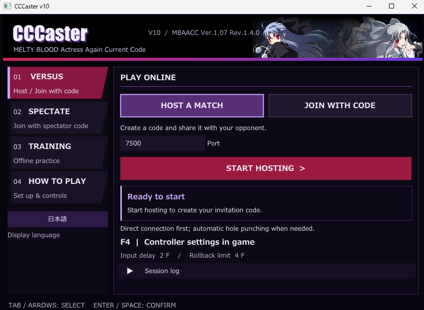

# CCCaster verB 1.0 beta

**A faster, easier CCCaster for MBAACC.**

CCCaster verB 1.0 beta supports **Melty Blood Actress Again Current Code Ver.1.07 Rev.1.4.0 (32-bit)** on Windows.

## What changed?

- **Faster startup:** training started in about **2.1 seconds**, compared with **8.7 seconds** in our old-version test.
- **Easy launcher:** host, join, spectate, or start training from an English/Japanese GUI.
- **Fairer settings:** both players use the same agreed delay and rollback values.
- **Steadier timing:** in our latest offline test, **99.7% of measured frame intervals were within 3µs of the target**.
- **Faster recovery:** rollback skips frames and waiting that players do not need to see.
- **Better input handling:** inputs are captured separately and stored with their frame numbers.
- **Simple sharing:** send one connection code instead of entering addresses and ports separately.

Results vary by PC and connection. The 3µs figure describes frame pacing, not controller or display latency. See the [benchmarks](docs/benchmarks/2026-09-13_offline_pacing.md) for the full conditions.

## How to play

Put the v10 files in the `cccaster_B` folder next to `MBAA.exe`, then open **CCCaster_v10_GUI.exe**.

1. **VERSUS:** host a match and share the code, or paste your opponent's code.
2. **TRAINING:** select **START TRAINING**.
3. **SPECTATE:** paste the host's `S-` spectator code.
4. Press **F4** before choosing a character to check your controls.

Both players need a matching v10 build. For a rematch, both players choose **ONCE**. If either player chooses character select, both return there.

## Current limits

- This repository targets the non-Steam game. Steam support is separate, with no cross-play.
- Ranked matchmaking is not currently included.
- Connection codes do not bypass router or firewall restrictions.
- Online replay-file saving is currently disabled.

For more detail, read [What's new in v10](docs/USER_APPEAL.md). Developers can start with the [current status](docs/CURRENT_STATE.md), [known issues](docs/OPEN_ISSUES.md), and [development guide](docs/DEVELOPMENT.md).

## Shorter connection codes

New connection codes use a Base62 format containing only letters and numbers. Copy them without changing letter case. An IPv4 code with a local IPv4 address is up to 30 characters instead of 35; a code that also contains IPv6 is up to 51 characters instead of 60. Codes expire after six hours. The new launcher still reads older codes, but joining with a new code requires the updated launcher. See the [format and validation details](docs/design/2026-09-13_compact_connection_codes.md).
