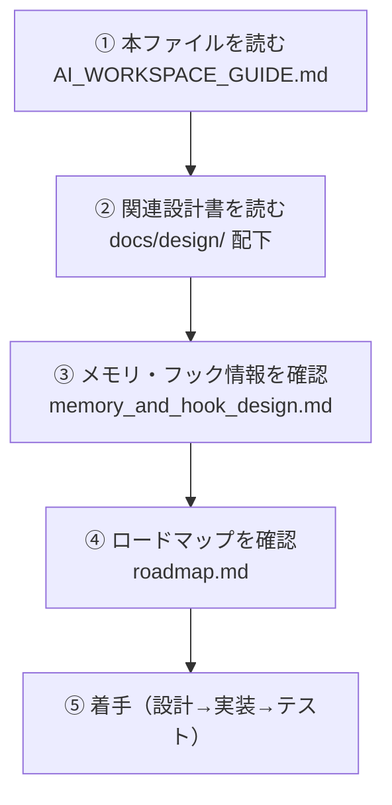

# CCCaster_v10 AI Workspace Guide (AI向け作業手順書)

## 📌 はじめに (For AI Assistants)
**新しいAIセッションを開始する際、最も最初にこのドキュメントを読み込んでください。**
本プロジェクト（CCCaster_v10）は、旧来の解析難易度が高く密結合なツール構造（旧CCCaster）を見直し、**「AIが理解しやすく、開発・拡張が容易な近代化された構造」**へと再設計した次世代の格闘ゲーム用通信同期（ロールバック）ツールです。

---

## 🏗️ 1. 設計理念とアーキテクチャ
旧来の複雑なフックコード、通信、UIが入り混じった状態を廃止し、明確な関心の分離（Separation of Concerns）に基づいたモジュール構造を採用しています。

### ⚠️ 絶対的な開発理念 (AIへの強制ルール)
このプロジェクトを触るAIアシスタントは、以下の理念を**絶対の戒律**として守ってください。
1. **「対戦にかかわる処理はすべてゲーム内（インゲーム）で行う」**
   - パフォーマンスや実行速度に直結する同期処理（Rollback Engine）、SaveState/LoadState等のメモリ読み書きは、プロセス外からの低速アクセスツールを使わず、DLLやフックを通じて**必ずゲーム内部の同じメモリ空間で高速に処理**させます。
2. **「妥協なきチューニングの徹底」**
   - 処理の遅延やフレームドロップを招く非効率な設計（無駄なコピー、ロック待機など）を妥協して実装してはなりません。
3. **「マスターへの申告」**
   - 上記のチューニングが困難な壁にぶつかった場合、またはアーキテクチャ上のクリティカルな変更判断が必要な場合は、自己判断で妥協せず**常にマスター（ユーザー）に状況を申告し、共に設計を行うこと**。

### モジュール構成
1. **`Network`**: UDP通信、redundancy（10フレーム冗長化パケット）、セッション管理。(asio使用)
2. **`Sync (Rollback Engine)`**: GGPO概念の128フレーム分State保存・巻き戻し・再計算と、高精度フレームタイマー（WASAPI + CPUスピン）。
3. **`GameInterface`**: API（DirectX, Input）フック、シーン監視、メモリアドレスの直接読み書き（Save/Load State）。
4. **`App / UI`**: アプリケーションライフサイクル、コマンドラインUI、およびゲーム内DirectXオーバーレイ描画（ImGui）。

すべてのロジックはモジュールごとにディレクトリ（`src/app/core_dll/`、`src/app/main_app/` など）に分割され、ヘッダファイルと実装ファイルが同居する形で管理されます。

---

## 📂 2. フォルダ階層 (完全ディレクトリ構造)

```text
i:\work_space\CCCaster_v10\
├── AI_WORKSPACE_GUIDE.md    <-- [重要] 新規AIはまずこれを読む
├── CMakeLists.txt           <-- プロジェクトのルートビルド設定
├── .agents/
│   └── workflows/           <-- AI向けワークフロー定義
│       ├── build.md         # /build で呼び出し可能なビルド手順
│       └── test.md          # /test で呼び出し可能なテスト手順
├── docs/
│   ├── requirements/        <-- 要件定義書（機能改修時に必ず参照）
│   │   └── dummy_peer_v2/   # DummyPeer v2 大改修の要件定義
│   │       ├── 01_requirements_overview.md   # 概要・業務状態定義
│   │       ├── 02_packet_specification.md    # パケット仕様書
│   │       └── 03_implementation_plan.md     # 実装計画書
│   ├── issues/             <-- [重要] バグ・問題・リスク一覧（一元管理）
│   │   ├── ISSUE_TRACKER.md              # 全バグ・問題管理リスト
│   │   ├── BUG_REPORT_UI_RENDERING.md    # UI描画の高速点滅・クラッシュ報告
│   │   └── RISK_dxhook_refactoring.md    # DxHookリファクタリングリスク分析
│   ├── design/              <-- 各機能の詳細設計書（変更前に必ず参照）
│   │   ├── roadmap.md               # 全体ロードマップ (Phase 1-4)
│   │   ├── System_Architecture_Overview.md # ★システム全体・メモリ・IPC設計
│   │   ├── core_dll/                # DLLレイヤー設計
│   │   │   ├── Core_Engine_Architecture.md  # ★フック・描画・シーン統合設計
│   │   │   └── Frame_Pacing_Control.md      # フレームパッキング制御
│   │   ├── main_app/                # アプリレイヤー設計
│   │   │   └── Application_Layer_Architecture.md # ★CLI・設定・ランチャー設計
│   │   ├── network/                 # ネットワーク設計（レイヤー分類）
│   │   │   ├── l4_transport/        # L4: UDPパケット通信・冗長化
│   │   │   ├── l5_session/          # L5: ネゴシエーション・接続管理
│   │   │   └── l7_application/      # L7: 同期ロジック・対戦フロー
│   └── archive/             <-- アーカイブ済みドキュメント（旧設計やメモ等）
│       └── design/
│   └── requirements/        <-- 新規実装やテストの要件定義・仕様書
│       ├── 01_system_overview.md        # システム全体の要件定義
│       ├── 02_cli_requirements.md       # CLI UIの機能要件
│       ├── 03_network_requirements.md   # ネットワーク通信要件
│       ├── 04_ingame_sync_requirements.md # InGame同期要件
│       ├── 05_test_specification.md     # テスト仕様・合否判定基準
│       ├── 06_packet_specification.md   # パケット仕様書
│       ├── 12_packet_field_specification.md # パケット項目仕様書
│       └── dummy_peer_v2/               # ダミーピア要件
├── src/
│   ├── core_dll/            # 【DLL全体】ゲームへ注入するDLLの全モジュール
│   │   ├── dllmain.cpp      # DLLエントリーポイント
│   │   ├── CMakeLists.txt   # DLLビルド設定
│   │   ├── infra/           # 【インフラ層】ゲーム非依存の汎用メカニズム
│   │   │   ├── DxHook.cpp/.hpp     # DirectX9 vtableフック (ImGui描画基盤)
│   │   │   ├── input/              # DInputフック
│   │   │   ├── network/            # UDP通信 (UdpSocket)
│   │   │   ├── overlay/            # OverlayRenderer (DirectX描画基盤)
│   │   │   ├── memory/             # メモリアクセスインターフェース群
│   │   │   └── ISpeedController.hpp # 速度制御インターフェース
│   │   ├── domain_session/  # 【業務処理】セッション管理
│   │   │   └── SceneRunner, GameControl, SessionContext
│   │   ├── domain_memory/   # 【ゲーム固有メモリ操作】ゲーム書き換え処理
│   │   │   ├── MbaaConstants.hpp, MbaaSpeedController.hpp
│   │   │   ├── GameMonitor.cpp, GamePhaseDetector.hpp
│   │   │   └── MemDumper, StateBuffer, StateRingBuffer, DumpEntryList
│   │   ├── domain_netplay/  # 【ネット対戦固有】フック・パケット・同期・UI
│   │   │   ├── GameHooks, TimeHooks           # ゲーム介入フック
│   │   │   ├── VirtualClock, TimeSynchronizer  # フレームタイミング制御
│   │   │   ├── PacketRouter, RedundantProtocol # パケットルーティング
│   │   │   ├── RollbackEngine, InputFilter     # ロールバックエンジン
│   │   │   └── ControllerMapper, NetplayOverlay # ネット対戦UI
│   │   └── domain_scene/   # 【シーン管理】画面ごとの状態遷移
│   │       └── SceneCharaSelect, SceneInGame, SceneLoading, SceneRematch
│   ├── launcher/            # 【ゲーム起動】Dll注入用ランチャー
│   │   ├── CMakeLists.txt
│   │   └── GameLauncher.cpp
│   ├── cli/                 # 【CLIアプリ本体】ネットワーク仲介・起動・UI
│   │   ├── CMakeLists.txt
│   │   ├── main.cpp
│   │   ├── ConfigManager.cpp
│   │   ├── controller/
│   │   ├── network_wrapper/
│   │   └── ui/
├── tests/                   # 単体テスト
│   ├── OwdMathTest.cpp
│   ├── benchmark_rollback/
│   └── owd_correction/
├── tools/
│   └── dummy_peer/          # ★ 擬似クライアント (1台でDLL通信テスト用)
│       ├── CMakeLists.txt
│       ├── TEST_PROCEDURE.md
│       ├── TESTING_IMPROVEMENTS.md
│       ├── include/         # DummyPeer, NetworkSimulator, InputGenerator, SyncResponder
│       ├── src/             # 各ヘッダの実装
│       └── build/           # ビルド出力 (gitignore)
├── changelogs/              # 月別変更履歴 (CHANGELOG_YYYY-MM.md)
├── build/                   # ★ ビルド成果物 (gitignore)
│   ├── bin/                 # CCCaster_v10.exe, libcccaster_hook.dll
│   └── lib/                 # 静的ライブラリ
├── build_logs/              # ビルドログ(gitignore)
├── _TEST_MBAACC/            # ゲーム統合テスト環境 (gitignore)
│   ├── cccaster/            #   実行バイナリ配置先
│   └── MBAA.exe             #   ゲーム本体
└── _temp_backup/            # 一時バックアップ (gitignore)
```

---

## ⚙️ 3. ビルド設計 (CMake)
ビルドは用途によって明確に分離します。CMake実行時に設定を切り替えてください。

### ビルド構成
| 構成 | 用途 | フラグ | ログ |
|---|---|---|---|
| **Debug** | 開発・デバッグ | アサート有効 | 全ログ出力 |
| **Release** | 競技・配布用 | `-O3`最適化 | Fatal Errorのみ |

### 依存ライブラリ（FetchContentで自動取得）
| ライブラリ | バージョン | 用途 |
|---|---|---|
| **ASIO** | `asio-1-30-2` | UDP非同期通信 (App層) |
| **MinHook** | `v1.3.3` | API関数フック (DLL層) |
| **ImGui** | `v1.90.4-docking` | ゲーム内オーバーレイUI (DLL層) |

---

## 🔧 4. ビルドとテストの実行方法

> [!IMPORTANT]
> 詳細なビルド・テスト手順、および合否判定基準は以下のワークフローおよびドキュメントに分離されています。
> 自動化スクリプトや要件定義書を必ず参照してください。

### 4.1 ビルド運用について
- **ビルド手順**: `.agents/workflows/build.md` を **/build** コマンドで呼び出すか、内容を参照してください。
- **原則**: ビルドログ (`*.log`, `*_err.txt` 等) を**プロジェクトルートに放置しないでください**。必ず `build_logs/` に隔離すること。

### 4.2 テスト環境とシナリオ定義について
- **テスト自動化**: `.agents/workflows/test.md` を **/test** コマンドで呼び出すか、内容を参照してください。
- **テスト要件・定義書**: 各テストの合否判定基準や、ヘッドレスモードの仕様詳細については `docs/requirements/05_test_specification.md` に記載されています。
  - DummyPeer(擬似クライアント)を用いたDLL通信層テスト（`tools/dummy_peer/TEST_PROCEDURE.md`）
  - ローカルループバック確認
  - ヘッドレスモードCLI引数リファレンス等

---

## 📝 6. 新規AI向けの作業フロー

AIはタスク受領時、以下のフローで作業を行ってください。

### 6.1 事前準備（理解フェーズ）



1. **完全把握**: 本ファイル（`AI_WORKSPACE_GUIDE.md`）と `docs/design/` 配下の関連する設計書を読み込み、仕様と構造を理解する。
2. **マスターアーキテクチャの熟読**: 「全体構造」については `System_Architecture_Overview.md` を、「DLL内部挙動」については `core_dll/Core_Engine_Architecture.md` を、「CLIとアプリ」については `main_app/Application_Layer_Architecture.md` を起点に読み解く。
3. **ロードマップ確認**: `docs/design/roadmap.md` で全体の進捗と現在のフェーズを把握する。

### 6.2 コーディング規約

| 項目 | ルール |
|---|---|
| **言語規格** | C++20 (`CMAKE_CXX_STANDARD 20`) |
| **ヘッダ配置** | 対象モジュールのディレクトリ内にインターフェース（ヘッダ）を切り、疎結合を保つ |
| **旧include/** | **廃止済み** — 使用・復活させないこと |
| **モジュール分割** | 各コンポーネントのディレクトリ内でソース実装し、CMakeLists.txtも更新する |
| **設計書** | 新機能は実装前に `docs/design/` に設計書を作成し承認を得る |

### 6.3 コミット・変更履歴ルール

> [!CAUTION]
> **ユーザールールに基づく強制事項です。違反厳禁。**

ルールや変更管理の詳細については、ルートディレクトリの **`CONTRIBUTING.md`** を必ず参照し、内容を厳守してください。とくにAtomic Commitと変更履歴（Changelog）必須のルールは絶対です。

### 6.4 ファイル管理ルール

| カテゴリ | 保存先 | gitignore |
|---|---|---|
| ソースコード | `src/app/` 配下 | ✗ 追跡対象 |
| 設計書 | `docs/design/` 配下 | ✗ 追跡対象 |
| 変更履歴 | `changelogs/CHANGELOG_YYYY-MM.md` | ✗ 追跡対象 |
| ビルド成果物 | `build/bin/`, `build/lib/` | ✓ 無視 |
| ビルドログ | `build_logs/` | ✓ 無視 |
| テスト環境 | `_TEST_MBAACC/` | ✓ 無視 |
| 一時ファイル | `_temp_backup/` | ✓ 無視 |
| AI作業用フォルダ | `.ai_workspace/` | ✓ 無視 |
| AIワークフロー | `.agents/workflows/` | ✓ 無視 |

> [!NOTE]
> AIが一時的なスクリプト実行やテキスト出力などの作業用スクラッチを行う場合は、必ず `.ai_workspace/` フォルダ内で作業を行ってください。このフォルダ内のファイルは一切コミットに含めない運用とします。

> [!WARNING]
> ビルドログ (`*.log`, `*_err.txt` 等) やビルドスクリプト (`*.bat` 等)、一時スクリプト (`fix_*.py`, `rename_*.py` 等) を**プロジェクトルートに放置しないでください**。`build_logs/` または `.ai_workspace/` フォルダに隔離すること。

---

## 📖 7. 設計書リファレンス（クイックインデックス）

変更を加える前に、関連する設計書を**必ず参照**してください。

### コアシステム
| 設計書 | 概要 | パス |
|---|---|---|
| システムアーキテクチャ | ★ [最重要] MBAAメモリアドレス・IPC・全体構成 | `docs/design/System_Architecture_Overview.md` |

### ネットワーク通信層 (`network`)
| 設計書 | 概要 | パス |
|---|---|---|
| **L4_Transport** | | |
| ネットワークプロトコル | パケットフォーマット・冗長化仕様 | `docs/design/network/l4_transport/network_protocol_design.md` |
| **L5_Session** | | |
| SessionNegotiator | 接続確立ネゴシエーション | `docs/design/network/l5_session/main_app_SessionNegotiator.md` |
| Connection Hash設計 | IP+ポート+ホスト複合ハッシュ | `docs/design/network/l5_session/connection_hash_design.md` |
| **L7_Application** | | |
| 時間同期アルゴリズム | OWD同期・クロックドリフト補正 | `docs/design/network/l7_application/TimeSync_Algorithm.md` |
| ネットプレイライフサイクル | 状態遷移・対戦フロー・同期フェーズ仕様 | `docs/design/network/l7_application/Netplay_Session_Lifecycle.md` |

### DLLレイヤー (`core_dll`)
| 設計書 | 概要 | パス |
|---|---|---|
| エンジンアーキテクチャ | ★ フック・シーン・入力・ロールバックの包括設計 | `docs/design/core_dll/Core_Engine_Architecture.md` |
| フレーム制御 | 60FPSパッキングとFastForward制御 | `docs/design/core_dll/Frame_Pacing_Control.md` |

### アプリレイヤー (`main_app`)
| 設計書 | 概要 | パス |
|---|---|---|
| アプリケーション層アーキテクチャ | ★ CLI UI・設定・内部機能・ランチャー起動の包括設計 | `docs/design/main_app/Application_Layer_Architecture.md` |

### 要件定義書
| ドキュメント | 概要 | パス |
|---|---|---|
| DummyPeer v2 概要 | 業務状態変数(PeerState)定義・状態遷移図 | `docs/requirements/dummy_peer_v2/01_requirements_overview.md` |
| DummyPeer v2 パケット仕様 | 統一ヘッダ20B・全PacketType・ペイロード定義 | `docs/requirements/dummy_peer_v2/02_packet_specification.md` |
| DummyPeer v2 実装計画 | 5フェーズの実装計画・ファイル変更一覧・検証計画 | `docs/requirements/dummy_peer_v2/03_implementation_plan.md` |

---

## 🗺️ 6. 開発ロードマップ概要

詳細な要件や進行状況については、`docs/design/roadmap.md` を確認してください。本プロジェクトは全体を通して **Phase1 〜 Phase4** に分割されています。作業着手時は必ず現在のPhaseを確認し、逸脱した改善を行わないように注意してください。

---

## 🛠️ 9. ツールとユーティリティ

### DummyPeer（擬似クライアント）
**目的**: 1台のPCでDLL通信・同期コードをテストするためのスタンドアロンツール。
**所在**: `tools/dummy_peer/`
**詳細手順**: `tools/dummy_peer/TEST_PROCEDURE.md`

主な機能:
- ランダム遅延・パケットロス・時計ズレの注入
- SYNC_REQ/RESプロトコル模倣
- コントローラ入力パケット生成
- ロールバックシミュレーション

### テスト用ベンチマーク
- **OWD数学テスト**: `tests/OwdMathTest.cpp`
- **ロールバックベンチマーク**: `tests/benchmark_rollback/`
- **OWD補正テスト**: `tests/owd_correction/`

---

## 🔄 8. 標準作業サイクル（チェックリスト）

AIが1つのタスクを完了するまでの標準的な作業サイクルです。

```
1. [ ] 本ガイドと関連設計書を読む
2. [ ] 影響範囲の特定（どのモジュール・ファイルを触るか）
3. [ ] 変更が大規模な場合、設計書を作成しマスターの承認を得る
4. [ ] 環境変数を設定（$env:PATH）
5. [ ] コードを実装
6. [ ] /build の実行等でビルドテスト
7. [ ] ビルドエラーがあれば修正して再ビルド
8. [ ] テスト実行（該当シナリオ）
9. [ ] 変更履歴（changelog）を作成
10. [ ] コードと変更履歴を同一コミット
11. [ ] マスターへ結果を申告
```
