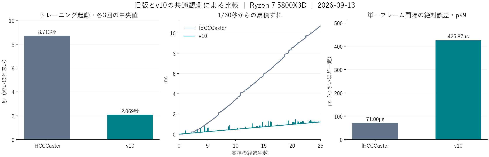

# 旧CCCaster / v10 比較ベンチマーク

**Update:** The offline pacing path has since been improved. See the [latest frame-pacing results in English](2026-09-13_offline_pacing.md) and [English product overview](../USER_APPEAL.md). The original measurements below are retained as a historical record.

測定日: 2026-09-13（日本時間）。対象: MBAACC Ver.1.07 Rev.1.4.0、32bit。

**トレーニング起動の中央値は8.713秒→2.069秒、76.26%短縮。** 同じ戦闘場面の1,500区間では、25秒基準からの累積ずれが10.710ms→1.207msだった。

起動時間、累積ずれ、単一フレームのばらつきを別々に集計する。起動は各3回、戦闘周期は同じキャラクター・ムーン・カラー・ステージで各1回。全数値は[集計JSON](2026-09-13_legacy_comparison.json)、紹介用の説明は[旧版とv10の違い](../USER_APPEAL.md)を参照。



[図のSVG版](2026-09-13_legacy_comparison.svg)

## 1. 共通条件

| 項目 | 条件 |
|---|---|
| CPU | AMD Ryzen 7 5800X3D、8コア16スレッド |
| GPU | NVIDIA GeForce RTX 5070 Ti、ドライバ32.0.16.1088 |
| OS | Windows 11 Pro、10.0.26200 |
| メモリ | 約48GiB |
| ゲーム | 両版とも同一のMBAA.exe・ゲームデータから作った独立コピー |
| 旧CCCaster | `I:/work_space/CCCaster/OLD` の3.1.007ローカルソースを32bit Releaseビルド |
| v10 | 測定開始時の`build/bin`のCLI・DLL。起動試験と周期試験でSHA256一致 |
| 起動モード | 旧版`-ot -n`、v10 `--training` |
| 戦闘条件 | 1Pシオン（ID 0）／2P吸血鬼シオン（ID 11）、双方Crescent・カラー01、ステージ50「No Control Red」 |
| 戦闘中の入力 | 選択に仮想DS4の通常入力経路を使用。測定中は無操作 |
| 外部時計 | 共通観測器のQPC、周波数10,000,000Hz（読取り単位0.1µs） |

既存のゲーム・設定を保全するため、`_TEST_MBAACC/LegacyBenchmark/old`と`new`に独立コピーを用意した。両版を同時には実行していない。Windows上の既存アプリは継続し、OS再起動・ファイルキャッシュ消去は行っていない。

旧版のビルドは元ソースのRelease設定（Ofast、NDEBUG、RELEASE、DISABLE_LOGGING）を使用。このPCの非表示コンソールではフォント列挙が0件となるため、その場合だけフォント変更を省く処置を比較用コピーのランチャーに加えた。ゲーム・ネットコード・フレームリミッターは元のまま。比較対象はこのローカルソースのビルドであり、別の公開配布版へ数値を一般化しない。[互換処置の差分](../../build_logs/legacy_benchmark_20260913/legacy_console_compatibility.patch)・[ビルドログ](../../build_logs/legacy_benchmark_20260913/old_build.log)

## 2. 起動時間

ランチャーのプロセス生成要求直前を起点とする。ゲームのモードがキャラクター選択（20）になり、そこでWorldTimerの進行を検出した時点を終点とした。GUIのクリックやモニターの発光時刻とは別の、両版に共通するゲーム準備の指標である。

外部プロセスから同じメモリアドレスを読み、約1ms間隔で終点を検出する。検出前後のQPCを保存した。今回の6試行の検出幅は約0.99～1.07ms。フレーム観測DLLの注入は起動時間の測定後に行う。

順序は旧1→新1→旧2→新2→旧3→新3。ここでは観測DLLを使わず、起動後に終了した6試行だけを採用する。

| 試行 | 旧版（秒） | v10（秒） |
|---|---:|---:|
| 1 | 9.072024 | 2.072527 |
| 2 | 8.647045 | 2.068741 |
| 3 | 8.713315 | 1.980205 |
| 中央値 | **8.713315** | **2.068741** |
| 最小～最大 | 8.647045～9.072024 | 1.980205～2.072527 |

中央値で**6.644574秒削減、76.2577%短縮**。旧版の所要時間はv10の約4.21倍だった。

## 3. フレーム間隔

両版のゲーム本体の同じ命令位置`0x433401`を観測する。ここはフレーム末尾の待機・クリティカルセクション解放後にある共通地点で、v10ではGameReleaseGateの直後に当たる。観測器は独自DLLのQPCを読み、固定長共有メモリへ記録する。ゲーム状態・入力・速度設定は変更せず、観測中のファイル出力も行わない。

隣接するWorldTimerが1ずつ進み、mode=1、intro=0、skip=0である連続区間を使う。ロード・イントロ・ゲームフレームの不連続で区間を分け、最初の十分長い区間の先頭120Fを準備区間として除き、次の**1,500間隔**を採用する。最も安定した区間の探索や、区間内のスパイク除去はしない。

| 指標 | 旧版 | v10 |
|---|---:|---:|
| 採用区間数 | 1,500 | 1,500 |
| 間隔の中央値 | 16,666.700µs | 16,667.500µs |
| 間隔の平均 | 16,673.807µs | 16,667.471µs |
| 間隔の最小 | 16,481.000µs | 16,142.000µs |
| 間隔の最大 | 16,965.600µs | 17,195.500µs |
| 1/60秒からの絶対誤差・中央値 | 0.067µs | 2.667µs |
| 同・p95 | 46.033µs | 123.845µs |
| 同・p99 | 71.000µs | 425.868µs |
| 同・最大 | 298.933µs | 528.833µs |
| 絶対誤差3µs超 | 278 / 1,500 | 689 / 1,500 |
| 絶対誤差100µs超 | 10 / 1,500 | 83 / 1,500 |
| 絶対誤差1ms超 | 0 / 1,500 | 0 / 1,500 |
| 1,500区間の実経過時間 | 25.010710秒 | 25.001207秒 |
| 25秒基準からの終点の累積ずれ | **+10.710ms** | **+1.207ms** |

この条件ではv10の累積ずれが小さく、単一フレームの絶対誤差p99は旧版の方が小さい。累積ずれと単発のばらつきは別の評価軸として扱う。60Hzや±3µsという設定・目標値を、この表の実測値の代わりには使わない。

累積ずれは、最初の観測を0として`実経過時間 − 区間数 / 60`で計算する。別PCの時計差・両者の同期差ではない。今回は各1回の無操作トレーニングであり、再計算、攻撃負荷、ネットワークの入力待ち、物理入力から表示までの遅延はこの比較に含めない。

旧版はQPCで前回フレームからの経過を待つ`newCasterFrameLimiter()`を使用。v10はWASAPI基準の絶対締切方式で、採用回のログに`WASAPI active`を確認した。観測本体の2回のQPC読取りの間の時間も記録しており、中央値は両版とも0.1µs。これはフック全体の費用や測定不確かさを表す値ではない。

## 4. 根拠と採用区間

| 用途 | ログ |
|---|---|
| 旧版の起動3回 | [1](../../build_logs/legacy_benchmark_20260913/startup_1_old/result.json)・[2](../../build_logs/legacy_benchmark_20260913/startup_2_old/result.json)・[3](../../build_logs/legacy_benchmark_20260913/startup_3_old/result.json) |
| v10の起動3回 | [1](../../build_logs/legacy_benchmark_20260913/startup_1_new/result.json)・[2](../../build_logs/legacy_benchmark_20260913/startup_2_new/result.json)・[3](../../build_logs/legacy_benchmark_20260913/startup_3_new/result.json) |
| 旧版の周期 | [stage50_old_final/result.json](../../build_logs/legacy_benchmark_20260913/stage50_old_final/result.json)・[生フレーム列](../../build_logs/legacy_benchmark_20260913/stage50_old_final/frames.bin)・[戦闘画面](../../build_logs/legacy_benchmark_20260913/stage50_old_final/battle.png) |
| v10の周期 | [fixed_new/result.json](../../build_logs/legacy_benchmark_20260913/fixed_new/result.json)・[生フレーム列](../../build_logs/legacy_benchmark_20260913/fixed_new/frames.bin)・[戦闘画面](../../build_logs/legacy_benchmark_20260913/fixed_new/battle.png)・[時計ログ](../../build_logs/legacy_benchmark_20260913/fixed_new/cccaster_hook_log.txt) |
| 測定器の実物 | [使用時のSHA256](../../build_logs/legacy_benchmark_20260913/measurement_tools.json) |
| 設定保全 | [32ファイル・変更0](../../build_logs/legacy_benchmark_20260913/protected_after.json) |

採用したレコード番号は旧版4231～5731、v10 3773～5273（0始まり）。全QPC列、EXE/DLL、関連ソースのSHA256を集計JSONに保存した。ゲーム本体のSHA256は両版とも`04b5bbd582fd795ea2fd27acb5beb2c4e958c6840b1054cda4cb0b70481d949d`。

準備中の試行も同じログルートに残す。`smoke_*`は起動・観測器・コンソール環境の確認、`battle_old`は入力設定、`battle_old_pad`／`battle_new_pad`／`fixed_old`は異なるステージの試行。`stage50_old`は同じ条件に到達したが区間長不足のため、時間を延ばした`stage50_old_final`を採用した。これらを正式な起動3回や同一場面の表へ混ぜていない。

## 5. 再測定と再集計

観測器は[src/harness/build_legacy_benchmark.ps1](../../src/harness/build_legacy_benchmark.ps1)で32bitビルドする。ゲームの版・実行パス・対象命令を照合し、比較専用コピーにだけ注入する。DLLの注入はキャラクター選択到達後に行う。

```powershell
./src/harness/build_legacy_benchmark.ps1
python -X utf8 src/harness/bench_legacy_real.py --variant old --out build_logs/my_old_startup
python -X utf8 src/harness/bench_legacy_real.py --variant new --out build_logs/my_new_startup
# 周期測定では双方を同じキャラクター・カラー・ステージへ進める。
python -X utf8 src/harness/bench_legacy_real.py --variant old --out build_logs/my_old_frames --observe-seconds 200
python -X utf8 src/harness/bench_legacy_real.py --variant new --out build_logs/my_new_frames --observe-seconds 200
```

今回の保存済みデータの再集計と図の生成:

```powershell
python -X utf8 src/harness/test_legacy_benchmark.py
python -X utf8 src/harness/summarize_legacy_benchmark.py
python -X utf8 src/harness/plot_legacy_benchmark.py
```

旧版の初期入力設定はF4で仮想DS4を1Pへ割り当て、A/決定をSquareへ設定。両版とも通常のDirectInput経路でキャラクターとステージを選んだ。測定区間中は入力・F4操作・ウィンドウ操作を行わない。観測器による全記録の保存後、脚本が自分で起動したゲームとランチャーだけを終了する。

共通観測器・注入補助の32bitビルド、および固定区間選択・スパイク保持・不正データ拒否の3検査は成功。製品側のv10コード・DLLは変更していない。

## 6. 高速再計算の資料

今回直接比較した指標は起動と通常フレーム間隔。ロールアップは同一深度・同一入力列・復元と保存を含む区間をそろえる測定項目として別に管理する。

v10の既存実ゲーム記録では、観戦の追いつき1,063更新／0.347603秒（約3,058更新/秒）、保存最適化前後の復元込み再計算中央値874.5→758.15µsを確認している。これらは旧版との同条件の速度比ではなく、それぞれの測定条件での実績として紹介資料へ掲載した。[観戦の測定](../design/2026-09-12_spectator_stream.md)・[保存最適化の測定](../design/2026-09-11_confirmed_replay_snapshots.md)
