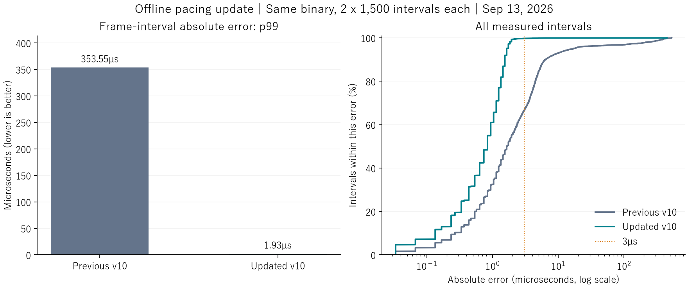

# Offline frame-pacing improvement

Measured September 13, 2026. MBAACC Ver.1.07 Rev.1.4.0, 32-bit.

**The latest offline pacing update reduced the 99th-percentile absolute frame-interval error from approximately 354µs to 1.93µs. In the updated runs, 99.7% of measured intervals were within 3µs of 1/60 second.**

[Machine-readable results](2026-09-13_offline_pacing.json) · [SVG chart](2026-09-13_offline_pacing.svg) · [Product overview](../USER_APPEAL.md)

## What changed

The previous v10 offline path used `Sleep(1)` during its initial wait. A diagnostic run observed that call taking **5,201.3µs** when only **2,419.2µs** remained until the preparation deadline. The next clock read followed just **0.7µs** after the sleep returned. This directly located the delay in the sleep/wakeup path, rather than in subsequent input processing.

The offline path also prepared inputs after its wait ended, without using the final release gate already available to netplay. That work added a variable delay between the deadline and the common game observation point.

The update:

1. Uses the existing high-resolution waitable-timer helper for the offline preparation wait.
2. Prepares inputs 200µs before the absolute deadline and performs the final wait after the game's critical-section release.
3. Applies the existing game-thread scheduling and CPU-affinity policy to offline play as well.

The WASAPI clock, absolute cadence, network protocol, and negotiated delay/rollback settings remain in place. This change does not replace the audio clock with an unrelated timing source.

## Measurement conditions

- Ryzen 7 5800X3D, 8 cores / 16 threads; GeForce RTX 5070 Ti; Windows 11 Pro 26200.
- Independent game copy; training mode; Sion versus V. Sion, Crescent / Color 01; stage 50, No Control Red.
- Same final executable and DLL for both configurations. `CCCASTER_TEST_OFFLINE_PACING=legacy` restores the previous offline waiting and scheduling path for comparison; the updated configuration uses defaults.
- Detailed timing diagnostics disabled. Normal controller input selects the scene, followed by neutral input during measurement.
- Shared QPC observer at game address `0x433401`, immediately after the frame-end wait and critical-section release. QPC resolution: 0.1µs.
- First eligible uninterrupted battle segment; discard its first 120 frames, then retain the next 1,500 intervals. No spike removal or search for a better segment.
- Two completed runs per configuration, **3,000 intervals each**. Foreground status was sampled every 200ms; all 125 samples within each included window identified the game as foreground.
- WASAPI active in all included runs, with no recorded QPC fallback. Game and configuration file hashes remained unchanged.

Absolute error is `abs(measured interval − 1,000,000/60 µs)`. Percentiles use linear interpolation. These are frame-interval measurements, not average FPS, physical input latency, or monitor scanout measurements.

## Results

| Absolute interval error | Previous v10 | Updated v10 |
|---|---:|---:|
| Median | 1.633µs | 0.833µs |
| Mean | 11.922µs | 1.136µs |
| p95 | 16.833µs | 1.633µs |
| p99 | 353.548µs | 1.933µs |
| Maximum | 528.567µs | 450.433µs |
| Intervals exceeding 3µs | 1,006 / 3,000 | 9 / 3,000 |
| Intervals exceeding 100µs | 96 / 3,000 | 2 / 3,000 |
| Intervals exceeding 1ms | 0 / 3,000 | 0 / 3,000 |

| Included run | p99 | Maximum | Raw results |
|---|---:|---:|---|
| Previous, run 1 | 387.545µs | 528.567µs | [Log](../../build_logs/offline_pacing_20260913/quiet_before_1/result.json) |
| Previous, run 3 | 333.497µs | 457.533µs | [Log](../../build_logs/offline_pacing_20260913/quiet_before_3/result.json) |
| Updated, run 1 | 2.133µs | 450.433µs | [Log](../../build_logs/offline_pacing_20260913/quiet_after_1/result.json) |
| Updated, run 2 | 1.933µs | 4.933µs | [Log](../../build_logs/offline_pacing_20260913/quiet_after_2/result.json) |

The updated result is approximately **99.45% lower at p99**. Rare larger errors remain, so the result supports improved consistency rather than an all-frame ±3µs guarantee.

The earlier [legacy-build comparison](2026-09-13_legacy_comparison.md) recorded a p99 of 71.000µs for old CCCaster and 425.868µs for v10 before this work. That historical comparison is retained separately from the same-binary comparison above. An audio-referenced cadence can also differ slightly from an exact QPC-referenced 60Hz interval; the remaining approximately 0.8µs median is not evidence of an equivalent sleep overrun.

## Diagnostic and incomplete runs

Diagnostic runs are retained separately and are not pooled into the headline results. Moving the final wait reduced ordinary jitter, but coarse sleep/wakeup delays remained. [Sleep attribution](../../build_logs/offline_pacing_20260913/sleep_foreground_trace/offline_analysis.json) identifies the 5.2ms sleep above. [High-resolution wait diagnostic](../../build_logs/offline_pacing_20260913/precise_foreground_trace/offline_analysis.json) recorded p99 2.033µs.

The previous configuration's second run changed foreground status during the fixed window: 82 of 125 samples were foreground. The whole run is excluded on that condition, with its spikes retained in the [original result](../../build_logs/offline_pacing_20260913/quiet_before_2/result.json). The updated third run ended without a cadence result and reported `ReadProcessMemory` error 299; its [record](../../build_logs/offline_pacing_20260913/quiet_after_3/result.json) is retained as incomplete. No further trials were performed after the user's instruction to use the existing results.

## Validation and artifacts

The final implementation passed the 32-bit build and **34 CTest tests**, including absolute-deadline and preparation-margin checks. Five Python analysis checks passed. Training selection and the battle screen were exercised through the normal virtual-controller path. A fresh two-player netplay test of this final change was not performed before testing was stopped at the user's request.

- [Build log](../../build_logs/offline_pacing_20260913/build_precise.log)
- [CTest log](../../build_logs/offline_pacing_20260913/ctest_precise.log)
- [Reproducible aggregation](../../src/harness/summarize_offline_pacing.py)
- [Frame benchmark harness](../../src/harness/bench_legacy_real.py)
- [Timing attribution analyzer](../../src/harness/analyze_offline_pacing.py)

Measured hook DLL SHA256: `d57e83476a5b4080f3d20ea2bc68b90fbb10728d16e353b215566b4a6a2e82fc`. Per-run executable and game hashes are included in the JSON results. Performance on other hardware, longer sessions, and all frames is not established by these short training runs.
