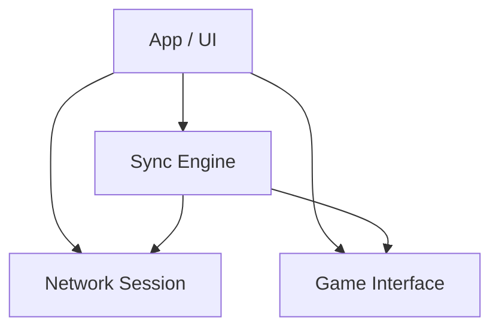

# ゲームプロセス メモリアドレスおよびフック設計書

## 1. 概要
本ドキュメントは、ターゲットゲーム（MELTY BLOOD Actress Again Current Code Ver.1.07 Rev.1.4.0）に対するメモリアドレスの操作およびAPIのフック手法をまとめたものです。旧「CCCaster」の解析結果に基づき、ロールバック同期エンジンやオーバーレイUIを実装するための基盤情報として活用します。

## 2. APIフック設計
ゲームの本来の描画や処理に干渉するため、以下の関数群に対して `MinHook`（または `Detours`）等を用いてパッチを当てます。

### 2.1 ゲームループ・描画系フック
- **`EndScene` / `Present` (DirectX 9)**
  - 用途: オーバーレイUI（ImGui）の描画。
  - アドレスポインタ例: `0x76E7D4` (`IDirect3DDevice9*`) から VTable を辿るか、ダミーデバイスを作成して VTable を取得してフック。
- **`WindowProc` (ウィンドウメッセージフック)**
  - 用途: 操作パススルーの遮断（UI操作時にゲームへ入力を渡さない）。
  - アドレス: `0x40D4C0`

### 2.2 フレーム制御・実行基盤
- **メインイベントループ**
  - アドレス: `0x40D330`
  - 用途: メインスレッドと同期し、ロールバックの実行単位（フレームステップ）を管理。
- **`QueryPerformanceFrequency` / `QueryPerformanceCounter`**
  - 用途: 既存のFPS制限を無効化し（ゲーム内FPS上限外し `0x774A80`）、当ツールの WASAPI+スピンウェイト高精度タイマー に差し替える。

## 3. メモリアドレスマップ (主要な State)
同期・ロールバックに必要なメモリアドレス一覧です。（ベースポインタおよび静的アドレス）

### 3.1 ゲーム進行フラグ・タイマー
| アドレス | 型 | 用途 |
| :--- | :--- | :--- |
| `0x54EEE8` | `uint32_t` | 現在のゲームモード（タイトル:`2`, キャラセレ:`20`, 対戦中:`1` 等） |
| `0x74d598` | `uint32_t` | 中間ゲームステート（キャラ登場演出等の中間フラグ） |
| `0x55D1D4` | `uint32_t` | ワールドタイマー。1フレームごとに常に増加するステップタイマー。 |
| `0x562A3C` | `uint32_t` | ラウンドタイマー (4752からカウントダウン) |

### 3.2 プレイヤー情報 (1P)
※1プレイヤーあたりの構造体サイズは `0xAFC` です。2P以降はこのサイズ分を加算します。
| アドレス(1P) | 型 | 用途 |
| :--- | :--- | :--- |
| `0x555130` | `uint8_t` | プレイヤー有効フラグ |
| `0x5551EC` | `uint32_t` | 現在の体力 (Health) |
| `0x555238` | `int32_t` | X座標位置 |
| `0x55523C` | `int32_t` | Y座標位置 |
| `0x55524C` | `int32_t` | X速度 |
| `0x555250` | `int32_t` | Y速度 |
| `0x555210` | `uint32_t` | マジックサーキット（ゲージ量） |
| `0x555140` | `uint32_t` | アニメーションシーケンス番号 |
| `0x555144` | `uint32_t` | アニメーションステート番号 |

### 3.3 入力送信先ポインタ
- **入力書き込み先ポインタ**: `0x76E6AC` (`char*`)
  - ※このポインタからオフセットを加算した位置に、毎フレームの方向キーおよにボタン入力を書き込むことでキャラクターを操作します。
  - 1P 方向キー オフセット: `+0x18`
  - 1P ボタン オフセット: `+0x24`
  - 2P 方向キー オフセット: `+0x2C`
  - 2P ボタン オフセット: `+0x38`

### 3.4 乱数（RNG）ステート
決定論的な同期を保つため、ロールバック時は乱数エンジンの状態も保存・復元する必要があります。
- 乱数ステート要素1: `0x563778`
- 乱数ステート要素2: `0x56377C`
- 乱数ステート要素3: `0x564068`
- 乱数ステート要素配列: `0x564070` (サイズ 220 bytes)

## 4. ロールバックステート (Memory Dump) のセーブ/ロード設計
- CCCaster準拠の挙動として、上記を含む「ゲームを決定づけるすべての静的メモリ領域・ポインタ指し先」を一覧化し、バイナリブロックとしてまとめて `128` フレーム分メモリプール（リングバッファ）にキャッシュします。
- **Save State処理**: `std::fenv_t`（FPUコンテキスト）の保存とともに、対象メモリ領域をバッファ配列へコピー（保存）する。
- **Load State処理**: FPU環境のリストア後、バッファからゲームのメモリ空間へコピーし直すことで、過去フレームの状態を完全復元する。


---

# ゲームメモリアドレス 使用箇所および具体的処理の詳細抽出

## 1. 概要
本ドキュメントでは、旧来の `Constants.hpp` 等で定義されているゲームメモリアドレス（ポインタ群）が、**実際の処理コード（`DllNetplayManager.cpp` や `DllMain.cpp` 等）でどう読み書き・操作されているか**を具体的に示します。
これらは新しいロールバック同期エンジンにおいて、「ゲームへ干渉・同調する仕組み」のコアとなる実用例です。

---

## 2. 詳細な使用箇所と処理内容

### 2.1 ゲームモードおよび進行ステート関連
#### `CC_GAME_MODE_ADDR`（現在のゲームモード）
- **使用箇所**: `NetplayManager::getInitialInput()` ほか多数
- **具体的な処理内容**:
  - メニュー操作の自動化: `(*CC_GAME_MODE_ADDR) != CC_GAME_MODE_MAIN` の場合、メインメニューに到達するまで自動で「キャンセル（戻る）」や「決定」を入力し続ける（TitleからMain Menuへの自動遷移など）。
  - ロールバックエンジンの挙動分岐: 現在のモードが `Netplay`, `Training`, `Versus`, `Spectate` のどれに該当するかを判断し、ポーズメニューを開けるかどうかや、強制的にキャラクターセレクト画面に飛ばす処理（`forceGotoVersus` などのアセンブリハック適用判定）に使用される。

#### `CC_WORLD_TIMER_ADDR`（システム稼働タイマー）
- **使用箇所**: `NetplayManager::updateFrame()`, `DllMain::timerExpired`
- **具体的な処理内容**:
  - **フレームステップの基準**:
    `_indexedFrame.parts.frame = (*CC_WORLD_TIMER_ADDR) - _startWorldTime;`
    ゲーム内の一意な時間として参照。開始時点からの差分を取り、「現在のゲームフレーム」として計算する。これが一致しない＝フレーム差異が生じた（ロールバックが必要）と判定するトリガーとなっている。

#### `CC_GAME_STATE_ADDR`（ゲームの詳細遷移ステート）
- **使用箇所**: `ChangeMonitor` (`DllMain`), `NetplayManager` モード監視
- **具体的な処理内容**:
  - ロード画面・キャラクター登場演出などの「対戦ラウンド以外の時間」を監視する。
  - 値の変化を監視して、「対戦開始（ラウンド1開始）」や「暗転中」のトリガーを受け取る。

---

### 2.2 座標・速度などのプレイヤーステート系
#### `CC_P1_X_POSITION_ADDR` / `CC_P2_X_POSITION_ADDR`（各種座標）
- **使用箇所**: `NetplayManager::getInGameInput()`, トレーニングモード操作ロジック
- **具体的な処理内容**:
  - **トレーニングモードのReset（位置初期化）**:
    `[FN2]`（リセットボタン）が押された際、プレイヤーの入力方向（下＋FN2、右＋FN2等）によって、直接このポインタに固定値（中央=`16384/-16384`、端=`45056/61440`）を書き込むことで、キャラクターを強制的に画面端や中央へ移動させている。
  - **カメラ連動強制移動**:
    座標アライメントのリセット時は `*CC_CAMERA_X_ADDR` もセットで書き換え、カメラがキャラクターにおいつく処理をフレームジャンプで解決している。

#### `CC_P1_SEQUENCE_ADDR`（キャラクターのアニメーション・行動シーケンス）
- **使用箇所**: `DllTrialManager::frameStepTrial()`
- **具体的な処理内容**:
  - **コンボトライアルの判定支援**:
    特定の通常技や必殺技を出しているか（例：5A > 2A > 5B...）を、このシーケンスIDの推移を監視することで検知。期待するシーケンス番号以外が来たら「コンボドロップ（ミス）」扱いとしている。

---

### 2.3 入力送信とメニュー操作
#### `CC_PTR_TO_WRITE_INPUT_ADDR`（未フォーマット入力領域） および `CC_BUTTON_CONFIRM` マクロ等
- **使用箇所**: `NetplayManager::getCharaSelectInput()`, `NetplayManager::getMenuNavInput()`
- **具体的な処理内容**:
  - **直接的な入力インジェクション**:
    ネットワーク（あるいはデモプレイ）で受信した入力ビットマスク（16bit）を特定オフセットのメモリに向けて書き込む。
  - **入力フィルタ（無効化）**:
    キャラセレ画面のロード中（最初の150Fなど）には `input &= ~COMBINE_INPUT(0, CC_BUTTON_A | CC_BUTTON_CONFIRM);` のように論理積（AND NOT）をかけることで、ユーザーがボタンを押しても「決定」だけがゲームに入らないよう**強引なマスク**を行っている（同期ズレ防止のため）。
  - **自動ナビゲーション**:
    エラー時の確認画面やホストへの接続時など、あらかじめ用意されたメニューインデックスとなるまで「上・下・決定」の値を強制的に代入し続ける操作の自動化。

#### `CC_PAUSE_FLAG_ADDR`（ポーズフラグ）
- **使用箇所**: `NetplayManager::getInGameInput()`
- **具体的な処理内容**:
  - **操作のロックダウン**:
    対戦中に一時停止ボタン（START）が押された場合、対戦相手との同期が確定していない場合は一時停止を無視・無効化する（前述の `input &= ~ CC_BUTTON_START;`）。
  - トレーニングモードにおいてポーズ画面が出ている時（フラグが立っている時）は、トレーニング用の特殊リセット処理をバイパスする。

---

### 2.4 自動保存およびRNG
#### `CC_RNG_STATE0_ADDR` 〜 `CC_RNG_STATE3_ADDR`（乱数シード）
- **使用箇所**: `NetplayManager::setState ( NetplayState::InGame )`, `DllMain` ロールバック管理
- **具体的な処理内容**:
  - デシンク（同期ズレ）を直すための基礎データ。対戦ラウンド（InGame）に入った最初のフレームで、この位置にある既存のシード値を別変数にコピーダンプ（退避）する。
  - リプレイやロールバック発生時にはこのシード値を書き戻し、乱数の結果を過去のフレームと完全に一致させる。

#### `CC_AUTO_REPLAY_SAVE_ADDR`
- **使用箇所**: `DllMain::ipcRead` (オプション設定反映時)
- **具体的な処理内容**:
  - ツールのオプション設定（AutoReplaySave等）が有効な場合、このアドレスに `1` を書き込み続けることで、ゲームクラスタの終了後（Win/Loseリザルト後）に自動的にリプレイ保存ダイアログへ移行するようにゲームの挙動を騙している。


---

# CCCaster verB 1.0 beta: EXE-DLL間連携 (API/IPC) 業務設計書

## 1. 背景と目的
現在、`CCCaster_v10.exe` (main_app) はユーザーのUI入力を受け付け、対象のIP・ポート・ホスト/クライアントの役割を確定させた上で、`GameLauncher` を使用して `MBAA.exe` を起動し `libcccaster_hook.dll` (core_dll) をインジェクトしています。
しかし、決定されたセッション情報（ネットワーク設定など）を **EXE から DLL へ伝達する経路（プロセス間通信）が未定義**です。
本設計では、両モジュールから共通参照されるヘッダ群を `src/include/cccaster/public_api/` として切り出し、Shared Memory (メモリマップトファイル) を用いた安全かつ高速な IPC 機構を構築することを目的とします。

## 2. アーキテクチャ概要 (Shared Memory アプローチ)
Windows APIの `CreateFileMapping` / `MapViewOfFile` を用いて、EXE側で共有メモリ領域を確保・初期設定し、DLL側が初期化時（インジェクト直後）にそれを読み取る方式を採用します。

### メリット
* **高速かつ確実**: ファイルI/Oを伴わず、メモリ上で即座にデータの受け渡しが可能。
* **C++構造体の直接マッピング**: シリアライズ/デシリアライズの手間がなく、`public_api/IpcData.hpp` に定義した構造体をそのままキャストして読み書き可能。
* **独立性の担保**: `main_app` が死んでも、共有メモリハンドルをDLLが握っている限りデータは保持される。

## 3. ディレクトリ・モジュール構成
新設するパブリックヘッダは、`main_app` および `core_dll` の双方から依存される「糊（Glue）」の役割を果たします。

```text
src/include/cccaster/public_api/
  ├── CccasterIpc.hpp       # IPC通信管理クラス (Create/Open, Read/Write のラッパー)
  ├── IpcData.hpp           # 共有メモリに配置される共通構造体 (SharedState)
```

## 4. データ構造設計 (`IpcData.hpp`)
共有されるメモリレイアウトは、厳密なサイズ固定のPOD (Plain Old Data) 構造体である必要があります。動的アロケーション（`std::string` や `std::vector`）は使用できません。

```cpp
namespace cccaster::public_api {

constexpr const char* IPC_SHARED_MEM_NAME = "Local\\CCCasterV10_SharedState";
constexpr uint32_t IPC_VERSION_MAGIC = 0xCC100001; // バージョンミスマッチ防止用

// ネットワークおよび起動パタメータのコンテナ
struct SharedState {
    uint32_t magicVersion;     // マジックナンバー
    
    // アプリケーション状態
    uint32_t targetGameMode;   // 0: Versus, 1: Training, 2: Spectate
    
    // ネットワーク情報
    bool isHost;               // true: ホスト(Server), false: クライアント(Client)
    bool isIpv6;
    uint16_t port;             // 接続先/待受ポート番号
    char targetIp[64];         // 接続先IPアドレス (NULL終端)
    
    // ゲームプレイ設定 (ディレイ・ロールバックなど)
    uint8_t delayFrames;
    uint8_t maxRollbackFrames;
    char playerName[32];       // 自プレイヤー名
    
    // コントローラー割り当て
    int32_t p1DeviceIndex;     // -1: default, 0+: 特定デバイス
    int32_t p2DeviceIndex;
    
    // 状態同期用フラグ
    bool dllInitialized;       // DLLが初期化を完了したか
    bool gameShutdownRequest;  // EXE側からDLLへの終了要求フラグ
    
    // 異常終了・切断通知
    uint32_t lastErrorCode;    // 0:正常, 1:相手の切断, 2:同期ズレ, その他致命的エラー
    
    // リアルタイム通信統計 (DLLから直書き)
    uint32_t currentPingMs;
    uint32_t currentJitterMs;
    uint32_t totalRollbackFrames;
};

// ...
```

## 5. 実行ワークフロー (Lifecycle) と パフォーマンスへの影響

DLL側（`libcccaster_hook.dll`）は、**ゲーム開始時に一度だけ `MapViewOfFile` で共有メモリのアドレスポインタを取得し、以降は対戦中ずっとその生ポインタを保持する** アプローチを取ります。
これにより、対戦中のアセンブリ処理や毎フレームコールバック（`GameHooks`内）で `currentPingMs` などの変数を書き換える際、単なる「C++ポインタへの代入（= 共有メモリへの直書き）」となり、Win32 APIの呼び出し（Map/Unmap等）のオーバーヘッドが一切かからず、**ゲームの処理（FPS）を全く妨げない** ゼロ・コスト設計となります。

1. **[main_app]** `SessionNegotiator` で接続（ポート穴開けなど）が完了する。
2. **[main_app]** `public_api::IpcManager::CreateAndWrite()` を呼び出し、決定したIP/Port/Roleを共有メモリに書き込む。
3. **[main_app]** `GameLauncher::BootAndMonitor()` で `MBAA.exe` を起動し `libcccaster_hook.dll` をインジェクトする。
4. **[core_dll]** `DllMain` あるいは `GameHooks` の初期化プロセス内で `public_api::IpcManager::OpenAndRead()` を呼び出す。
5. **[core_dll]** 読み取った `SharedState` の情報を元に、ASI/UDPソケットのバインド実行と、ロールバックエンジンの初期化を行う。
6. **[core_dll]** `dllInitialized` フラグを `true` にする。
7. **[main_app]** 定期的に共有メモリをポーリングし、ゲームのステータス表示等をコンソールにフィードバックする（将来の拡張）。

## 6. 実務的懸念と対策
* **アライメント問題**: 32bit(MBAA.exe)とEXE(おそらく32bit/64bit混在可能性有)で構造体のパディングがズレる危険を避けるため、`#pragma pack(push, 1)` 等での強制アライメントを規定。
* **寿命管理 (Lifecycle)**: `main_app` と `core_dll` が共に `CloseHandle` するまで共有メモリはOSに保持される。適切なハンドル管理を `IpcManager` RAII クラスでカプセル化する。


---

# プロセス間通信 (IPC) 設計・新旧比較

本プロジェクト（CCCaster_v10）における「外部のUI・通信本体（`CCCaster_v10.exe`）」と「ゲーム内フック処理（`cccaster_hook.dll`）」をつなぐデータ送受信（IPC）において、どのような手段をとるかについての設計根拠および旧バージョンとの違いを記載します。

## 1. 概要
通信やUIを司る「安全な外部EXE」と、実際に毎フレーム60回ゲームのメモリを同期する「極めてシビアなインゲームDLL」との間で、ネットワークの入力パケットやゲームの現在の状況（ラウンド開始、メニュー画面など）をハイスピードでやり取りする必要があります。

## 2. 旧方式: Named Pipe（名前付きパイプ）
旧来のCCCaster等のツールでよく用いられた方式です。

* **仕組み**: Windows OS が管理するストリーム（管）を通してデータのバイト配列を送受信する。
* **メリット**:
  * OSによって送受信順序やタイミングの保護（ロック）が完全に行われるため、実装が容易でバグ（データ競合）が起きにくい。
* **デメリット**:
  * データの読み書きを行うたびに、ユーザーの空間から Windows OS の深層部（カーネル）を必ず経由する「コンテキストスイッチ」と、メモリアロケーション（コピー）が発生する。
  * **【理念抵触】** 毎秒60回発生する入力同期のパスとしては、ごくわずかではあるが無視できない通信のオーバーヘッド（ラグの要因）となる。

## 3. 新方式: Shared Memory（共有メモリ / Memory Mapped File）
本プロジェクトにおいて、**「妥協なきチューニング」「対戦にかかわる処理のインゲームでの実行」**という絶対理念に従い採用する新方式です。

* **仕組み**: EXEとDLLの両方からアクセスできる「共通のメモリ領域（構造体）」をあらかじめPCのRAM上に確保し、互いにそこへ直接データを書き込む。
* **メリット**:
  * OSのバッファや通信プロトコルを一切介さず、**手元のポインタ変数を操作するのと同じ「真の最速バス（ゼロコピーパス）」**でデータをやり取りできる。
  * 毎フレーム発生する大量の入力・同期データの受け渡しにおいて、現状で考え得る最も低レイテンシ（ラグゼロ）を実現できる。
* **デメリット（課題事項）**:
  * OSレベルのデータ保護がないため、「片方が書き込んでいる最中にもう片方が読み込んでしまう」ようなデータ破壊（Data Race）を防ぐため、自前で `スピンロック` や `同期イベントオブジェクト（Event）` を用いたシビアな排他制御を実装する必要がある。

## 4. 結論
マスターからの指示である「対戦時にかかわるものは妥協せずにチューニングする」規則に基づき、旧来の堅牢だが数マイクロ秒〜数ミリ秒の遅延が重なる Named Pipe を廃止し、実装難易度を上げてでも **Shared Memory 方式を用いた最速のIPCチャネル** をアーキテクチャの中核として採用します。


---

# モジュール別 C++詳細実装設計書

本ドキュメントは、「相互干渉を最小限に抑え、AIが限られたスコープ単位で実装・改修できるクリーンアーキテクチャ」を実現するための各モジュールの詳細設計を示します。
各モジュールのソースコードを書き始める際は、**本ドキュメントに記載されたインターフェース（ヘッダ）定義にのみ従い、外部モジュールの内部実装には一切依存しない**ようにしてください。

---

## 🏗 モジュール構成図と依存関係
依存の方向は必ず上から下（右から左）へ向かい、循環参照を禁止します。


---

## 1. `Network` モジュール (通信・パケット処理)
**【責務】**
外部とのUDPパケットの送受、消失パケットの冗長化復元、相手からの入力値のバッファリングのみを行う。ゲームの内部状態（フレーム数など）は一切知らない。

**【ディレクトリ】**
- ヘッダ: `include/cccaster/network/`
- 実装: `src/network/`

**【主要クラスとインターフェース】**

### `UdpSocket` クラス
非同期 UDP I/O の低レイヤ通信をカプセル化（`asio` ベース）。
```cpp
namespace cccaster::network {
    class UdpSocket {
    public:
        using ReceiveCallback = std::function<void(const std::vector<uint8_t>& data, const std::string& senderIp, uint16_t port)>;

        UdpSocket(uint16_t bindPort);
        ~UdpSocket();
        
        // パケットの非同期送信
        void Send(const std::string& targetIp, uint16_t targetPort, const std::vector<uint8_t>& data);
        
        // 受信時のコールバック登録
        void OnReceive(ReceiveCallback callback);
        
        void Poll(); // イベントループ処理
    };
}
```

### `RedundantProtocol` クラス
過去10フレーム分の入力履歴を持った冗長パケットを作成・解析する責務。
```cpp
namespace cccaster::network {
    struct InputPacket {
        uint32_t frameId;
        uint16_t currentInput;
        uint32_t roundTimer;        // 状況確認用のラウンドタイマー
        uint64_t wasapiClock;       // 相手側のQPC（高精度クロック）値
        uint64_t creationTimeUs;    // パケット作成時の絶対システム時刻（UNIXマイクロ秒等）
        std::array<uint16_t, 10> historyInputs; // 過去10フレーム分の入力
    };

    class RedundantProtocol {
    public:
        // 送信用の平文入力データから冗長パケット(byte配列)を生成
        std::vector<uint8_t> EncodeInput(uint32_t currentFrame, uint16_t currentInput, const std::deque<uint16_t>& localHistory);
        
        // 受信したbyte配列から InputPacket をパース
        std::optional<InputPacket> DecodeInput(const std::vector<uint8_t>& payload);
    };
}
```

---

## 2. `GameInterface` モジュール (メモリ操作・APIフック)
**【責務】**
ゲームプロセス特有の処理（Windows APIフック、MBAACCの特定メモリアドレスのRead/Write）を完全に隠蔽する。
他のモジュールは `Constants.hpp`（メモリアドレス等のマジックナンバー）を直接 `include` してはならない。

**【ディレクトリ】**
- ヘッダ: `include/cccaster/game_interface/`
- 実装: `src/game_interface/`

**【主要クラスとインターフェース】**

### `MemoryAccessor` クラス
MBAAのステート（座標、モード、フラグ）へのアクセス窓口。
```cpp
namespace cccaster::game_interface {
    // 状態を抽象化した定数群
    enum class GameMode { MainMenu, CharacterSelect, InGame, Loading, Unknown };

    class MemoryAccessor {
    public:
        // 値の取得
        static GameMode GetCurrentGameMode();
        static uint32_t GetWorldTimer();
        static bool IsRoundStarted();

        // 状態操作（インジェクション）
        static void WritePlayerInput(int playerIndex, uint16_t inputBits);
        static void ForcePlayerPosition(int playerIndex, int x, int y);
        static void BypassMenuInput(uint16_t inputMaskToDisable); // ロード中などの入力無効化用
    };
}
```

### `HookManager` クラス
DirectX や WinHook のフック設置と、コールバックのディスパッチ。
```cpp
namespace cccaster::game_interface {
    class HookManager {
    public:
        using RenderCallback = std::function<void()>;
        
        // 指定した関数(例: EndScene)に対してフックを実施
        bool InstallHooks();
        void RemoveHooks();

        // UI描画などのタイミングで呼ばれるコールバックを登録
        void RegisterRenderCallback(RenderCallback cb);
    };
}
```

---

## 3. `Sync` モジュール (ロールバックエンジン・タイマー管理)
**【責務】**
対戦状態の128フレ保存、フレーム進行制御、遅延(Fixed Delay)の適用、ロールバックの実行フラグ判定を行う。
`Network` から入力を受け取り、`GameInterface` へ入力とステート書き戻しを指示する。

**【ディレクトリ】**
- ヘッダ: `include/cccaster/sync/`
- 実装: `src/sync/`

**【主要クラスとインターフェース】**

### `FrameTimingController` クラス
60FPS維持と高精度スピンウェイト管理（WASAPI連動）。
```cpp
namespace cccaster::sync {
    class FrameTimingController {
    public:
        FrameTimingController();
        
        // 1フレーム(16.66ms)の経過を厳密に待機する。
        // ゲームループ内で毎フレーム呼ばれる。
        void WaitNextFrame();
        
        // 現在のレイテンシ状況に応じて、意図的に待機時間を増減させる(ドリフト補正用)
        void AdjustTimingOffset(int microSecondsOffset);
    };
}
```

### `RollbackManager` クラス
ロールバックエンジン本体。GGPO的な State 保存・入力予測を担う。
```cpp
namespace cccaster::sync {
    class RollbackManager {
    public:
        RollbackManager(int maxRollbackFrames, int fixedDelayFrames);

        // ゲームの 1 フレーム更新前に実行（予測または確定入力の取得）
        uint16_t PrepareFrame(uint32_t currentFrame, uint16_t localRawInput);

        // ネットワークからリモート入力が届いた際に呼び出し。
        // （予測と違っていれば Rollback 予定フラグを立てる）
        void OnRemoteInputReceived(uint32_t frameId, uint16_t remoteInput);

        // フレーム終了時に最新の State (メモリダンプ) を保存する。
        void SaveState(uint32_t frameId, void* rawMemoryDump, size_t size);

        // 次の WaitNextFrame() 前に、ロールバックが必要ならここでメモリを書き戻して再計算を指示。
        bool CheckAndProcessRollback(uint32_t currentFrame);
    };
}
```

---

## 4. `App` モジュール (統合管理・UI UI)
**【責務】**
アプリケーション起動処理、設定値の管理、Imgui等を使ったオーバレイUI描画の実装、および各モジュールのインスタンス生成とイベントを繋ぎ込むメインループ管理。

**【ディレクトリ】**
- ヘッダ: `include/cccaster/app/`
- 実装: `src/app/`

**【主要クラスとインターフェース】**

### `AppController` クラス
DIレイヤ。インスタンスの初期化順や通信設定などを保持し、システム全体をオーケストレーションする。
```cpp
namespace cccaster::app {
    class AppController {
    public:
        void Initialize();
        void MainLoop();  // UIやネットワークのポーリングなどメイン制御
        void Shutdown();
        
    private:
        // 全モジュールの所有
        std::unique_ptr<network::UdpSocket> _socket;
        std::unique_ptr<sync::RollbackManager> _rollbackManager;
        std::unique_ptr<game_interface::HookManager> _hookManager;
        
        void OnRenderRequested(); // フックから呼ばれる ImGui 描画ハンドラ
    };
}
```

### `OverlayUi` クラス
DirecX Hook 経由で呼び出される ImGui の各種ウィンドウ描画。
```cpp
namespace cccaster::app {
    class OverlayUi {
    public:
        // ImGuiのコンテキスト初期化
        void Initialize(void* d3dDevice);
        
        // 毎フレームの描画処理（キャラセレ相互設定UIやPing表示）
        void Render(const AppState& currentState);
    };
}
```

---
**※【AI 実装時のルール】※**
実装時、例えば `RollbackManager` の `.cpp` ファイル内から `MemoryAccessor` や `UdpSocket` の詳細仕様を直接書き換えたり、互いのプライベートメンバを呼び出すようなコードは一切記述しないでください。必ずこの仕様で示された Public メソッドを介してデータの受渡しのみを行ってください。


---

