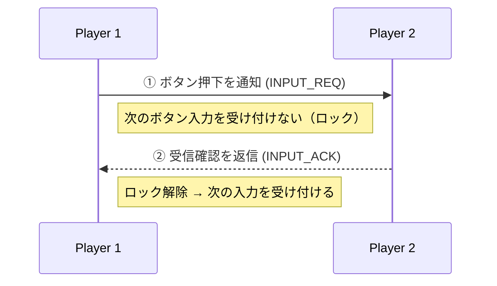
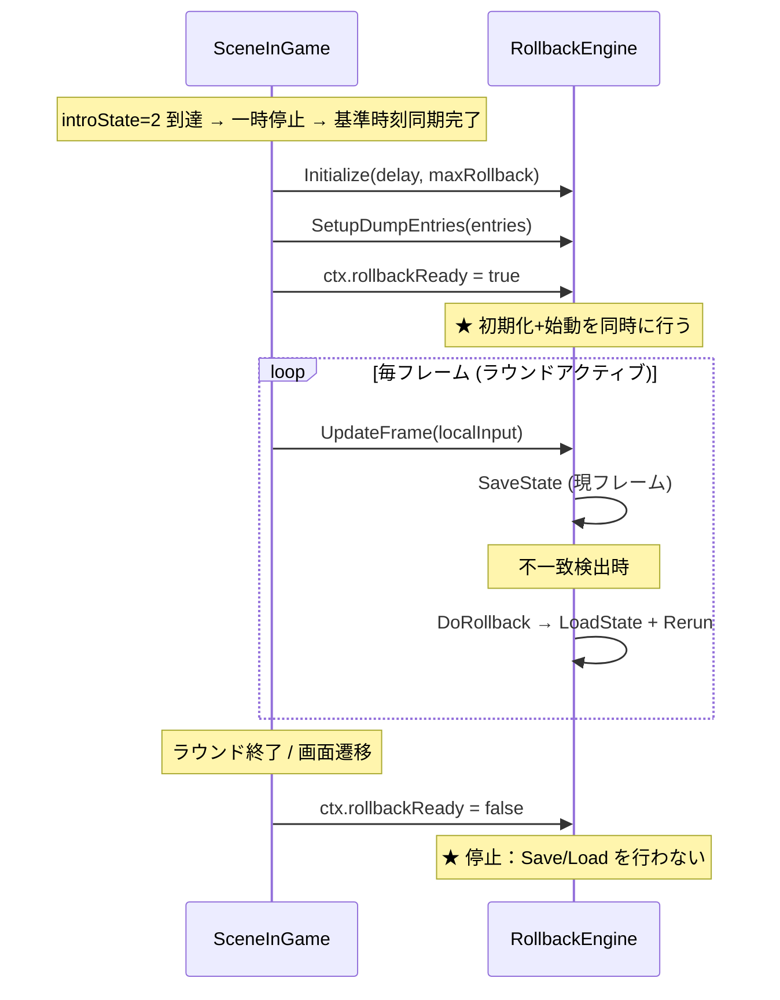
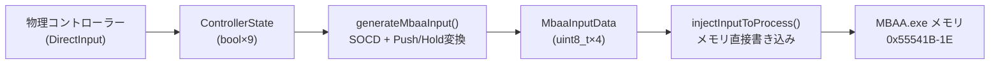
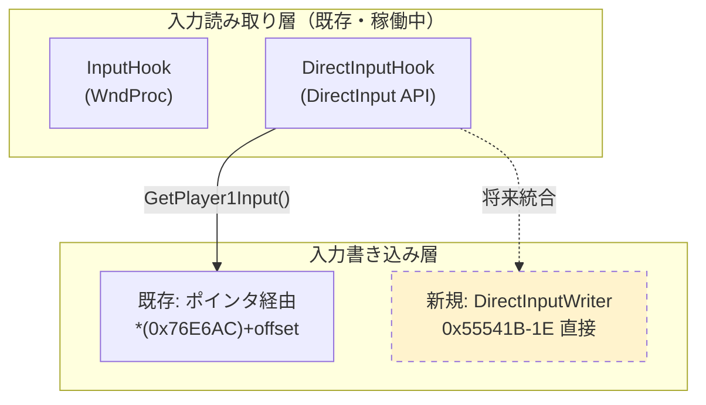
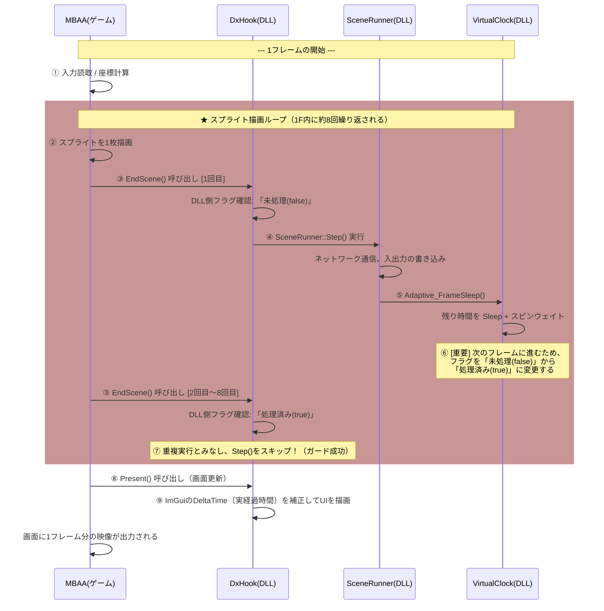

# ロールバックエンジン詳細設計

## 1. コア・データ構造
### 1.1 Input Ring Buffer
- **サイズ**: 256（安全のため最大予測の数倍を確保）
- **役割**: ローカルおよびリモートの各フレームの入力を保持。
- **予測**: リモート入力が未着の場合、前フレームの入力をコピーして予測進行する。

### 1.2 State Ring Buffer
- **サイズ**: 15フレーム（ロールバック発生の上限フレームとしては最大15で十分なため）
- **役割**: ゲームの完全なメモリ状態（`GameState`）を保持。
- **State要素**: 
  - キャラクター座標、HP、ゲージ
  - 各種タイマー、フラグ
  - 入力受付状態
  - 乱数シード（必要な場合）

## 2. ロールバック・アルゴリズム
### 2.1 毎フレームの処理フロー
1. **入力取得**: ローカルの入力を取得し、Input Bufferに格納。
2. **通信**: ローカル入力を相手に送信、相手からの入力を受信してBufferを更新。
3. **ロールバック判定**:
   - 受信した「確定入力」が、過去に「予測」で進めた入力と異なるかチェック。
   - 差異がある場合、最後に一致していたフレームまで **LoadState** で巻き戻す。
4. **再シミュレーション (Fast Forward)**:
   - 巻き戻した地点から現在のフレームまで、確定入力を適用して高速にゲームロジックを再実行（レンダリングはスキップ）。
5. **最新フレーム実行**:
   - 最新の状態を **SaveState** で保存し、描画を行う。

## 3. ゲームインターフェース要件
ゲームをロールバックさせるためには、以下のAPIの特定が必須です。
- `void SaveState(void* buffer)`: 指定バッファに全ゲーム状態をダンプ。
- `void LoadState(void* buffer)`: 指定バッファから全ゲーム状態を復旧。
- `void AdvanceFrame(Input p1, Input p2)`: 1フレーム分ゲームを進める（描画なしモードが望ましい）。

## 4. チューニングとパフォーマンスの絶対理念
1. **インゲームでの徹底処理**:
   `SaveState` や `LoadState` 等、毎フレーム発生する極めて負荷の高い処理は、外部プロセスからの `ReadProcessMemory`/`WriteProcessMemory` ではなく、**ターゲットゲームへのフック注入により、同一メモリ空間上（インゲーム）の最速パスで実行**する必要があります。
2. **チューニングの報告義務**:
   これらの最深部の同期ロジックにおいて、妥協した実装や一時凌ぎの設計を行うことは固く禁じられています。最適化の判断や問題発生時は、**必ずマスター（ユーザー）へ事象を申告し、チューニングの方向性の承認を得ること**を設計・運用ルールとします。


---

# ロールバックおよびロールアップ（再計算）処理 設計書

本ドキュメントでは、ネットワーク対戦中（`InGame`フェーズ）において、相手の遅延入力が過去の予測と異なっていた際に発生する「ロールバック処理」および、現在フレームに追いつくための「ロールアップ（再計算・Fast Forward）処理」の具体的な業務フローと、それに伴う不安要素（エッジケース）とその解決策を定義します。

---

## 1. 業務フロー（ロールバック＆ロールアップの流れ）

ロールアップはゲームの描画メインスレッド（`UpdateFrame`が呼ばれるスレッド）の先頭で実行されなければなりません。

1. **不整合検知 (Trigger)**
   - ネットワーク受信キューからパケットを取り出し、過去フレーム `F` に対する予測入力と実際の受信入力が異なることを検知する。
2. **状態のロード (Load State / Rollback)**
   - `F` 以前の直近で「状態（メモリダンプ）」が確定・保存されているフレーム `R` ( `R <= F` ) をリングバッファ (`StateBuffer`) から探す。
   - `R` のメモリダンプをゲームのメモリ領域全体へ一括コピー（リストア）する。
   - ※この時点でゲーム世界はフレーム `R` にタイムスリップする。
3. **リプレイバッファ・特殊状態の補正 (Pre-Rollup Fix)**
   - ゲームが独自に管理している「リプレイ用入力履歴配列」のポインタやインデックスを、巻き戻ったフレーム数ぶんだけ手動で減算・消去する。
4. **ロールアップ (Rollup / Fast-Forward)**
   - フレーム `R` から現在のフレーム（描画待ちのフレーム）に向かって、ゲームの進行処理 (`AdvanceFrame`) インタフェースを `while` ループ等で複数回（最大15回等）連続で叩く。
   - この際、`R` から `F` までは「既に届いた正しい入力」を使い、`F` 以降は「再度予測した入力」を使って計算を進める。
5. **SFX（効果音）のミュート**
   - 多重再生を防ぐため、再計算中（ロールアップ中）はゲーム内のすべてのSFX発音命令を強制的にミュート（無音化）状態にする。
6. **現在フレームの通常処理へ復帰 (Resume)**
   - ロールアップが完了したら、ミュートを解除し本来の現在フレームに対する通常処理（1F分の処理と、画面描画の許可）を再開する。

---

## 2. 具体的不安材料 (Anxiety Points) と課題解決策

ロールバック・ロールアップ特有の技術的な課題と、実装で必須となる解決アプローチを5つ挙げます。

### A. パフォーマンススパイクによる処理落ち
**不安要素:**
1フレームの制限時間（約16.6ms）の間に、メモリ全体のバッガムーブ（コピー）と、最大15フレーム分のゲームロジック再計算（`AdvanceFrame`）が走るため、CPU/GPUにすさまじい負荷がかかり、60FPSの維持ができずカクつく懸念。
**解決策:**
ロールアップの `while` ループ実行中（再計算中）は、MBAA本体の **画面描画フラグ（`CC_SKIP_FRAMES_ADDR` 等）を `ON` （スキップ）に強制する**。これにより、当たり判定や座標などの内部計算のみを最高速で回し、DirectXの描画コールを完全に省略させる（Early Exit）ことでCPU/GPU負荷を劇的に下げる。再計算が終わった直後にフラグを `OFF` に戻す。

### B. 音の多重再生と再生漏れ (SFX Desync)
**不安要素:**
描画をスキップして高速再計算しても、ゲームの仕組み上「音声を再生せよ」というフラグが立つため、ロールバックの直後に同じ打撃音やボイスが凄まじい勢いで「ダダダダン！」と多重再生されてしまう。
**解決策:**
旧実装の複雑なトラッキングは廃止し、**「ロールアップ実行中は完全にミュート（無音）にする」という潔いシンプルなアプローチ**を取る。
- 再計算中（`while` ループ内）はメモリ領域へのオーディオ再生命令を一時的に遮断するか、ミュートフラグを全適用し続ける。
- 再計算ループが終わって最新フレームに追いついた段階で、何もせずにミュート解除し、そこからの音は通常通り鳴らす。

### C. ゲーム本体のリプレイデータ破損
**不安要素:**
ゲームのメモリダンプから復元しきれない領域がある。特に、ゲーム本体が持っている「リプレイ保存のためのキー履歴配列 (`RepRound->inputs`)」は、ロールバックしてもポインタのインデックス（`activeIndex` や `frameCount`）が勝手に巻き戻ってくれない。結果、オンライン対戦後のリプレイファイルが壊れたり、保存中にクラッシュするリスクがある。
**解決策:**
ロードステート（復元）処理の直後、ゲーム本体の `CC_REPROUND_TBL_ENDPTR_ADDR` 周辺のメモリを直接パースし、**巻き戻したフレーム数（例: -3F）の分だけ、手動でプレイヤーごとのリプレイ入力インデックスとフレームカウントを減算（デクリメント）・ゼロクリアする処理**を組み込む。

### D. マルチスレッドアクセスの衝突 (Thread Collision)
**不安要素:**
現在の `RollbackEngine.cpp` では、UDP受信用スレッドが `OnRemoteInputReceived()` を叩き、直接 `DoRollback()` を呼び出そうとしている。しかし、ロールバックによるメモリ上書き中に、メインスレッドが画面描画や `UpdateFrame()` で同じメモリ領域を参照すると、メモリアクセス違反（シグナル）や内容の矛盾でゲームが即死する。
**解決策:**
**UDP受信スレッド側ではロールバックを直接実行しない。** 受信した入力パケットはMutexやLock-freeキューといった「スレッドセーフな受信トレイ」に突っ込むだけにする。
ロールバック検知と実行は、**必ずゲームのメインスレッド側（`UpdateFrame`ブロックの先頭・描画前）で受信トレイを取り出したタイミング**で同期的に行い、スレッド競合を物理的に排除する。

### E. RNG（乱数）の取りこぼしによるバタフライ効果
**不安要素:**
復元対象メモリ（ダンプ領域）から、エフェクト発生器のシードやサブ乱数のメモリアドレスが1つでも漏れていた場合、ロールバック後に再計算を通った世界と、そうでない相手の世界で「飛び道具の持続」や「エフェクトの角度」がズレ始め、やがてゲーム全体の同期崩壊（Desync）を引き起こす。
**解決策:**
同期対戦（`InGame`）開始前の**対戦前待機フェーズ（Phase 4）**のタイミングで、Host が RNG state （`CC_RNG_STATE0123_ADDR` およびその他の未解明シード候補群）を読み取り、**`RNG_SYNC` パケットで Client に送信して強制的に同期させる**アプローチを取る。このフェーズではゲームが一時停止状態のため、Host/Client 双方が安全に RNG を確定できる。その上で、ダンプ領域のアドレス設定 (`MemDumpList`相当) が旧コードと完全一致しているかをテスト環境で厳密にアサートする。


---

# 画面遷移ベース アーキテクチャ再構築設計

## 1. 概要

`net_Versus_main.cpp`（628行）を**画面ごとのソースに分割**し、選択したモードの業務変数を**POD構造体**で持ち回す構成に変更する。

---

## 2. SessionContext — 高速POD設計

```cpp
// sizeof ≈ 24 bytes → L1キャッシュ1ライン(64B)内
// ヒープゼロ、コピー可能
struct SessionContext {
    // ---- 起動時確定（不変）----
    uint8_t  appMode;         // 1=Versus, 2=Training, 3=Spectator
    bool     isHost;
    bool     headless;
    uint8_t  _pad0;

    // ---- 同期パラメータ ----
    int16_t  delay;           // 共有ディレイ (default: 3)
    int16_t  maxRollback;     // 最大ロールバック深度 (default: 7)

    // ---- フェーズ進行フラグ ----
    bool     syncDone;        // 基準時刻同期が完了したか
    bool     roundStartSynced;
    bool     fastForward;
    bool     rollbackReady;   // ロールバックエンジン始動済みか

    // ---- フレームカウンタ ----
    uint32_t framesInPhase;
};
```

> 重いオブジェクト（RollbackEngine, atomic, UdpSocket*）はContext外に static / ポインタで管理

---

## 3. メインループ — 画面監視 + ディスパッチ

```cpp
void SceneRunner::Run(SessionContext& ctx) {
    GamePhase prev = GamePhase::Unknown;

    while (!shouldExit) {
        // ---- 毎フレーム共通 ----
        if (ctx.fastForward) *CC_SKIP_FRAMES_ADDR = 1;
        TimeSynchronizer::GetInstance().Update(ctx.isHost);

        // ★ 画面情報の監視
        GamePhase phase = GameMonitor::GetCurrentPhase();

        // ★ 画面遷移検出 → 状態リセット
        if (phase != prev) {
            OnPhaseChanged(prev, phase, ctx);
            ctx.framesInPhase = 0;
        }

        // ★ 画面ごとにディスパッチ
        switch (phase) {
            case GamePhase::CharaSelect: SceneCharaSelect::Update(ctx); break;
            case GamePhase::Loading:     SceneLoading::Update(ctx);     break;
            case GamePhase::InGame:      SceneInGame::Update(ctx);      break;
            case GamePhase::Rematch:     SceneRematch::Update(ctx);     break;
            default: Clock().WaitForNextFrame(); break;
        }

        prev = phase;
        ctx.framesInPhase++;
    }
}
```

---

## 4. 各画面の振る舞い

### 4.1 同期パイプライン（キャラセレ / ロード画面 / 対戦モード 共通）

```
一時停止 → 基準時刻同期 → 開始時間の通知 → 同時刻再開
```

| 画面 | 同期タイミング | 補足 |
|---|---|---|
| **キャラセレ** | **確定応答方式**（後述 §4.5） | 同期パイプラインは使わない |
| **ロード画面** | 通過のみ（TimeSynchronizer Reset） | 次ラウンドの再計測を仕込む |
| **対戦モード** | introState=2 到達時に停止→同期→再開 | RollbackEngine **初期化+始動** はここ |

### 4.2 リマッチ画面

レガシー踏襲（同期パイプラインなし）

### 4.3 画面別 入力フィルタ

| 画面 | 許可ボタン | 方向 |
|---|---|---|
| タイトル / メニュー | パススルー | パススルー |
| キャラセレ（キャラ） | A/B/Confirm/Cancel | 全方向 |
| キャラセレ（ムーン/カラー） | A/B/Confirm/Cancel | 上下のみ |
| ロード | 全クリア | 全クリア |
| 対戦中（イントロ） | A/B/Confirm/Cancel | 上下のみ |
| 対戦中（ラウンド） | Start/FN1/FN2ブロック | 全方向 |
| 対戦中（KO後） | パススルー | パススルー |
| リマッチ / リプレイ | A/B/Confirm/Cancel | 上下のみ |

### 4.5 キャラセレ同期 — 確定応答方式（LockStep Confirm）

通常の対戦同期（ディレイ＋ロールバック）は60FPSの高速入力に対応するが、キャラセレは**メニュー操作**であり入力頻度が低い。そのため、より厳密で安全な**確定応答方式**を採用する。



**プロトコル**:

| パケット | 方向 | 内容 |
|---|---|---|
| `INPUT_REQ` | 送信側→相手 | 押されたボタン + フレーム番号 |
| `INPUT_ACK` | 相手→送信側 | 確認済みフレーム番号 |

**動作ルール**:
1. ボタン押下を検出 → 相手に `INPUT_REQ` を送信
2. `INPUT_ACK` が返るまで**次のボタン入力をブロック**（方向キーは即時反映可）
3. `INPUT_ACK` 受信 → ブロック解除、ゲームメモリに入力を書き込み
4. 一定時間（例: 500ms）ACKが返らない場合 → リトライ送信

> [!NOTE]
> この方式は低頻度のメニュー操作に適しており、1入力あたり1RTT（往復遅延）の待ちが発生するがキャラセレでは問題にならない。対戦中のロールバック方式とは完全に分離された独立した同期機構。

---

### 4.6 画面別 監視メモリ

| 画面 | 監視対象 | 用途 |
|---|---|---|
| **キャラセレ** | `CC_SELECTOR_MODE` | キャラ/ムーン/カラー段階判定 |
| **対戦中** | `CC_INTRO_STATE`, `CC_GAME_STATE`, `CC_NO_INPUT_FLAG` | サブステート判定 |
| **対戦中** | `CC_ROUND_TIMER`, `CC_REAL_TIMER` | タイマー同期 |
| **リマッチ** | `CC_GAME_MODE` の変化 | 遷移先の検出のみ |

---

## 5. RollbackEngine ライフサイクル

### 5.1 配置

```
SceneRunner (static)
  ├── RollbackEngine         ← ここに配置（SceneRunnerと同じ寿命）
  ├── std::atomic<uint16_t>  ← リモート入力 (受信スレッドから書き込み)
  └── SessionContext         ← POD業務変数
```

> SceneRunner の static に置くことで、**受信スレッドからの `OnRemoteInputReceived` 呼び出し**がダングリングポインタを踏むことを防ぐ。

### 5.2 初期化 + 始動（InGame introState=2 で一括）



### 5.3 SaveState / LoadState の禁止区間

> [!CAUTION]
> **ラウンドアクティブ以外でSave/Loadを実行してはならない**

| 区間 | Save | Load | 理由 |
|---|---|---|---|
| キャラセレ | ❌ | ❌ | ゲーム状態がまだ確定していない |
| ロード中 | ❌ | ❌ | リソースロード中にメモリを書き換えるとクラッシュ |
| イントロ中 (introState≠0) | ❌ | ❌ | 登場演出のメモリ配置が不安定 |
| **ラウンドアクティブ** | ✅ | ✅ | **唯一の許可区間** |
| KO演出中 | ❌ | ❌ | 演出中のLoadは表示破綻 |
| リマッチ | ❌ | ❌ | ゲーム状態がリセット途中 |

**実装方法**:

```cpp
// SceneInGame::Update 内
bool canRollback = ctx.rollbackReady
                && (introState == INTRO_ROUND_ACTIVE)
                && !noInputFlag;

if (canRollback) {
    rollbackEngine.UpdateFrame(localInput);  // Save含む
} else {
    // ★ 禁止区間: ロールバックエンジンを一切動かさない
}
```

### 5.4 DumpEntryList の禁止区間セーフティ

`BuildGameDumpEntries()` で定義される保存対象に**禁止区間で不安定なアドレスが含まれていないこと**を確認済み：

| 保存対象 | 安全性 |
|---|---|
| P1-P4 構造体 (`0x555130`, 0xAFC×4) | ✅ ラウンド中は安定 |
| RNG状態 (4エントリ) | ✅ 常に安定 |
| タイマー, ポーズフラグ | ✅ |
| カメラ座標 | ✅ |
| CC_SKIP_FRAMES, SKIPPABLE_FLAG | ⚠️ FastForward時に値が変動するがSave/Loadで復元すれば整合性は保たれる |

---

## 6. パケット受信スレッドの最適化配置

### 6.1 現在の構造

```
GameHooks::NetworkSyncLoop  (スレッド A — 専用スレッド)
  └── UdpSocket::OnReceive コールバック
        └── PacketRouter::OnPacket
              ├── TimeSynchronizer へ (タイムスタンプ)
              └── OnRemoteInputPacket → RollbackEngine (入力)
```

### 6.2 問題点

| 問題 | 影響 |
|---|---|
| `OnRemoteInputPacket` が `net_Versus_main.cpp` 内のstatic変数（`s_rollbackEngine`, `s_roundStartSynced`）に直接アクセス | Scene分割でstaticの所在が変わると**リンクエラーまたはダングリング** |
| 受信コールバックから `RollbackEngine::OnRemoteInputReceived` を呼ぶが、メインスレッドの `UpdateFrame` と**同時アクセス**する | 現在は `atomic` で入力値のみ保護しているが、RollbackEngineの内部状態は無保護 |

### 6.3 提案: パケットハンドラの配置

```
UdpSocket (受信スレッド)
  └── PacketRouter::OnPacket
        ├── TimeSyncer: そのまま（スレッドセーフ設計済み）
        └── 入力パケット: atomic<uint16_t> に書き込むだけ
              ↓
SceneInGame::Update (メインスレッド)
  └── atomic から読み取り
  └── RollbackEngine::OnRemoteInputReceived を呼ぶ ← ★ メインスレッドのみ
```

> [!IMPORTANT]
> **RollbackEngine へのアクセスは全てメインスレッドに限定する**。受信スレッドは `atomic<uint16_t>` への書き込みのみ。これにより**ロック不要・最速**。

**OnRemoteInputPacket の書き換え**:
```cpp
// 現在: 受信スレッドから直接RollbackEngineを操作（危険）
void OnRemoteInputPacket(uint16_t input) {
    s_rollbackEngine.OnRemoteInputReceived(targetFrame, input);
}

// 提案: 受信スレッドは値を置くだけ
void OnRemoteInputPacket(uint16_t input) {
    g_remoteInput.store(input, std::memory_order_relaxed);  // ← これだけ
}

// メインスレッド（SceneInGame::Update内）で消費
uint16_t remote = g_remoteInput.load(std::memory_order_relaxed);
rollbackEngine.OnRemoteInputReceived(targetFrame, remote);
```

---

## 7. ファイル構成

```
src/app/core_dll/
├── dllmain.cpp               (既存: 初期化 → SceneRunner::Run 呼び出し)
├── session/
│   ├── SessionContext.hpp     [NEW] POD業務変数
│   └── SceneRunner.cpp/.hpp   [NEW] メインループ + ディスパッチ + RollbackEngine配置
├── scene/
│   ├── SceneCharaSelect.cpp   [NEW] 同期パイプライン + RollbackEngine初期化
│   ├── SceneLoading.cpp       [NEW] TimeSynchronizer Reset
│   ├── SceneInGame.cpp        [NEW] ラウンド同期 + RollbackEngine始動/禁止区間制御
│   └── SceneRematch.cpp       [NEW] レガシー踏襲
├── input/
│   └── GameInputFilter.cpp    [NEW] プロトタイプから昇格
└── net_Versus_main.cpp        → 分解完了後に削除
```

---

## 8. 移行ステップ

| # | 作業 | 規模 |
|:---:|---|---|
| 1 | `SessionContext.hpp` 作成 | 小 |
| 2 | `SceneRunner` 骨格（メインループ + RollbackEngine/atomic 配置） | 中 |
| 3 | `OnRemoteInputPacket` をatomic書き込みのみに変更 | 小 |
| 4 | `SceneCharaSelect` — 確定応答方式（LockStep Confirm）実装 | 中 |
| 5 | `SceneLoading` — Reset + パススルー | 小 |
| 6 | `SceneInGame` — RE初期化+始動・禁止区間ガード・ラウンド同期（**最大**） | **大** |
| 7 | `SceneRematch` — レガシー踏襲 | 小 |
| 8 | `GameInputFilter` 昇格統合 | 中 |
| 9 | `dllmain.cpp` 差し替え + `net_Versus_main.cpp` 削除 | 中 |


---

# 業務処理設計書 — 画面遷移ベース実装

> 対象: `net_Versus_main.cpp`（628行）を分解し、画面ごとのScene + 共通基盤に再構築する

---

## 1. ファイル構成と実装順序

```
src/app/core_dll/
├── session/
│   ├── SessionContext.hpp       ← ① 最初に作成
│   └── SceneRunner.hpp/.cpp     ← ② メインループ
├── scene/
│   ├── SceneCharaSelect.hpp/.cpp  ← ④
│   ├── SceneLoading.hpp/.cpp      ← ⑤
│   ├── SceneInGame.hpp/.cpp       ← ⑥ (最大)
│   └── SceneRematch.hpp/.cpp      ← ⑦
├── input/
│   └── GameInputFilter.hpp/.cpp   ← ⑧ プロトタイプ昇格
└── net/
    └── PacketRouter.cpp           ← ③ atomic化改修
```

---

## 2. SessionContext.hpp

```cpp
#pragma once
#include <cstdint>

namespace cccaster::core_dll::session {

struct SessionContext {
    // ---- 起動時確定（不変）----
    uint8_t  appMode   = 1;   // 1=Versus, 2=Training, 3=Spectator
    bool     isHost    = false;
    uint8_t  _pad0[2]  = {};

    // ---- 同期パラメータ ----
    int16_t  delay        = 3;
    int16_t  maxRollback  = 7;

    // ---- フェーズ進行フラグ ----
    bool     charaSelectSyncDone  = false;
    bool     roundStartSynced     = false;
    bool     fastBoot             = false;  // 高速起動中（Scene処理スキップ）
    bool     rollbackReady        = false;

    // ---- フレームカウンタ ----
    uint32_t framesInPhase = 0;
};

} // namespace
```

---

## 3. SceneRunner — メインループ

### 3.1 重いオブジェクトの配置

```cpp
// SceneRunner.cpp 内の static（SessionContext外に配置）
static cccaster::sync::RollbackEngine  s_rollbackEngine;
static std::atomic<uint16_t>           s_latestRemoteInput{0};
static std::atomic<uint16_t>           s_latestRemoteFrame{0};
```

### 3.2 メインループ擬似コード

```cpp
void SceneRunner::Run(SessionContext& ctx) {
    SetFastForward(true);  // 起動直後は高速化ON

    GamePhase prev = GamePhase::Unknown;
    bool running = true;

    while (running) {
        // ============================================================
        // ★★★ 最優先ゲート: 高速通過モード ★★★
        // フラグが立っている間、Scene処理を一切行わず
        // ゲームフレームをできるだけ早く進める
        // ============================================================

        // [Gate 1] ロールアップ中 — RE の rerun を1F進めるだけ
        if (s_rollbackEngine.IsRollingBack()) {
            uint16_t p1 = 0, p2 = 0;
            bool done = s_rollbackEngine.ProcessRerunFrame(p1, p2);
            WriteInputToMemory(p1, p2);
            if (done) {
                SetFastForward(false);  // 描画復帰
            }
            Clock().WaitForNextFrame();
            continue;  // ← Scene処理を完全スキップ
        }

        // [Gate 2] 高速起動中 — フレームを即座に返す
        if (ctx.fastBoot) {
            MaintainFastForward();  // CC_SKIP_FRAMES の毎F補充
            Clock().WaitForNextFrame();
            continue;  // ← Scene処理を完全スキップ
        }

        // ============================================================
        // 通常処理（Gate通過後のみ到達）
        // ============================================================

        // 通常フレームでも高速化中なら毎F補充
        MaintainFastForward();

        // (A) TimeSynchronizer 毎F駆動
        auto& sync = TimeSynchronizer::GetInstance();
        sync.Update(ctx.isHost);
        if (sync.IsSyncFailed()) { running = false; break; }

        // (B) 画面監視
        GamePhase phase = GameMonitor::GetCurrentPhase();

        // (C) 画面遷移検出
        if (phase != prev) {
            OnPhaseChanged(prev, phase, ctx);
            ctx.framesInPhase = 0;
        }

        // (D) ディスパッチ
        switch (phase) {
            case GamePhase::CharaSelect:
                SceneCharaSelect::Update(ctx, s_rollbackEngine); break;
            case GamePhase::Loading:
                SceneLoading::Update(ctx); break;
            case GamePhase::InGame:
                SceneInGame::Update(ctx, s_rollbackEngine,
                                    s_latestRemoteInput, s_latestRemoteFrame); break;
            case GamePhase::Rematch:
                SceneRematch::Update(ctx); break;
            default:
                Clock().WaitForNextFrame(); break;
        }

        prev = phase;
        ctx.framesInPhase++;

        // (E) 中断
        if (GetAsyncKeyState(VK_F12) & 0x8000) running = false;
    }

    SetFastForward(false);
}
```

### 3.3 SetFastForward / MaintainFastForward — CC_SKIP_FRAMES は関数内のみ

```cpp
// 仕様: docs/design/fast_forward_mode_spec.md
// ★ CC_SKIP_FRAMES_ADDR の読み書きはこの2関数の中だけで行うこと
static bool s_fastForward = false;

// 状態切り替え（ON/OFF）
static void SetFastForward(bool enabled) {
    if (s_fastForward == enabled) return;
    s_fastForward = enabled;
    if (enabled) {
        *CC_SKIP_FRAMES_ADDR = 1;
        Clock().SetSkipMode(true);
    } else {
        *CC_SKIP_FRAMES_ADDR = 0;
        Clock().SetSkipMode(false);
    }
}

// 毎フレーム補充（ゲームエンジンが毎F消費して0に戻すため再設定が必要）
static void MaintainFastForward() {
    if (s_fastForward) {
        *CC_SKIP_FRAMES_ADDR = 1;
    }
}
```

### 3.4 最優先ゲートの設計原則

| ゲート | フラグ | 何をする | 何をしない |
|---|---|---|---|
| **ロールアップ中** | `RollbackEngine::IsRollingBack()` | `ProcessRerunFrame` + `WriteInputToMemory` | Scene処理、TimeSyncer、画面監視 |
| **高速起動中** | `ctx.fastBoot` | `CC_SKIP_FRAMES=1` 補充のみ | Scene処理、TimeSyncer、画面監視 |

> [!IMPORTANT]
> ゲートに入ったら**即座に `continue`** でゲーム側にフレームを返す。余計な処理を一切挟まないことで、ロールアップは最速のrerun完了、高速起動はゲーム画面の最速通過を実現する。
```

### 3.3 OnPhaseChanged — 画面遷移ハンドラ

```cpp
void SceneRunner::OnPhaseChanged(GamePhase from, GamePhase to, SessionContext& ctx) {
    // キャラセレ → ロード: FastForward ON
    if (from == GamePhase::CharaSelect) {
        SetFastForward(ctx, true);
    }

    // ロード突入: TimeSynchronizer Reset + ラウンド同期リセット
    if (to == GamePhase::Loading) {
        TimeSynchronizer::GetInstance().Reset();
        ctx.roundStartSynced = false;
        ctx.rollbackReady = false;
    }
}
```

---

## 4. PacketRouter — 最新値フィルタ改修

### 4.1 変更前（現在）

```cpp
// 受信スレッドから RollbackEngine に直接アクセス（危険）
void OnRemoteInputPacket(uint16_t input) {
    s_rollbackEngine.OnRemoteInputReceived(targetFrame, input);
}
```

### 4.2 変更後

```cpp
// SceneRunner の static を extern 参照
extern std::atomic<uint16_t> s_latestRemoteInput;
extern std::atomic<uint16_t> s_latestRemoteFrame;

void PacketRouter::OnPacket(const uint8_t* data, size_t len, ...) {
    // TimeSyncパケット (0x10-0x12): そのまま
    if (type >= 0x10 && type <= 0x12) {
        TimeSynchronizer::OnReceiveSyncPacket(...); return;
    }

    // 入力パケット: frameId(2) + input(2) = 4bytes
    if (len >= 4) {
        uint16_t frameId = *(uint16_t*)(data);
        uint16_t input   = *(uint16_t*)(data + 2);

        // ★ 古いフレームは捨てる（タイムスタンプが最新のみ保持）
        uint16_t prev = s_latestRemoteFrame.load(std::memory_order_relaxed);
        if (frameId > prev) {
            s_latestRemoteFrame.store(frameId, std::memory_order_relaxed);
            s_latestRemoteInput.store(input,   std::memory_order_relaxed);
        }
        return;
    }
}
```

> ★ `vector<uint8_t>` のヒープ確保も排除（raw pointer受け渡しに変更）

---

## 5. SceneCharaSelect — 確定応答方式（LockStep Confirm）

```cpp
void SceneCharaSelect::Update(SessionContext& ctx, RollbackEngine& re) {
    static bool skipping = true;
    static bool waitingAck = false;

    // ========================
    // Phase 1: 50F 高速スキップ
    // ========================
    if (skipping) {
        if (ctx.framesInPhase >= 50) {
            SetFastForward(ctx, false);
            *CC_PAUSE_FLAG_ADDR = 1;
            skipping = false;
        }
        Clock().WaitForNextFrame();
        return;
    }

    // ========================
    // Phase 2: TimeSynchronizer 同期
    // ========================
    if (!ctx.charaSelectSyncDone) {
        auto& sync = TimeSynchronizer::GetInstance();
        if (!sync.IsSynced()) {
            Clock().WaitForNextFrame(); return;
        }
        Clock().SetTargetOffset(sync.GetClockOffsetUs());
        ctx.charaSelectSyncDone = true;
        *CC_PAUSE_FLAG_ADDR = 0;  // 再開
    }

    // ========================
    // Phase 3: 確定応答方式 入力同期（ボタン+方向キー一体）
    // ========================
    // 入力フィルタ適用
    uint16_t rawInput = ReadLocalInput(ctx.isHost);
    FilterContext fctx = BuildFilterContext(ctx);
    uint32_t filtered = GameInputFilter::Apply(rawInput, fctx);
    // filtered = (direction << 16) | buttons の32bitフォーマット

    static uint32_t lastSentInput = 0;  // 前回送信した入力

    // 入力変化を検出（ボタン・方向キーどちらの変化も同一扱い）
    if (filtered != lastSentInput && !waitingAck) {
        // INPUT_REQ 送信（ボタン+方向の32bit全体を送る）
        SendInputReq(filtered, ctx.framesInPhase);
        waitingAck = true;   // ACK受信まで全入力をロック
        lastSentInput = filtered;
    }

    if (waitingAck) {
        if (CheckInputAck()) {
            // ACK受信 → ゲームメモリに入力を書き込み
            WriteInputToMemory(filtered, ctx.isHost);
            waitingAck = false;  // ロック解除、次の入力を受け付ける
        }
        // タイムアウト（500ms）→ リトライ送信
    }
    // ★ ACK待ち中は方向キーもボタンも一切ゲームに反映しない

    Clock().WaitForNextFrame();
}
```

---

## 6. SceneLoading — 時刻同期 + ディレイ同期 + スキップ許可

> [!IMPORTANT]
> ロード中は RollbackEngine が動いていないため高精度な同期は不可能。
> ディレイのみで同期し、時刻同期が十分完了した場合のみスキップボタンを許可する。
> スキップなしでも自然遷移（ゲームが自動的にInGameに移行）は正常に動作する。

### 6.1 フロー

```
Phase 1: 安定待ち（OnPhaseChangedでFastForward OFF済み、入力クリア）
   ↓ framesInPhase >= 30（通常速度で同期パケットが往復する時間を確保）
Phase 2: 時刻同期待ち（TimeSynchronizer.IsSynced() を待つ）
   ↓ 同期完了 → θ確定 → VirtualClock反映
Phase 3: ディレイ付き入力交換（スキップタイミング同期）
   ↓ delay F 分バッファリング後、ローカル入力を遅延書き込み
   ↓ 同時にリモートに送信 → 相手も同じディレイで受信
   ↓ スキップが揃う → intro=2 でシームレス同期
```

> [!IMPORTANT]
> Phase 3 では**入力を ctx.delay フレーム遅延**させてゲームに反映する。
> 片方がスキップしても相手にディレイ分の猶予があるため、
> 双方のスキップタイミングが揃い、intro=2 での同期が自然になる。

### 6.2 擬似コード

```cpp
void SceneLoading::Update(SessionContext& ctx) {
    auto& sync = TimeSynchronizer::GetInstance();

    // ========================
    // Phase 1: 高速通過（入力クリア + 安定待ち）
    // ========================
    if (ctx.framesInPhase < 30) {
        WriteInputToMemory(0, 0);  // 入力クリア
        Clock().WaitForNextFrame();
        return;
    }

    // ========================
    // Phase 2: 時刻同期待ち
    // ========================
    if (!s_timeSyncDone) {
        if (!sync.IsSynced()) {
            WriteInputToMemory(0, 0);  // 同期中は入力クリア
            Clock().WaitForNextFrame();
            return;
        }
        // θ確定 → VirtualClock に反映
        Clock().SetTargetOffset(sync.GetClockOffsetUs());
        DebugLog("[Loading] TimeSync done! offset=%lldus",
                 sync.GetClockOffsetUs());
        s_timeSyncDone = true;
    }

    // ========================
    // Phase 3: ディレイ同期完了 → スキップ許可
    // ========================
    // 時刻同期完了 ＝ ディレイ同期可能状態
    // ★ ここからボタン入力を通す（スキップ許可）
    // ★ 入力クリアしない → ゲームが自動でスキップ処理
    //
    // ボタン押下なしの場合: ゲームの自然遷移でInGameへ
    // ボタン押下ありの場合: ゲームのスキップ機能でInGameへ即座に遷移
    Clock().WaitForNextFrame();
}

static void SceneLoading::Reset() {
    s_timeSyncDone = false;
}
```

> [!WARNING]
> スキップ許可前（Phase 1-2）は**必ず入力クリア**する。
> 同期未完了でスキップされると双方の画面位置がずれ、ゲーム体験を著しく損なう。

---

## 7. SceneInGame — 対戦画面（最複雑）

### 7.1 全体フロー

```
[introState=2 到達] → 一時停止 → 基準時刻同期 → RE初期化+始動 → 再開
→ [ラウンドアクティブ] → 毎F: atomic読み取り→RE.UpdateFrame→ロールバック判定
→ [KO/タイムオーバー] → RE停止 → パススルー
```

### 7.2 擬似コード

```cpp
void SceneInGame::Update(SessionContext& ctx, RollbackEngine& re,
                         std::atomic<uint16_t>& remoteInput,
                         std::atomic<uint16_t>& remoteFrame) {

    uint8_t introState = *CC_INTRO_STATE_ADDR;
    bool noInputFlag = *CC_P1_NO_INPUT_FLAG_ADDR != 0;

    // ===========================================
    // ラウンド開始同期（introState=2 で一回だけ）
    // ===========================================
    if (!ctx.roundStartSynced) {
        if (introState == 2) {
            // 同期パイプライン
            static bool syncInitiated = false;
            if (!syncInitiated) {
                SetFastForward(ctx, false);
                *CC_PAUSE_FLAG_ADDR = 1;
                syncInitiated = true;
            }

            auto& sync = TimeSynchronizer::GetInstance();
            if (!sync.IsSynced()) {
                Clock().WaitForNextFrame(); return;
            }

            // θ確定 → Clock反映
            Clock().SetTargetOffset(sync.GetClockOffsetUs());

            // 同時スタート
            if (sync.HasStartTime()) sync.WaitUntilStartTime();
            sync.SetRoundStartTimeUs(TimeSynchronizer::GetLocalTimeUs());

            // ★★★ RollbackEngine 初期化 + 始動 ★★★
            re.Initialize(ctx.delay, ctx.maxRollback);
            re.SetupDumpEntries(BuildGameDumpEntries());
            ctx.rollbackReady = true;

            *CC_PAUSE_FLAG_ADDR = 0;
            ctx.roundStartSynced = true;
            syncInitiated = false;
            Clock().ResetFrameDuration();
        }
        Clock().WaitForNextFrame();
        return;
    }

    // ===========================================
    // 禁止区間ガード
    // ===========================================
    bool canRollback = ctx.rollbackReady
                    && (introState == 0)   // ラウンドアクティブ
                    && !noInputFlag;       // KOでない

    // ===========================================
    // RERUN モード（ロールアップ中）
    // ===========================================
    if (re.IsRollingBack()) {
        uint16_t p1 = 0, p2 = 0;
        bool done = re.ProcessRerunFrame(p1, p2);
        WriteInputToMemory(p1, p2);
        if (done) SetFastForward(ctx, false);
        Clock().WaitForNextFrame();
        return;
    }

    // ===========================================
    // 通常モード
    // ===========================================
    if (canRollback) {
        // ★ atomic からリモート入力を消費（メインスレッドのみ）
        uint16_t rFrame = remoteFrame.load(std::memory_order_relaxed);
        uint16_t rInput = remoteInput.load(std::memory_order_relaxed);
        uint32_t lastConfirmed = re.GetLastConfirmedFrame();
        if (rFrame > lastConfirmed) {
            re.OnRemoteInputReceived(lastConfirmed + 1, rInput);
        }

        // ローカル入力取得 + フィルタ
        uint16_t localInput = ReadLocalInput(ctx.isHost);
        localInput = FilterInGameRound(localInput);

        // UpdateFrame
        Clock().PauseTimeCorrection();
        bool shouldRender = re.UpdateFrame(localInput);
        Clock().ResumeTimeCorrection();

        // ロールバック発火 → FastForward
        if (re.IsRollingBack()) {
            SetFastForward(ctx, true);
            Clock().WaitForNextFrame();
            return;
        }

        // レイヤー1: フレーム周期動的調整
        ApplyDynamicFrameDuration(Clock());
    }
    // canRollback==false: KO後等 → 入力パススルー、REは触らない

    // 相対補正の適用
    ApplyRelativeCorrection(ctx);

    Clock().WaitForNextFrame();
}
```

---

## 8. SceneRematch — 自由選択 + 状態共有方式

> [!IMPORTANT]
> リマッチ画面では**入力を同期しない**。各プレイヤーが自由にメニュー操作できる。
> - ゲームメモリからローカルの選択結果を読み取り、相手に共有
> - 相手の選択を受信し、業務判定を行う
> - **片方がキャラセレ戻り** → 相手を強制的にキャラセレに遷移させる
> - **双方が再戦** → ゲームの自動遷移でLoading→InGameへ

### 8.1 フロー

```
[毎フレーム]
  1. ゲームメモリからローカル選択を読み取り
  2. 選択が変わったら相手にパケット送信
  3. 相手の選択を受信
  4. 判定:
     ├─ 片方がキャラセレ戻り → ForceCharaSelectInput()
     └─ 双方が再戦 → パススルー（ゲーム自動遷移）
  ★ 入力ロックは一切しない（お互い自由に操作）
```

### 8.2 擬似コード

```cpp
void SceneRematch::Update(SessionContext& ctx) {
    // 1. メモリから自分の選択を読み取り
    uint8_t localChoice = ReadRematchChoice(ctx.isHost);

    // 2. 変化時に送信
    if (localChoice != s_lastSentChoice) {
        SendRematchChoice(localChoice);
        s_lastSentChoice = localChoice;
    }

    // 3. 相手の選択を受信（最新値を保持）

    // 4. 判定
    if (localChoice == CHARA_SELECT || s_remoteChoice == CHARA_SELECT) {
        ForceCharaSelectInput();  // 相手がキャラセレ→自分も強制遷移
    }
    // 双方再戦 → パススルー（入力をブロックしない）

    Clock().WaitForNextFrame();
}
```

---

## 9. 共有ユーティリティ（SceneRunner内 or 共通ヘッダ）

| 関数 | 元の場所 | 新しい場所 |
|---|---|---|
| `SetFastForward(ctx, bool)` | net_Versus_main L115 | `SceneRunner.cpp` |
| `WriteInputToMemory(p1, p2)` | net_Versus_main L133 | `session/InputHelper.hpp` (inline) |
| `ReadLocalInput(isHost)` | net_Versus_main L398-408 | `session/InputHelper.hpp` |
| `QPCNowUs()` | net_Versus_main L96 | `timer/VirtualClock.hpp` に統合 |
| `DebugLog(fmt, ...)` | net_Versus_main L86 | `session/DebugLog.hpp` |

---

## 10. 移行実装の手順書

| Step | 作業 | 入力 | 出力 | テスト |
|:---:|---|---|---|---|
| **1** | `SessionContext.hpp` 作成 | アーキ設計書 §2 | ヘッダファイル | コンパイル通過 |
| **2** | `SceneRunner` 骨格 | 本設計書 §3 | メインループ（ディスパッチのみ） | 既存Process関数を呼ぶだけで動作同等 |
| **3** | `PacketRouter` atomic化 | 本設計書 §4 | 最新値フィルタ付き受信 | DummyPeerで入力到達確認 |
| **4** | `SceneCharaSelect` | 本設計書 §5 | 確定応答方式 | 2P接続でキャラ選択同期 |
| **5** | `SceneLoading` | 本設計書 §6 | TimeSynchronizer Reset | ロード通過確認 |
| **6** | `SceneInGame` | 本設計書 §7 | RE初期化+禁止区間+ラウンド同期 | DummyPeerでロールバック動作 |
| **7** | `SceneRematch` | 本設計書 §8 | レガシー踏襲 | リマッチ画面遷移確認 |
| **8** | `GameInputFilter` 統合 | プロトタイプ | 各Sceneに統合 | ユニットテスト12件PASS |
| **9** | `dllmain.cpp` 差替+旧コード削除 | — | 完全移行 | 全フロービルド+動作テスト |


---

# DirectInputWriter（低遅延直接入力注入）設計書

## 1. 概要

本モジュールは、コントローラーの物理入力をMBAAのゲームメモリに**直接書き込み**する機構です。
既存の入力経路（ポインタ `0x76E6AC` 経由）とは異なり、**入力構造体の実体アドレスに直接アクセス**することで、
ゲームへの入力反映を**1フレーム早く**実現します。

> [!IMPORTANT]
> 本モジュールは**未検証のベータ機能**です。現時点ではプロジェクトに組み込みますが、
> 実際の入力パイプラインへの統合は行いません。検証が完了するまで凍結扱いとします。

---

## 2. 技術的背景: なぜ1F早いのか

```
【既存の入力経路（ポインタ間接参照）】
  コントローラー → DirectInput → *(0x76E6AC) + offset → ゲーム読み取り (次フレーム反映)
                                  ^^^^^^^^^^^^^^^^^^^
                                  ポインタが指す先に書き込む
                                  → ゲームが次のフレームステップで読むため1F遅延

【DirectInputWriter（直接アドレス書き込み）】
  コントローラー → DirectInput → 0x55541B/1D/1E に直接書き込み → 即フレーム反映
                                  ^^^^^^^^^^^^^^^^^^^^^^^^^^^
                                  入力構造体の実体そのものに書き込む
                                  → 現フレームの処理で即座に反映
```

ポインタ経由の場合、ゲームの入力読み取りループが「ポインタの指す先を読む → 内部構造にコピー」という2段階処理を行うため、
書き込みタイミングによっては1Fの遅延が発生します。
一方、直接アドレスは入力構造体の実体メモリそのものであるため、同一フレーム内で即座に反映されます。

> [!CAUTION]
> **必須前提条件**: 直接アドレスに書き込むだけでは動作しません。
> ゲームのメインループ内に、これらの入力アドレスを **毎フレーム `0x00` でクリアする命令** が存在しており、
> 書き込んだ値が即座に上書きされてしまいます。
> この命令を **NOP埋め（`0x90`）** で無効化することが、DirectInputWriter を機能させるための絶対条件です。

### 2.1 NOP埋め対象（入力クリア命令の無効化）

ゲームの入力処理ループは以下のような流れで入力を処理しています:

```
【ゲーム側の毎フレーム処理】
  1. 入力アドレス (0x55541B-1E) を 0x00 でクリア ← ★これをNOP埋めで殺す
  2. ポインタ経由で外部入力を読み取り
  3. 入力アドレスにコピー
  4. ゲームロジックが入力アドレスを参照
```

DirectInputWriter は手順2-3を**バイパス**し、手順4で直接参照されるアドレスに書き込みます。
しかし手順1のクリア命令が生きていると、書き込んだ値が消されるため、NOP埋めが必須です。

```
【DirectInputWriter 有効化後のフレーム処理】
  1. (NOP) ← クリア命令を無効化済み
  2. (不要) ← ポインタ経由の読み取りは不要
  3. (不要) ← コピーも不要
  ★ DirectInputWriterが直接書き込み
  4. ゲームロジックが入力アドレスを参照 → 即反映！
```

> [!WARNING]
> **NOP埋め対象のアドレスは未特定**です。
> 過去にマスター（ユーザー）が調査済みで発見可能と判断されています。
> 統合前の検証フェーズで、逆アセンブラ（distorm等）を用いて
> `0x55541B`/`0x55541D`/`0x55541E` への `mov byte [addr], 0` 命令を
> 特定し、NOP (`0x90`) で上書きする必要があります。

## 3. メモリアドレスマップ

### 3.1 直接入力アドレス

プレイヤー構造体サイズ `CC_PLR_STRUCT_SIZE = 0xAFC` で P1/P2 は等間隔に配置されています。
（参照: `Constants.hpp` L157 — P1: `0x555130`, P2: `0x555C2C`）

| 用途 | P1 アドレス | P2 アドレス (P1 + 0xAFC) | 型 | 値の意味 |
|---|---|---|---|---|
| 方向キー | `0x0055541B` | `0x00555F17` | `uint8_t` | `0x02`=↓, `0x04`=←, `0x06`=→, `0x08`=↑ |
| ボタン A/B/C/D | `0x0055541D` | `0x00555F19` | `uint8_t` | 上位4bit=Hold, 下位4bit=Push |
| Eキーホールド | `0x0055541E` | `0x00555F1A` | `uint8_t` | `0x01`=E保持中 |

### 3.2 既存入力アドレスとの対比

| 項目 | 既存（ポインタ経由） | DirectInputWriter（直接） | 差分 |
|---|---|---|---|
| P1方向キー | `*(0x76E6AC) + 0x18` | `0x0055541B` | **1F低遅延** |
| P1ボタン | `*(0x76E6AC) + 0x24` | `0x0055541D` | **1F低遅延** |
| P1 Eキー | （未定義） | `0x0055541E` | 新規発見 |
| P2方向キー | `*(0x76E6AC) + 0x2C` | `0x00555F17` | **1F低遅延** |
| P2ボタン | `*(0x76E6AC) + 0x38` | `0x00555F19` | **1F低遅延** |
| P2 Eキー | （未定義） | `0x00555F1A` | 新規発見 |

> [!TIP]
> P2アドレス算出: `P2 = P1 + CC_PLR_STRUCT_SIZE (0xAFC)`
> パペットキャラ用にP3/P4構造体も存在する（それぞれ +0xAFC ずつ加算）。

---

## 4. ボタン入力の構造

### 4.1 ボタンバイト（`0x0055541D`）のビットレイアウト

```
 ビット: [7] [6] [5] [4] [3] [2] [1] [0]
 意味:    D   C   B   A   D   C   B   A
         ←── Hold ──→   ←── Push ──→
```

- **Pushビット（下位4bit）**: ボタンが押された瞬間のフレームのみ `1`。エッジ検出。
- **Holdビット（上位4bit）**: ボタンが押されている間ずっと `1`。レベル検出。
- 通常のAボタン押下例: `0x11`（Hold A + Push A）

### 4.2 Eボタンマクロ（方向依存）

MBAAのEボタンは方向キーとの組み合わせで異なるボタン同時押しに展開されます:

| 方向 | Push値 | Hold値 | 対応する同時押し |
|---|---|---|---|
| ニュートラル | `0x17` | `0x70 (ABC)` | A+B+C |
| 左 or 右 | `0x19` | `0x90 (AD)` | A+D |
| 下 | `0x13` | `0x30 (AB)` | A+B |
| 斜め | `0x10` | `0x00` | （特殊処理） |

### 4.3 SOCDクリーニング

同時方向キー入力（Simultaneous Opposing Cardinal Directions）は無効化されます:
- **左+右 同時** → **両方無効**
- **上+下 同時** → **両方無効**

---

## 5. データフロー設計



### 5.1 構造体

```cpp
// 物理コントローラーの入力状態（上流）
struct ControllerState {
    bool isPressedUp, isPressedDown, isPressedLeft, isPressedRight;
    bool isPressedA, isPressedB, isPressedC, isPressedD, isPressedE;
};

// メモリ書き込み用の中間データ（下流）
struct MbaaInputData {
    uint8_t directionData;  // 方向キー
    uint8_t holdData;       // ボタンHold（上位4bit用）
    uint8_t pushData;       // ボタンPush（下位4bit用）
    uint8_t e_holdData;     // Eキーホールド
};
```

---

## 6. 格納先と命名規則

### 6.1 命名: `DirectInputWriter`

| 属性 | 値 | 理由 |
|---|---|---|
| ファイル名 | `DirectInputWriter.hpp` | 「何を書き込むか」ではなく「どこに書き込むか」を表現。既存の`DirectInputHook`と対になる命名。 |
| 格納先 | `src/include/cccaster/core_dll/input/` | 入力モジュールの一部として既存構造に統合 |
| 名前空間 | `cccaster::game_interface` | 既存の`InputHook`/`DirectInputHook`と同じ名前空間 |

### 6.2 モジュール内での位置づけ

```
src/include/cccaster/core_dll/input/
├── InputHook.hpp           ← WndProcフック（キーボード入力）
├── DirectInputHook.hpp     ← DirectInput読み取り + INIバインド変換
└── DirectInputWriter.hpp   ← 【NEW/凍結中】低遅延メモリ直接書き込み
```

---

## 7. 既存モジュールとの関係性



---

## 8. 検証計画（将来の統合前に必須）

### 8.1 安全性検証
- [ ] **【最優先】** 入力クリア命令のアドレス特定とNOP埋め（`0x55541B`-`0x55541E` への `mov [addr], 0` を逆アセンブラで検索）
- [ ] NOP埋め後にゲームが正常動作するか（クラッシュ・副作用の確認）
- [ ] 直接アドレス書き込みがゲームのフレーム処理と競合しないか（書き込みタイミング検証）
- [ ] Save/LoadState時にこのアドレス範囲がロールバック対象に含まれているか確認
- [x] ~~P2用のアドレス特定~~ → `P1 + 0xAFC` で確定（`Constants.hpp`参照）
- [ ] P2アドレスの実機動作検証

### 8.2 遅延検証
- [ ] 既存ポインタ経由とDirectInputWriter の入力反映フレームを比較計測（目視 or フレーム記録）
- [ ] 実際に1F差があることの定量的証明

### 8.3 互換性検証
- [ ] Eボタンマクロの全パターン（ニュートラル/横/下/斜め）がゲーム内で正しく動作するか
- [ ] SOCDクリーニングが大会ルールに準拠しているか（Last Input Priority vs Neutral）
- [ ] ロールバック時の入力再注入が正しく動作するか


---

# オーバーレイUIおよびシーン管理設計

## 1. 概要
本ツールはコマンドラインの黒い画面（メインUI）に加え、インジェクト先のゲーム画面上に直接描画する「オーバーレイUI」を具備します。また、ゲームの現在状態（対戦中か、ロード中か等）を監視し、同期エンジンの挙動を動的に切り替える仕組み（シーン管理）が必要です。

## 2. オーバーレイUI層の設計
### 2.1 描画方式 (DirectX Hook)
- ターゲットゲームが使用している描画API（DirectX9等の古いAPIを想定）の `EndScene` または `Present` を `MinHook` や `Detours` でフックします。
- フックした関数内で、ゲーム本来の描画が終わったあとに **ImGui** などの軽量GUIライブラリを用いてUIを描画します。

### 2.2 ホットキー制御と入力パススルー
- 特定のキー（例: F4 や F9 など）を監視し、オーバーレイUIの表示/非表示をトグルします。
### 2.3 メニュー構成と設定の同期
オーバーレイUIでは以下の「ユーティリティ機能」などを操作可能とします。
- **操作案内の常時表示**: コマンドラインUIに「Settings」メニューを設けない代わりに、**「キャラクターセレクト画面」では常にオーバーレイを表示**し、「何のキーを押せばディレイ設定やキーコンフィグ等の設定ができるか」の案内・ナビゲーションを出し続けます。
- ネットプレイ中の通信ステータス確認（Ping、パケットロス率、ロールバック発生頻度）
- **同期遅延（Fixed Delay）と最大ロールバック予測フレームの調整**
  - **初期設定**: ホストは通信開始時に一旦、同期遅延と最大ロールバックの初期値を入力します。
  - **相互調整（キャラセレ画面）**: 接続確立後、お互いが設定を変更できる場として「キャラクターセレクト画面」のオーバーレイを用います。ホスト・クライアント両者が数値を調整可能です。
  - **リアルタイム通知**: どちらかが数値を変更した際、同期エンジンを通じて「設定更新パケット（Command）」が送信され、双方のオーバーレイUI上に「相手がディレイを〇Fに変更しました」といった通知を即座に表示します。
  - **同意とロック**: キャラクターの決定を「現在の設定値への同意」とみなします。両者がキャラクターを選択完了した時点で数値が確定・ロックされます。提示された設定に同意できない場合は、キャラクターを選択せずに待機（または拒否して切断）することができます。
- **コントローラー設定 (Input Configuration)**
  - 旧CCCasterの機能に準拠し、オーバーレイUI上からゲームパッド/キーボードのボタンアサイン（キーコンフィグ）を設定・変更できる機能を備えます。
- トレーニングモード時のリセット・状態保存等の実行（テスト用）
- 切断・セッション破棄処理

## 3. シーン管理 (State Management) の設計
同期エンジンは、ゲームが「対戦画面」にあるときのみ 60FPS(WASAPI高精度)で同期を行う必要があります。

### 3.1 シーン取得方式
- **メモリスキャン**: 対象ゲームの「現在シーン」を管理しているメモリアドレス（例: `0xXXXXXXX` などのポインタ）を特定し、毎フレーム監視します。
- または、特定の関数呼び出し（ラウンド開始関数、ロード終了関数など）をフックすることで状態の遷移をデシジョンします。

### 3.2 状態ごとのエンジン挙動仕様
- **対戦画面 (Playing)**: 
  - ロールバックエンジン アクティブ。
  - WASAPI + CPUスピンによる高精度 60FPS 完全固定（通信相手と歩調を合わせる）。
- **メニュー／ロード画面 (Lobby, Loading)**: 
  - ロールバック無効（または緩い同期へ移行）。
  - OS標準の `Sleep` タイマーを利用し、ロード等のゲーム進行を妨げない。
- **リザルト／再戦選択 (Result, Rematch)**:
  - 相手が「再戦」を押すまでの待機通信（Ping等）のみ実施。同期エンジンは保留状態。


---

# libcccaster_hook.dll 処理設計書

## 1. 概要
`libcccaster_hook.dll` は、プロジェクトのインゲームフックライブラリであり、MBAA（Melty Blood Actress Again）のプロセス空間にインジェクトして動作します。
このモジュールは主に以下の役割を担います：
- ゲーム内へのDirectXオーバーレイ表示（ImGui）
- ゲームエンジンの入力処理のハイジャックと、専用のコントローラーポーリング（DirectInput）の適用
- ウィンドウメッセージのフックとホットキー処理
- メモリアクセスによるゲームシーケンスの監視・改ざん（ファストブートや入力の直接流し込みなど）

## 2. 構成モジュールと各ファイルの役割

### 2.1 `dllmain.cpp` (エントリーポイント)
- **役割**: DLLのロード時に初期化プロセスを安全に開始する。
- **処理内容**:
  - `DLL_PROCESS_ATTACH` イベントで、ブロッキングを防ぐために専用の初期化スレッド (`InitThread`) を起動します。
  - 約1秒待機してメインゲームの初期化を待った後、`ConfigManager::Load`で設定を読み込みます。
  - `GameHooks::Initialize()` および `DxHook::Initialize()` を順次呼び出し、フック処理を開始します。

### 2.2 `DxHook.cpp` (DirectX 9 フック)
- **役割**: ゲームの描画ループに介入し、独自のUI（オーバーレイ）を描画する。
- **処理内容**:
  - `MinHook` を利用し、一時的なダミーデバイスを作成してDirect3D9のvtableポインタ（`EndScene`, `Reset`）を取得し、フックを仕掛けます。
  - フックされたコンテキスト（`Hooked_EndScene`）の初回呼び出し時に、ImGuiの初期化、タホマフォントの読み込み、およびウィンドウハンドルの取得から `InputHook` や `DirectInputHook` の初期化を行います。
  - 毎フレーム `ImGui_ImplDX9_NewFrame` 等を発行し、`OverlayUI::Render()` を呼んで描画データをバックバッファに書き込みます。

### 2.3 `GameHooks.cpp` (ゲームロジック・メモリ干渉)
- **役割**: ゲーム本体の処理フロー・入力・ステータス等に直接メモリ操作で干渉する。
- **処理内容**:
  - 初期化時に `hijackControls` として、ゲームが直接DirectInputを読み取る処理（`0x41F098` 等複数個所）をアセンブリパッチ（NOP）で無効化します。
  - 同様に、物理キーボードのキーマップアドレス領域 (`0x54D2C0`) をゼロ埋めし、ゲームエンジン本来のキーボード入力を永続的に遮断します。
  - 常駐の `TrainingModeLoop` スレッドを立ち上げ、以下を行います：
    - ロゴスキップやタイトル画面からの自動Enter送信による**ファストブート**。
    - P1, P2のHPを無条件でMAXに書き換える干渉テスト。
    - `DirectInputHook` で取得した仮想入力を、ゲームの入力バッファポインタ（`0x76E6AC`）のオフセットに直接毎フレーム書き込みます。

### 2.4 `InputHook.cpp` (ウィンドウメッセージフック)
- **役割**: OSレベルのウィンドウイベント（キーボード・マウス・デバイス変更）を監視・横取りする。
- **処理内容**:
  - `SetWindowLongPtr(GWLP_WNDPROC)` を使用し、ゲームウィンドウのメッセージループを乗っ取ります。
  - **ImGui入力**: ImGuiがフォーカスを持っている場合はマウス・キー操作をゲームエンジンに渡さずにブロック（消費）します。
  - **ホットキー**: F4キーによるマッピングUI切り替え、Ctrl+数字 / Alt+数字 による手動ディレイ・ロールバック値の入力インターフェースを提供します。
  - **Hotplug**: `WM_DEVICECHANGE` を検知し、USBコントローラーが抜き差しされた際に自動的に `DirectInputHook::RefreshDevices()` を発火させます。

### 2.5 `DirectInputHook.cpp` (入力デバイスポーリング)
- **役割**: プレイヤーの物理コントローラー入力を読み取り、ゲーム内部向けの値に変換する。
- **処理内容**:
  - `DirectInput8` APIを用いてシステム上のジョイスティック・ゲームパッドを列挙します。
  - `.ini` 設定ファイル（`p1_config`, `p2_config`）と照らし合わせ、取得したデバイス情報（Axis, Hat, Buttons）をMBAAの内部ビット列（`CC_BUTTON_A` 等）にマッピングします（`BuildPlayerInput`）。
  - マッピングウィンドウ操作のための、ボタンの「エッジ検出」（押された瞬間を特定する機能）も備えています。

### 2.6 `OverlayUI.cpp` (ImGui UI 描画)
- **役割**: 画面前面に表示される、デバッグおよびプレイヤー向け設定UIの実装。
- **処理内容**:
  - 常に画面上部にネットワーク状況（Delay設定、Rollback設定）のガイドを表示（現在はUI表示のみで値の内部適用は別）。
  - `showMappingWindow` フラグが有効な場合、各プレイヤーの入力デバイス選択と、ボタン・レバーの割り当てGUI（マッピング画面）を描画・制御します。
  - ImGuiのレイアウト機能とステートマシンを用いて、直感的にコントローラーのキーコンフィグが行えるように設計されています。

## 3. 初期化の全体フロー
1. ロード (`DLL_PROCESS_ATTACH`) -> `InitThread` 起動。
2. 1秒スリープ後、`ConfigManager` 初期化。
3. `GameHooks::Initialize()` パッチ適用、判定スレッド起動。
4. `DxHook::Initialize()` DirectX vtable フックの仕込み。
5. **[数フレーム後]** DirectXによって初めて `EndScene` がコールされる。
6. `DxHook` が ImGui, `InputHook`, `DirectInputHook` を対象のHWND向けに初期化。
7. 以降、毎パルス単位で入力データの反映（`GameHooks`）とオーバーレイ描画（`DxHook`内 `OverlayUI`）が動作し続ける。


---

# Direct3D9 Present Hook & VSync Bypass 設計書

## 1. 背景と課題

CCCasterのネットプレイにおけるロールバック同期において、ゲームスピードの「高速化（早送り）」は必須の要件です。
描画を伴う通常のフレーム進行では、Direct3D9 の `IDirect3DDevice9::Present` 関数の内部で **VSync（垂直同期）スリープ** が発生します。
これはディスプレイのリフレッシュレート（通常 16.66ms）ごとに描画を待機する仕様であり、この待機時間がゲームの計算速度のボトルネックとなります。

### 目標
高速化モード（`IsHighSpeed() == true`）が有効化された際に、以下の2点を同時に適用して 0ms でフレームを進めることを目標とします。
1. **フレームスキップフラグの有効化** (`CC_SKIP_FRAMES = 1`)
2. **描画待機（VSyncスリープ）の無効化**

## 2. 課題：標準的な Present フックでの失敗

CCCaster では当初、D3D9のAPIフックを行うために「ダミーのDirect3D9デバイスを生成し、その vtable から関数アドレスを取得する」という標準的な手法(`GetD3D9Device`)を採用していました。

しかし、`Present` 関数（vtable インデックス 17）の取得・フックにおいては以下の問題が判明しました。

- **DXGI Flip Model / Windows OS Shim の干渉:** 
  Windows 10 / 11 のフルスクリーン最適化や、Discord / Steam などのプロセスオーバーレイ機能は、ゲームが実際に描画に使用する DirectX デバイスの `Present` 関数ポインタだけを、OS互換レイヤーや自前のフック関数（Shim）にすり替えます。
- **フックのすり抜け:**
  CCCaster が「新しく生成したダミーのデバイス」から正式な `d3d9.dll` 内の `Present` アドレスを取得してフックしても、ゲーム側はすでにすり替えられた別のアドレス（Shim 上の Present）を呼び出しているため、我々のフックコードが一切呼ばれないという事態に陥りました。

## 3. 解決策：EndScene 経由の動的 Present フック

OSや各種ツールによる `Present` のすり替えを突破するため、**ゲーム本体が現在進行形で使用している真の `Present` アドレス** を動的に逆引きするアプローチへと設計を切り替えました。

### 3.1 実行フロー

1. **第1段階フック (`EndScene` の捕獲)**
   - `EndScene`（vtable 42番）は OS やオーバーレイによるすり替えの対象外となることが多い安全なフックポイントです。
   - 従来通りダミーデバイスを用いて `EndScene` をフックします。
2. **第2段階フック (真の `pDevice` の横取り)**
   - 毎フレーム、ゲームエンジンが `EndScene(pDevice)` を呼び出してきた瞬間に、引数として渡される **「ゲーム本番用のデバイスインスタンス (`pDevice`)」** を横取りします。
3. **動的 `Present` フックの適用**
   - 横取りした `pDevice` の中身（vtable[17]）を直接読み取ることで、「現在ゲームが実際に通らされている `Present` の最終メモリアドレス」が確定で手に入ります。
   - その初回呼び出し時に1度だけ、その実アドレスに対して `MinHook` を動的に適用 (`MH_CreateHook` / `MH_EnableHook`) します。

これによって、あらゆる互換レイヤーやオーバーレイの干渉を貫通して、`Present` の処理を確実にとらえられるようになりました。

## 4. VSync バンクカットの実装（スリープの排除）

`Present` 関数のフックが確実になったことで、VSyncスリープの排除が可能になります。

### フック版 Present の疑似コード
```cpp
HRESULT APIENTRY Hooked_Present(
    LPDIRECT3DDEVICE9 pDevice, 
    const RECT* pSourceRect, 
    const RECT* pDestRect, 
    HWND hDestWindowOverride, 
    const RGNDATA* pDirtyRegion) 
{
    // スピードコントローラなどに問い合わせ、高速化状態か判定
    if (SpeedController::GetInstance().IsHighSpeed()) {
        // [高速化中]
        // 実際の画面更新（とそれに伴うVSync待機）を一切実行せず、
        // 直ちに「描画に成功した」と虚偽の報告を返してゲーム計算を爆速ループさせる。
        return D3D_OK;
    }

    // [通常状態]
    // VSync待機を含めて、オリジナルの Present 処理を行わせる
    return pOrigPresent(pDevice, pSourceRect, pDestRect, hDestWindowOverride, pDirtyRegion);
}
```

## 5. まとめと今後の課題

このように、「**ダミーデバイスから抽出した安全な `EndScene` を経由して、本番デバイスの `Present` を動的フックする手法**」は、最新の Windows 環境や多重動作するオーバーレイツールに対して非常に堅牢な設計です。

今後はこのモジュールを `core/hooks/DxHook.cpp` に統合し、`MbaaSpeedController` 等と連動してロールバック中のフレーム単位での 0ms 連続進行を実現します。


---

# フレーム更新・描画フックとDLL側制御ワークフロー

本番環境（MBAACC）における「ゲームの描画ループ」と「CCCaster (DLL) のフレーム進行」がどのように噛み合っているか、そしてゲーム特有の **「1フレーム内の過剰な関数呼び出し」をDLL側でどう安全に制御するか** についてのワークフロー仕様です。

## 1. 背景と抱えていた問題点

MBAACC はレガシーな描画構造を持っており、「画面上のスプライト（キャラクターやエフェクト）を1枚描画するたびに、DirectX の `BeginScene()` と `EndScene()` を繰り返す」という特殊な挙動をします。
この結果、**1フレーム（1/60秒）の間に `EndScene()` が平均8回ほど連続して呼び出されます。**

従来は `EndScene()` が呼ばれたタイミングで、CCCasterのネットワーク通信やゲーム状態の更新処理 (`SceneRunner::Step()`) を無条件に実行していました。これにより、以下のような深刻なバグが引き起こされていました。

*   **過剰実行による状態破壊:** 1/60秒の間に8回も通信バッファへの書き込みや入力の更新処理が走り、内部状態が破綻する。
*   **通信輻輳:** スピードハックやロールバック時に処理が追いつかず、ネットワークパケットが異常な量送信される。
*   **非同期クラッシュ:** 処理が何回も回る間にWindowsのデバイス割り込み（USBデバイスの抜き差しなど）が発生すると、配列のクリア操作などと競合してクラッシュを誘発する。

これらを解消するために、**「ゲーム側の内部変数（タイマーメモリなど）を一切読まず、DLL側のタイマー機能だけで完結する」** 安全な実行制限ワークフローを実装します。

---

## 2. 【図解】1フレームにおけるゲームとDLLの処理順序

1フレーム（16.6ms）の間に、ゲーム（MBAA）とDLL（CCCaster）は以下の順序で処理をやり取りします。重要なのは、DLL側の「いまフレーム処理を終えたか？」というフラグによって、2回目以降の `EndScene` を弾くことです。



---

## 3. ワークフローの詳細（どうやって制御しているか）

DLL側でどう制御しているか、具体的な関数とロジックのステップを解説します。

### ステップA: フレーム進行フラグの導入 (`VirtualClock`)
DLLのタイマーの中核である `VirtualClock` またはその周辺に、**「いま現在のフレームの `Step()` 処理は完了したか？」** を判定するためのフラグ (`bool m_isCurrentFrameProcessed`) を用意します。

### ステップB: `DxHook::Hooked_EndScene()` でのガード
ゲーム側から `EndScene` が呼ばれた際、DLLは必ずこのフラグを確認します。
*   フラグが `false`（未処理）の場合: 初回の呼び出しとみなし、`SceneRunner::Step()` を実行します。
*   フラグが `true`（処理済み）の場合: 2回目以降の重複呼び出しとみなし、何もせずにゲームに処理を返します。これにより、ゲームが何度 `EndScene` を空撃ちしてもDLLの通信や内部状態は一切進みません。

### ステップC: `SceneRunner::Step()` と時間制御
初回の呼び出しで実行された `Step()` は、以下を行います。
1.  パケットの送受信、入出力の確定 (`ReadLocal`, `WriteInput` など)。
2.  各画面のビジネスロジック (`SceneInGame::Update` など)。
3.  **最後に `VirtualClock::Adaptive_FrameSleep()` を呼ぶ。**

### ステップD: スリープ完了とフラグのリセット（最重要）
`Adaptive_FrameSleep()` は、ゲームを 60FPS に保つために「次のフレームが来るまで 0.1ms 精度で細かく待機する」関数です。もしロールバックや高速化中であれば、待機時間なし（0ms）で即座に関数を抜けます。
このスリープ待機処理が完了した瞬間こそが**「1フレームの処理を締めくくり、次の新しいフレームに進む瞬間」**です。
したがって、スリープ処理の最後に、フラグを `true` に設定して、そのフレームでの処理をロックします。そして次の描画（または次の `EndScene` が来るまでの適切なタイミング）でフラグをリセットします。

（※実装上は、`EndScene` 側で「フラグを真にする」、`Adaptive_FrameSleep` の最後で「フレームを進めたので次回の EndScene のためにフラグを偽に戻す（許可を出す）」というフラグの使い方が最もシンプルかつ確実です）

### ステップE: `DxHook::Hooked_Present()` での UI リカバリ
1フレーム間の全ての描画が終わると、最後に `Present` が呼ばれます。ここで ImGui（設定用のF4オーバーレイUI）の描画を行いますが、ゲームが `QueryPerformanceCounter` をフックしている「スピードハック」の影響で時間が狂わないよう、フックされていない生のタイマー (`VirtualClock::QPCNowUs()`) で経過時間を計算し直し、UI の描画に反映させます。

---

## まとめ
このワークフローの最大の利点は、**ゲーム側の特殊な動作（複数回の描画）やゲームメモリのアドレス（ワールドタイマーなど）に一切依存せず、DLL内のタイマーロジック (`VirtualClock`) だけで「100%確実に1フレームに1回だけ処理を回す」ことを保証できる点**にあります。物理時間(12ms等)に縛られないため、ロールバック時の限界スピン（最速巻き戻し演算）も一切阻害しません。


---


