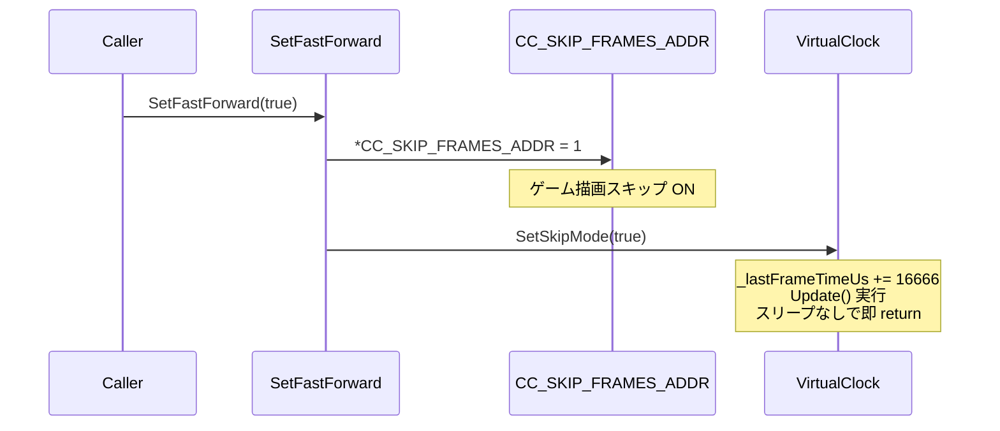
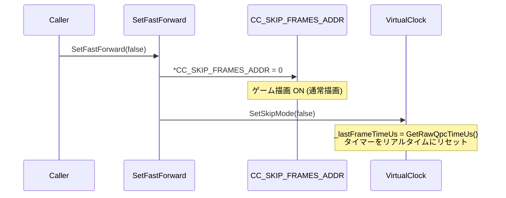
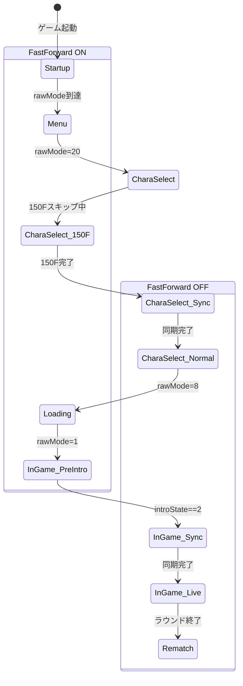

# 高精度フレームタイマー (WASAPI + CPU Spin) 設計

## 1. 目的と要件
格闘ゲームにおける入力同期では「フレームの揺らぎ」が致命的な同期ズレを引き起こします。
本ツールでは通常の `Sleep` ではなく、**WASAPI (Windows Audio Session API) タイマー** と **CPUスピンウェイト** を組み合わせた高精度同期を実現し、ジッター（揺らぎ）を極限まで排除した 60FPS 完全固定環境を構築します。

## 2. 状態ごとのタイマー制御要件
ゲームの進行状態に応じてフレームタイマーの挙動を切り替えます。

### 2.1 対戦画面 (Playing State)
- **対象区間**: ラウンド開始時の「Fight!」から「K.O.」などのリザルト移行まで。
- **制御ロジック**: 
  - WASAPIを用いた高精度タイミングの計測。
  - フレーム間隔 (約 16.666ms) を厳密に守るため、目標時間の 1〜2ms 前までは `Sleep` で待機し、残りの時間は CPUを回し続ける（スピンウェイト）ことで処理落ちやOSのスケジューラによる遅れを防ぐ。

### 2.2 非対戦画面 (Menu, Loading, Select State)
- **対象区間**: 起動ロゴ、キャラクター選択、ステージ読み込み、再戦メニューなど。
- **制御ロジック**:
  - タイマー精度を緩和し、OS標準の `Sleep` 中心の待機に切り替える。
  - 理由: ロード処理等で CPU リソースを過剰に消費するのを防ぎ、ゲーム本来のロード処理を妨げないため。
  - この区間ではロールバックエンジン自体もアイドル（または緩やかな同期）状態に遷移する。

## 3. 実装上の注意 (GGPOベースの考慮)
- ロールバック（巻き戻し＋再シミュレーション）が発生したフレームは、通常の1フレーム分以上の処理時間を消費します。
- スピンウェイトタイマーは「**ゲームのレンダリングを含む1フレームの処理が終わった直後**」から次フレームの開始目標時刻までの時間を待機するためにのみ使用し、処理落ちが発生した（すでに目標時刻を過ぎている）場合は待機をスキップする仕様とします。


---

# プログラム業務仕様書: 高速化モード (SetFastForward)

## 1. 概要

### 1.1 目的
ゲーム本体の描画処理およびフレームタイミング処理を一元的に制御し、
ロード画面・キャラ演出等の非対戦区間を高速通過しつつ、
対戦開始後は正常な描画と高精度フレームタイミングを提供する。

### 1.2 背景
MBAACC のゲームエンジンには内蔵の Sleep 処理があるが、精度が悪い（±数ms のブレ）。
ネットプレイでは ±1F (16.666ms) 以内のフレーム精度が必要なため、
ゲーム側 Sleep を無効化し、自前の高精度タイマー (VirtualClock) に置き換える。

### 1.3 制御対象

| 制御対象 | メモリアドレス/クラス | 役割 |
|---------|---------------------|------|
| ゲーム側描画スキップ | `CC_SKIP_FRAMES_ADDR` (0x55D25C) | N を書き込むと N フレーム描画をスキップ。ゲームが1F消費するごとに-1され 0 で描画再開。 |
| ゲーム一時停止 | `CC_PAUSE_FLAG_ADDR` (0x55D203) | 1 でゲームフレーム進行を一時停止 |
| DLL側フレームタイマー | `VirtualClock::WaitForNextFrame()` | 高精度 Sleep + SpinWait ハイブリッド (QPC ベース) |
| DLL側スキップモード | `VirtualClock::SetSkipMode(bool)` | true: 疑似1F経過 (スリープなし), false: 高精度待機 |

---

## 2. SetFastForward 関数仕様

### 2.1 関数シグネチャ

```cpp
static void SetFastForward(bool enabled);
```

### 2.2 動作定義

#### 高速化 ON (`SetFastForward(true)`)



| 項目 | 値 |
|-----|-----|
| `CC_SKIP_FRAMES_ADDR` | `1` (毎フレーム補充) |
| `VirtualClock::_skipMode` | `true` |
| WaitForNextFrame 動作 | `_lastFrameTimeUs += 16666us` → `Update()` → 即 return |
| 実時間消費 | **≒ 0** (CPU バウンド) |
| 描画 | **OFF** |

#### 高速化 OFF (`SetFastForward(false)`)



| 項目 | 値 |
|-----|-----|
| `CC_SKIP_FRAMES_ADDR` | `0` |
| `VirtualClock::_skipMode` | `false` |
| WaitForNextFrame 動作 | Sleep + SpinWait で正確に 16666us 待機 |
| 実時間消費 | **≒ 16.666ms/F** (60FPS) |
| 描画 | **ON** |

### 2.3 毎フレーム補充

高速化 ON 中は、メインループ先頭で毎フレーム `CC_SKIP_FRAMES_ADDR = 1` を再設定する。

**理由:** ゲームエンジンが1F処理するごとに `CC_SKIP_FRAMES` をデクリメントして 0 に戻すため、
毎フレーム補充しないと描画が復帰してしまう。

```cpp
while (isNetplayActive) {
    if (s_fastForward) {
        *CC_SKIP_FRAMES_ADDR = 1;  // 毎フレーム補充
    }
    // ... フェーズ処理 ...
}
```

---

## 3. VirtualClock::WaitForNextFrame 詳細仕様

### 3.1 通常モード (SetSkipMode = false)

```
1. now = GetRawQpcTimeUs()  (QueryPerformanceCounter ベース)
2. targetTime = _lastFrameTimeUs + 16666
3. remaining = targetTime - now
4. if remaining > 2000us:
     Sleep((remaining - 2000) / 1000)  ← 粗い待機
5. if remaining > 0:
     SpinWait until QPC >= targetTime  ← 精密待機
6. _lastFrameTimeUs = GetRawQpcTimeUs()
7. Update()  (θ補正・ドリフト計算)
```

**精度:** ±50us 程度 (QPC 分解能依存)

### 3.2 スキップモード (SetSkipMode = true)

```
1. if _lastFrameTimeUs == 0:
     _lastFrameTimeUs = GetRawQpcTimeUs()
2. _lastFrameTimeUs += 16666  ← 疑似的に1F経過
3. Update()
4. return  ← スリープなし
```

**内部時刻の一貫性:** Update() が呼ばれることで、θ補正やドリフト計算は
疑似時刻上で正常に動作する。実時間は進まないが、論理時刻は 1F ずつ進行する。

### 3.3 モード切替時の処理

```cpp
void SetSkipMode(bool enabled) {
    _skipMode = enabled;
    if (!enabled) {
        // リアルタイムにリセット → 次の WaitForNextFrame で正しい基準点から開始
        _lastFrameTimeUs = GetRawQpcTimeUs();
    }
}
```

> [!IMPORTANT]
> スキップ解除時のリセットがないと、疑似時刻と実時刻のずれにより
> WaitForNextFrame が大量のフレームを即座に処理しようとする問題が発生する。

---

## 4. フェーズ別 ON/OFF 制御

### 4.1 フェーズ遷移とモード切替



### 4.2 各フェーズの詳細

| # | フェーズ | FastForward | CC_SKIP | VirtualClock | 描画 | 呼び出し箇所 |
|---|---------|------------|---------|-------------|------|-------------|
| 1 | 起動〜メニュー | **ON** | 1 | Skip | OFF | `RunVersusMode()` 初期化時 |
| 2 | キャラセレ 0〜149F | **ON** | 1 | Skip | OFF | 起動時から継続 |
| 3 | キャラセレ 150F → 同期 | **OFF** | 0 | 高精度 | **ON** | `ProcessCharaSelectSync()` |
| 4 | キャラセレ通常進行 | **OFF** | 0 | 高精度 | **ON** | 同上 |
| 5 | Loading | **ON** | 1 | Skip | OFF | `ProcessLoadingSync()` |
| 6 | InGame (introState≠2) | **ON** | 1 | Skip | OFF | Loadingから継続 |
| 7 | InGame (introState==2) 同期 | **OFF** | 0 | 高精度 | **ON** | `ProcessInGameSync()` |
| 8 | 対戦中 | **OFF** | 0 | 高精度 | **ON** | 同上 |
| 9 | Rematch | **OFF** | 0 | 高精度 | **ON** | `ProcessRematchSync()` |

### 4.3 ON/OFF 切替のタイミング条件

| 切替 | 条件 | 説明 |
|-----|------|------|
| ON→OFF | `framesInCharaSelect >= 150` | キャラセレ冒頭スキップ完了 |
| OFF→ON | phase が Loading に遷移 | ロード画面突入 |
| ON→OFF | `*CC_INTRO_STATE_ADDR == 2` | キャラ登場演出開始 (移動可能) |

---

## 5. メモリアドレス詳細

### 5.1 CC_SKIP_FRAMES_ADDR (0x55D25C)

- **型:** uint32_t
- **動作:** ゲームエンジンが毎フレーム1ずつデクリメント。0 で描画実行。
- **書込値:** 高速化時は `1` (1Fスキップ→即座に消費)、通常時は `0`

> [!WARNING]
> `9999` 等の大きな値を書き込むと、その間ゲーム描画が完全に停止する。
> 通常モードに復帰できなくなるため、必ず `1` を使用すること。

### 5.2 CC_PAUSE_FLAG_ADDR (0x55D203)

- **型:** uint8_t
- **動作:** `1` でゲームフレーム進行を完全停止。描画ループは継続。
- **用途:** 同期ポイントで両者のタイミングを揃えるために使用。

### 5.3 CC_INTRO_STATE_ADDR (0x55D20B)

- **型:** uint8_t
- **値:** `2` = キャラ登場演出 (移動・ジャンプ可), `1` = プリゲーム, `0` = 対戦中
- **同期トリガー:** `== 2` の瞬間に高速化を OFF にして同期開始

---

## 6. エラー処理・制約

| 項目 | 内容 |
|-----|------|
| スキップ解除忘れ | `RunVersusMode` 終了時のクリーンアップで `SetFastForward(false)` を必ず呼ぶ |
| CC_SKIP_FRAMES アクセス | ゲームプロセス内 DLL からの直接メモリアクセス。NULLチェック不要 |
| VirtualClock 初期化前 | `GetInstance()` はシングルトン。`Initialize()` 呼び出し前は動作未定義 |
| QPC 分解能 | Windows QPC は通常 0.1us 以上の分解能を持つ。不足時は WASAPI フォールバック |


---


