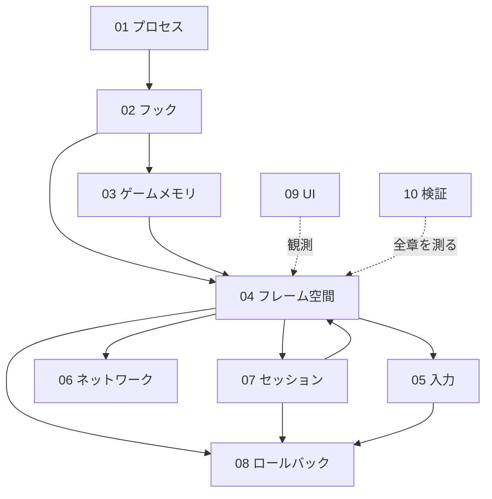

> **旧監査資料（2026-08-13）**。現行仕様は [CURRENT_STATE](../../CURRENT_STATE.md) を参照。本文の「現行」「未実装」は当時の状態。

# 00. 全体設計図 — 目次と全体像

CCCaster_v10（MBAACC 用ロールバック通信ツール）の設計図。10章を並行に書き起こし、
境界を突き合わせて統合したもの。**2026-08-13 時点の実装と実機ログのみを根拠とする。**

`docs/design/` と `docs/requirements/` の他の資料は 2026-02〜03 当時の構成が前提で、
現在のツリーと一致しない。**この `master/` 配下が唯一の現行設計図。**

| 章 | 領域 | 状態 |
|---|---|---|
| [01](01_process_lifecycle.md) | プロセス構成とライフサイクル | 動作中。ただし後始末が一度も走っていない |
| [02](02_hook_layer.md) | フック層 — ゲームへの割り込み口 | 動作中。初期化順序に地雷 |
| [03](03_game_memory.md) | ゲームメモリ層 | 動作中。seam の外に3系統が漏れている |
| [04](04_frame_space.md) | **フレーム空間と時間** | **設計確定・未実装。全体の中核** |
| [05](05_input_pipeline.md) | 入力パイプライン | 2026-08-13 に開通。オフラインは未成立 |
| [06](06_network.md) | ネットワーク層 | 動作中。停止検出が無い |
| [07](07_session_state.md) | セッション状態機械 | 動作中。同期機構は実質不在 |
| [08](08_rollback.md) | ロールバック | 未着手。04/07 が前提 |
| [09](09_ui_overlay.md) | UI とオーバーレイ | 動作中。45% が到達不能 |
| [10](10_verification.md) | 検証基盤 | 2026-08-13 に Linux 対応。ログが読めない |

---

## 1. このツールは何をするものか

MBAA.exe（32bit、Ver.1.07 Rev.1.4.0）に DLL を注入し、**対戦処理をすべてゲームプロセス内で行う**。
2台のゲームが同じ入力を同じタイミングで消費し続ければ、両者の画面は一致する。
それを維持するのがこのツールの全責務である。

```
[ランチャー EXE]                    [MBAA.exe + 注入 DLL]
  ネゴシエーション ──IPC──▶ InitThread ──▶ フック設置 ──▶ SceneRunner::Step()
                                                              │ 毎フレーム
                                    ┌─────────────────────────┼─────────────────────────┐
                                    ▼                         ▼                         ▼
                              入力を取る              相手の入力を待つ            ゲームメモリへ書く
                              (05 入力)               (06 通信 / 04 フレーム)      (03 メモリ)
```

## 2. 中核にある1つの問題

> **`netFrame` はゲームの進行に紐付いていない。**

`netFrame`（`writeHead`）は「`SceneRunner::Step()` が背圧を通過した回数 + 200」でしかなく、
ゲーム側の時計（`WorldTimer`）と一度も突き合わされていない。

実機で確定した恒等式:

```
WT − netFrame = 定数 + starve        （1フレームの誤差もなく一致）
```

背圧が両者の**番号だけ**を D+R 以内に強制的に揃えるため、
起動タイミング・ロード時間・メニュー滞在時間の差で生じたゲーム状態の食い違いが
「番号は合っている」という形で隠蔽され、恒久化する。

同期のための仕掛けは7つあるが（IntroBarrier / phaseBaseFrame / phaseBaseWorldTimer /
WorldTimer / `_latestPeerFrame` / α1 / SetRenderSkipByGap）、**実際に効いているのは背圧1つだけで、
それは番号しか見ていない。**

### 解は実測で確定している

| 実測（REALHW_RESULT） | 帰結 |
|---|---|
| `Present` と `WorldTimer` は厳密に 1:1 | WT を採番の権威にできる |
| WT は Loading 中も 1フレーム1カウント（止まらない） | ロード停止に依存する設計は不可 |
| Counting 突入時の原点は両機で一致（`startFrame=200 WT=0`） | 原点合意は不要 |
| `BaseWT` は intro=2 到達時に各機で採取済み（ラウンド2で host 5412 / client 5560） | **基準点は既にある。使っていないだけ** |

```
relFrame = WT − BaseWT
netFrame = epochId × EPOCH_STRIDE + relFrame
```

`BaseWT` が両機で違う値であることこそが正しい。各自の絶対 WT の差を吸収するのが基準点の役目で、
**交換も合意も要らない**（第4章）。

---

## 3. 章をまたぐ依存関係



**04 と 07 は相互依存**する。フレーム番号の権威は WT（04）だが、
「いつ基準を取り直すか」を決めるのはラウンドの区切り（07）だからである。
両者は**同一コミットで投入する**必要がある（07 の移行手順 T3 に明記）。

**08 は 04 と 07 が完了するまで着手できない。** フレーム番号がゲーム進行と一致していなければ、
巻き戻し先のフレームが何を指すのか定義できないためである。

---

## 4. 各章が独立に発見した「同じ形」の欠陥

10章を突き合わせた結果、**別々の領域で同じ構造の間違いが繰り返されている**ことが分かった。
個別に直すのではなく、パターンとして潰すべきである。

### 4-1. 失敗が無言

| 章 | 例 |
|---|---|
| 05 | デバイス解決失敗 → 無言で入力 0（2026-08-13 に修正） |
| 06 | IPv6 の送信失敗を握り潰す。送信元検証が無い |
| 03 | `MbaaPatcher` が全パッチの戻り値を無視し、失敗しても「適用完了」をログ |
| 06/07 | 相手のゲームが止まっても `Peer Disconnected` が出ない |
| 01 | `SessionErrorType::SyncTimeout` を書くコードが存在しない |

**利用者に見えるのは「動かない」という1種類の症状だけで、原因を示すものが何も無い。**
今回の入力バグが長く残ったのはこれが理由である。

### 4-2. 採取しているのに使っていない

| 章 | 値 | 状態 |
|---|---|---|
| 04/07 | `BaseWT` | ログにのみ出力。**これがフレーム空間の答えだった** |
| 04/07 | `phaseBaseFrame` | 恒久 0。受信側ガードが到達不能 |
| 06 | `_latestPeerFrame` | ログにのみ出力。**停止検出に使える** |
| 06 | `_peerActualPort` | 採取するが送信に使わない |
| 04 | `phaseBaseWorldTimer` | 代入とログのみ |

### 4-3. 生きているコードと死んでいるコードが同名で並んでいる

| 章 | 死 | 生 |
|---|---|---|
| 09 | `ControllerMapper.cpp`(542行) | `Controller_Ui_Logic.cpp` |
| 09 | `NetplayOverlay.cpp`(189行) | `State_Ui_*` |
| 08 | `StateBuffer` | `StateRingBuffer` |

**単体テスト `test_overlay.cpp` が対象にしているのは死んでいる `NetplayOverlay`** であり、
生きた UI のテストは0件（09章）。次の作業者は高確率で死んだ側を直す。

### 4-4. 「ゲームスレッドが生きている」と「ゲームが進んでいる」の混同

通信スレッドはゲームスレッドと独立に動くため、ゲームが完全に停止してもキープアライブは流れ続ける。
実機ログで実際にこれが起きた（ホスト停止 → クライアントが背圧で恒久停止 → **エラー表示なし**）。

---

## 5. 実装の順序

各章の移行手順を突き合わせた結果の推奨順序。**上ほど先。**

| # | 内容 | 章 | なぜこの位置か |
|---|---|---|---|
| 1 | ログの間引き（`[Backpressure] NEAR` の閾値バグ修正を含む） | 10 | **これ以降のすべての判断がログに依存する。** 現状は94%がノイズで定期ログが埋もれる |
| 2 | 相手のフレーム停止検出 | 06 | 両者が無言で固まる。実害が最大。プロトコル変更なしで実装可 |
| 3 | 共有メモリ名の分離 | 01 | 同一PC 2インスタンスが同じ IPC 領域を上書きし合う。**`dual_test.bat` の結果が信用できない** |
| 4 | オフラインのローカルループバック | 05 | Training が構造的に動かない。harness より速い検証手段になる |
| 5 | **`relFrame = WT − BaseWT` + `RoundEpoch`** | 04+07 | 本丸。1〜4 で検証と観測が整ってから入る |
| 6 | 自動ナビの撤去 | 07 | 死んだまま残すと 5 の障害物になる |
| 7 | デッドコード削除 | 09 | 5〜6 で触る領域と重なるので、その前後で |
| 8 | CPU ビジースピンの解消 | 02 | 挙動が変わるので、フレーム空間が安定してから |
| 9 | ロールバック | 08 | 5 の完了が前提 |

**1〜4 はいずれも独立に投入でき、フレーム空間には触れない。**
5 に入る前にこれらを済ませるのは、5 で何かが壊れたときに切り分けられるようにするためである。

---

## 6. 未確定事項（実機・逆アセンブルが必要）

各章の「未確定事項」から、**設計判断を左右するものだけ**を抜き出した。

| # | 内容 | 影響する章 |
|---|---|---|
| 1 | ホストのゲームスレッドが停止した原因（クラッシュか、利用者が閉じたか） | 06, 02 |
| 2 | `MbaaPatcher` のパッチ 4-1 / 4-2 の意図（4-2 は 4-1 のジャンプ範囲の内側にある） | 03 |
| 3 | `+0x1A..0x1B` が未使用パディングか（4バイト書込みが巻き込んでいる） | 03, 05 |
| 4 | ゲームの1ティックを DLL から呼ぶ口があるか（無ければ再計算は協調型に限定される） | 08 |
| 5 | `SetTimeMultiplier(1000)` 下でゲームが時間依存の乱数を引いていないか | 08 |

---

## 7. この設計図の扱い

- **実装が変わったらこの文書も同じコミットで直す。** 監査レポート
  （`docs/issues/AUDIT_2026-08-13.md`）は 2026-08-13 時点の記録なので更新しない
- 各章の「現状の構造」は**実装のスナップショット**であり、腐る。疑わしければコードを読む
- 各章の「目指す設計」は**まだ実装されていない**。ここを現状と誤読しないこと
