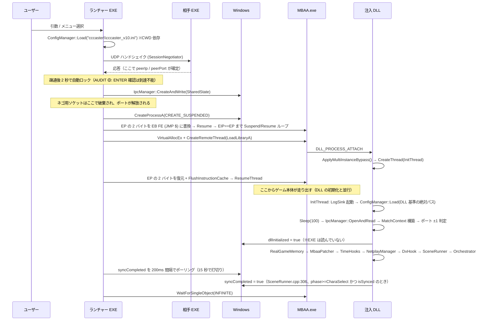

> **旧監査資料（2026-08-13）**。現行仕様は [CURRENT_STATE](../../CURRENT_STATE.md) を参照。本文の「現行」「未実装」は当時の状態。

# 01. プロセス構成とライフサイクル

## 責務

ランチャー EXE が接続先を確定させ、MBAA.exe を停止状態で生成し、そこへ DLL を注入するまでの一連を担う。
2 プロセスに分かれているのは「32bit のゲームプロセス内でしか触れないもの（メモリ・D3D9・DirectInput）」と
「ゲームを起動する前に決まっていなければならないもの（接続先・ポート・設定）」を分離するためである。
両者をつなぐ契約は共有メモリ 1 本のみで、しかも**注入完了後は一方向の通知にしか使われていない**。

---

## 現状の構造

### 主要コンポーネント

| ファイル | クラス / 関数 | namespace | 責務 |
|---|---|---|---|
| `src/cli_launcher/main.cpp` | `main()` | — | 引数解析、INI の先読み、`NetworkSimulator` の有効化 |
| `src/cli_launcher/controller/MainController.cpp` | `MainController` | `cccaster::main_app::controller` | メニュー状態機械、SharedState の構築と書込み、ゲームプロセスの生死監視、終了理由の表示 |
| `src/cli_launcher/network_wrapper/SessionNegotiator.cpp` | `SessionNegotiator` | `cccaster::main_app::network_wrapper` | UDP による疎通確認、RTT/ジッタ計測、`peerIp`/`peerPort`/`localPort` の確定 |
| `src/cli_launcher/ConfigManager.cpp` | `ConfigManager` | `cccaster::main_app` | INI の読み書き。**全メンバが static** |
| `src/launcher/GameLauncher.cpp` | `GameLauncher` | `cccaster::main_app` | `CREATE_SUSPENDED` 起動、EP ロック、`LoadLibraryA` 注入、EP 復元 |
| `src/shared_contracts/IpcData.hpp` | `SharedState` / `IpcManager` | `cccaster::public_api` | プロセス間契約の唯一の定義。ヘッダのみ |
| `src/core_dll/mbaa_mem/dllmain.cpp` | `DllMain` / `InitThread` | — | OS 橋渡しと、注入側の全初期化 |

**プロセス帰属**

| ランチャー EXE 側にあるもの | ゲームプロセス（注入 DLL）側にあるもの |
|---|---|
| ネゴシエーション用 UDP ソケット（対戦開始前に破棄される） | 対戦用 UDP ソケット（`NetplayManager`） |
| コンソール UI / メニュー | ゲーム内オーバーレイ（09） |
| `NetworkSimulator` の有効化（EXE プロセス内のみ、AUDIT B-7） | ゲームメモリ・フック・フレーム処理のすべて |
| INI の書込み（実質未使用） | INI の書込み（`Controller_Ui_Logic`）とゲーム内設定 |
| 終了理由の**表示** | 終了理由の**判定と書込み** |

同じ `ConfigManager` / `UdpSocket` / `NetworkSimulator` の**コードが両プロセスにリンクされている**が、
実体は別々である。この点が後述の事故の温床になっている。

### 処理の流れ

**EP ロックを挟む理由**（コードから読めない部分）:
`CREATE_SUSPENDED` 直後のプロセスは OS ローダの初期化すら終わっていないため、
その時点で `CreateRemoteThread(LoadLibraryA)` を撃つと `kernel32` の初期化と競合する。
一方、素直に Resume するとゲーム本体が走り出してしまい、フックが間に合わない。
EP を `EB FE` で無限ループにしてから Resume すると「ローダは完了済み・ゲームコードは未実行」という
唯一の安全点で足踏みさせられる。`GameLauncher.cpp:97-110` の Suspend/Resume ループは
その点に EIP が到達したことの確認であって、待ち時間の調整ではない。

### プロセス境界をまたぐ契約

#### (1) IPC 共有メモリ `Local\CCCasterV10_SharedState`

固定名・`#pragma pack(1)`・マジック `0xCC100001`。EXE が `CreateAndWrite` し、
**ハンドルを開いたまま**保持することで寿命を保つ（`MainController.cpp:67,181`）。

| フィールド | 書き手 | 読み手 | 実際に使われているか |
|---|---|---|---|
| `magicVersion` | EXE | DLL (`OpenAndRead` のみ) | ✅ 使用。ただし `UpdateOrReadState` は検証しない |
| `targetGameMode` | EXE | DLL → `ctx.appMode` | ✅ |
| `isHost` | EXE | DLL → `ctx.isHost` | ✅ |
| `isIpv6` | EXE | **誰も読まない** | ❌ AUDIT B-6（DLL は常に IPv4 ソケットを開く） |
| `port` | EXE | DLL（`peerPort==0` のときの代替） | ✅ |
| `localPort` | EXE | DLL → `ctx.localPort` | ✅（後述のとおりヘッダのコメントは誤り） |
| `targetIp` | EXE | DLL（`peerIp` が空のときの代替） | ✅ |
| `peerIp` | EXE | DLL → `ctx.peerIp` | ✅ |
| `peerPort` | EXE | DLL → `ctx.peerPort` | ✅ |
| `delayFrames` / `maxRollbackFrames` | EXE (INI 由来) | DLL → `ctx.delay` / `ctx.maxRollback` | ✅ |
| `playerName` | **誰も書かない** | 誰も読まない | ❌ 死フィールド |
| `p1DeviceIndex` / `p2DeviceIndex` | **誰も書かない** | 誰も読まない | ❌ 死フィールド。コントローラ選択は INI 経由（05） |
| `dllInitialized` | DLL (`dllmain.cpp:223`) | **EXE は読まない**（`MainController.cpp:179` に「ポーリングしない」と明記） | ❌ 書きっぱなし |
| `syncCompleted` | DLL (`SceneRunner.cpp:308`) | EXE (`MainController.cpp:109`) | ✅ **唯一の双方向経路** |
| `gameShutdownRequest` | **誰も書かない** | 誰も読まない | ❌ 死フィールド。EXE→DLL の指示経路は存在しない |
| `headlessMode` | EXE | **誰も読まない** | ❌ AI 入力注入は未実装 |
| `lastErrorCode` | DLL (`SceneRunner.cpp:321,341`) | EXE (`MainController.cpp:148`) | ✅ ただし `SyncTimeout` を書くコードは無い（AUDIT 🟡） |
| `currentPingMs` / `currentJitterMs` / `totalRollbackFrames` | **誰も書かない** | 誰も読まない | ❌ 死フィールド |

**要点**: 19 フィールド中、実際に機能しているのは 11。EXE→DLL は起動時の 1 回きり、
DLL→EXE は `syncCompleted` と `lastErrorCode` の 2 つだけである。
「共有メモリがあるから双方向に会話できる」という前提でコードを足すと必ず外す。

#### (2) 起動引数（EXE のみが解釈）

`--headless` / `--host` / `--ip <addr>` / `--port <n>` / `--hash <str>` / `--ipv6` /
`--sim-delay <min,max>` / `--sim-loss <pct>`。
`--sim-*` は EXE プロセス内の `NetworkSimulator` シングルトンにしか届かない（AUDIT B-7）。

#### (3) INI `cccaster_v10.ini`

| 読む側 | パス解決 | 用途 |
|---|---|---|
| EXE (`main.cpp:23`) | 相対 `"cccaster\cccaster_v10.ini"`（CWD 依存） | `[Netplay] DefaultDelay` / `MaxRollback` → SharedState |
| DLL (`dllmain.cpp:146`) | `paths::Resolve()` = **DLL のあるディレクトリ基準の絶対パス** | `[Settings] P1Device` / `P2Device`（05 のデバイス解決） |

### ConfigManager が「プロセスごとに別インスタンス」である件

`ConfigManager::configData` は static メンバ（`ConfigManager.hpp:36`、実体は `ConfigManager.cpp:7`）。
DLL は EXE のコードを**リンク済みバイナリごと持ち込んでいる**ため、同じクラス名でも実体は別プロセスの別変数である。

2026-08-13 以前、DLL 側で `Load` を呼んでいなかった。結果として
`GetString("Settings","P1Device")` が常に `""` を返し、`DirectInputHook.cpp:391` が joyId=-1 に落ち、
`BuildPlayerInput()` が無言の 0 を返し、その 0 が毎フレームゲームメモリに書かれていた。
**症状は「コントローラ設定が何であれ入力が一切効かない」**で、入力パイプライン側には一切バグが無かった。
`dllmain.cpp:137-149` の Load 追加で解消し、REALHW A-5 で実機確認済み。

この事故が示す一般則は「**EXE と DLL で共有されるのはコードであって状態ではない**」。
`static` を持つクラスを両方にリンクしたら、初期化も両方で必要になる。

### 終了経路

| 経路 | 起点 | DLL 側の処理 | EXE 側の表示 | `DllMain(DETACH)` は走るか |
|---|---|---|---|---|
| 正常終了 | ユーザーがゲームを閉じる | なし（`ExitProcess`） | `Match finished normally.` | **走るが `lpReserved != nullptr` のため Shutdown 群はスキップ** |
| Peer Disconnected | `SceneRunner.cpp:318` (`isPeerAlive == false`) | `lastErrorCode=2` → `GC::ExitGame()` | 赤字で切断表示 | **走らない**（`TerminateProcess`） |
| F12 中断 | `SceneRunner.cpp:338` (`GetAsyncKeyState(VK_F12)`) | `lastErrorCode=3` → `GC::ExitGame()` | `User Aborted` | **走らない** |
| 同期タイムアウト | EXE 側 15 秒（`MainController.cpp:121,138-142`） | なし | `SYNC TIMEOUT` + `TerminateProcess` | **走らない** |

`GC::ExitGame()` の実体は `TerminateProcess(GetCurrentProcess(), 1)`（`Platform.cpp:136-144`）。

**DLL_PROCESS_DETACH の処理順**（`dllmain.cpp:316-332`）:
`lpReserved == nullptr`（= `FreeLibrary` によるアンロード）のときだけ
`GameFrameOrchestrator::Shutdown` → `DxHook::Shutdown` → `NetplayManager::Shutdown` → `TimeHooks::Shutdown`
を実行し、最後に `LogSink::Shutdown`。ログを最後に閉じるのは上 4 つのログを取りこぼさないため、
ブロッキング可否を `lpReserved` で切り替えるのは強制終了時に他スレッドが排他を握ったまま消えている可能性があるため。

### 他領域との境界

**この章から出ていくもの**

| 出力 | 受け手 |
|---|---|
| `MatchContext`（appMode / isHost / delay / maxRollback / peerIp / peerPort / localPort） | 05 入力パイプライン、06 ネットワーク、07 セッション状態機械 |
| `TimeHooks::Initialize/SetTimeMultiplier/SetSleepBypass` の**恒久設定** | 02 フック、04 フレーム空間と時間（AUDIT A-4） |
| `RealGameMemory` の設置、`MbaaPatcher::ApplyStartupPatches()` | 03 ゲームメモリ |
| `DxHook::Initialize` → `GameFrameOrchestrator::Register`（Present コールバックの結線） | 02 フック、04 |
| INI の `[Settings] P1Device/P2Device` | 05 入力パイプライン |
| ネゴシエーションで確定したポートと相手アドレス | 06 ネットワーク |

**この章に入ってくるもの**

| 入力 | 出し手 |
|---|---|
| `NetplaySession::GetState().isSynced` / `isPeerAlive` | 06 / 07（`syncCompleted` と `lastErrorCode` の判定材料） |
| `PhaseMonitor::GetCurrentPhase()`（`phase >= CharaSelect` の判定） | 07 セッション状態機械 |
| INI への設定書込み（`Controller_Ui_Logic`） | 09 UI |
| `NetworkSimulator` の有効化要求 | 10 検証基盤 |

---

## 現状の問題

### 監査済み

| ID | この章に関わる形 |
|---|---|
| AUDIT A-4 | `dllmain.cpp:256-257` の `SetTimeMultiplier(1000)` / `SetSleepBypass(true)` は初期化シーケンスの一部として**無条件・恒久**に設定される。解除経路が設計上存在しない |
| AUDIT A-6 / B-8 | `WndProcHook::Shutdown()` と `NetplaySession::Stop()` が DETACH パスに無い。ただし後述のとおり DETACH パス自体がほぼ実行されない |
| AUDIT B-6 | `isIpv6` を DLL が読まない。IPv6 ネゴが成功しても対戦は IPv4 で開かれる |
| AUDIT B-7 | `NetworkSimulator` は EXE プロセス内のシングルトン。DLL には有効化手段が無い |
| AUDIT B-9 | `ApplyMultiInstanceBypass()` の `FindWindowA/W` 潰しが `WndProcHook` の窓探索を永久に失敗させる。ATTACH 時に無条件で適用されるため回避手段が無い |
| AUDIT 🟡 | `SessionNegotiator.cpp:243-251` の 2 秒自動ロックにより、ENTER 確認は到達不能 |
| AUDIT 🟡 | `SessionErrorType::SyncTimeout` を書くコードが存在しない |
| REALHW E | ホストのゲームスレッド停止が切断として検出されない。通信スレッドは独立に生きているため、プロセス分離の代償が直接出ている |

### 新規（本章で確認）

| # | 内容 | 根拠 |
|---|---|---|
| **P-1** | **DETACH のクリーンアップは production では一度も走らない。** `lpReserved == nullptr` は `FreeLibrary` 経由のときだけ真になるが、この DLL を `FreeLibrary` するコードはどこにも無い。正常終了は `ExitProcess`（`lpReserved != nullptr`）、異常終了は `TerminateProcess`（DETACH 自体が呼ばれない）。したがって A-6 / B-8 を「DETACH に追加する」形で直しても効果はゼロ | `dllmain.cpp:320` / `Platform.cpp:136-144` |
| **P-2** | **オフラインモード（Training / Spectator）は 15 秒で強制終了される。** `syncCompleted` は `isSynced` を条件とし、`isSynced` は `NetplaySession.cpp:225` のハンドシェイク成立でしか true にならない。相手のいない Training では永久に false のままなので、`MainController.cpp:138-142` が `TerminateProcess` する | `SceneRunner.cpp:302-313` / `NetplaySession.cpp:225` / `MainController.cpp:138-142` |
| **P-3** | **共有メモリ名が固定で、同一 PC の 2 インスタンスが同じ領域を奪い合う。** `dual_test.bat` は 1 台で 2 インスタンスを起動するが、両方が同じ `Local\CCCasterV10_SharedState` に `memcpy` する。後発の書込みが先発の状態を上書きし、また片方が書いた `syncCompleted` / `lastErrorCode` を**もう一方のランチャーも読む** | `IpcData.hpp:13,117` / `_TEST_MBAACC/dual_test.bat:34,44` |
| **P-4** | **EXE 側の INI 読込みは `dual_test.bat` の起動方法では必ず失敗する。** `main.cpp:23` は相対パス `cccaster\cccaster_v10.ini` だが、バッチは `cd` してから `cccaster` フォルダ内で EXE を起動するため、解決先は `cccaster\cccaster\...` になる。`DefaultDelay` / `MaxRollback` は常に既定値 2 / 4 にフォールバックし、INI の値は無視される。DLL 側だけが DLL 基準の絶対パスで正しく解決している | `main.cpp:23-30` vs `dllmain.cpp:146` |
| **P-5** | **`localPort` のヘッダコメントが実装と食い違う。** `IpcData.hpp:49` は「Client=0」と書くが、`SessionNegotiator.cpp:319` は `socket.GetPort()`（= 引数の bindPort）を無条件に返す。クライアントもホストと同じポート番号を返す。この誤解のまま ±1 シフト条件を読むと成立理由が分からなくなる | `IpcData.hpp:49` vs `SessionNegotiator.cpp:318-320` |
| **P-6** | **同一 PC 判定が私有アドレス全般を拾う。** `dllmain.cpp:196-199` は `192.168.` / `10.` / ループバックを「同一 PC」とみなす。LAN 上の別 PC 同士でも真になるが、両者が対称にシフトするため**結果的に破綻しない**。`172.16.0.0/12` は漏れているので、そこだけ非対称になる余地がある | `dllmain.cpp:194-219` |
| **P-7** | **`ConfigManager::Save` の呼び出し先パスが 2 系統ある。** `Controller_Ui_Logic.cpp:143` は `paths::Resolve()`、`ControllerMapper.cpp:107` は相対 `"cccaster\cccaster_v10.ini"`。後者は AUDIT 🟡 のとおり到達不能コードだが、生かした瞬間に別ファイルへ書く | `Controller_Ui_Logic.cpp:143` / `ControllerMapper.cpp:107` |

### ポート決定と peerIp の由来

**ホストとクライアントで `peerIp` の出所が違う。**

| | ホスト | クライアント |
|---|---|---|
| `peerIp` の由来 | **受信した最初のパケットの送信元 IP**（`SessionNegotiator.cpp:168-172`。`if (isHost)` ガードで囲まれている） | ハッシュの復号結果、または `--ip`。**事前に確定している** |
| `peerPort` の由来 | 同上、送信元ポート | ハッシュ内の port、または `--port` |
| `localPort` | `socket.GetPort()` = 指定ポート（既定 7500） | `socket.GetPort()` = **ホストと同じ番号** |

クライアントが自ポートをホストと同じ番号にバインドできるのは `UdpSocket.cpp:38` の
`reuse_address(true)` があるため。同一 PC ではホストのランチャーと同じ 7500 に両方が乗る。

**±1 シフト**（`dllmain.cpp:194-219`）は、この「同一 PC で両者の `localPort` が 7500 で衝突する」状況を
DLL 側で解く。判定条件は `isLocalPeer && localPort == peerPort` の 1 つだけで、

- クライアント: 自分の `localPort` を +1（7501 にバインド）
- ホスト: 送信先 `peerPort` を +1（7501 へ送る）

と**役割ごとに違うフィールドをずらす**ことで対称性を保つ。
ネゴシエーション用ソケットは `RunNegotiation` の戻りで破棄されるので、7500 は DLL 注入前に解放されている。

---

## 目指す設計

### 設計原則

1. **プロセス境界は「起動時に確定するもの」だけを渡す。** 実行中の双方向通信を共有メモリに足さない。
   現状の `gameShutdownRequest` のような「使う予定だったフィールド」を残すと、次の作業者が
   「経路がある」と誤認する。使わないフィールドは消す。
2. **契約はコードで検証する。** `SharedState` の各フィールドに「誰が書き誰が読むか」を静的に対応づけ、
   片側しか存在しないフィールドをビルド時か単体テストで検出する。
3. **インスタンス識別子を契約に含める。** 共有メモリ名を固定にしたことが同一 PC 検証を壊している。
   ±1 のポートシフトも同じ問題への場当たり的対処であり、識別子が入れば両方まとめて消える。
4. **終了は「DLL が状態を書く → EXE が表示する」だけに保つ。** クリーンアップを DETACH に頼らない。
   DETACH は実際には走らない（P-1）ので、必要な解放は自前の終了関数で明示的に行う。
5. **オフラインとネットプレイでライフサイクルを分ける。** 現状は「同期完了」が唯一の生存確認になっており、
   相手のいないモードが構造的に成立しない（P-2）。

### 変更点

| # | 変更 | 解決する問題 |
|---|---|---|
| C-1 | 共有メモリ名に**ランチャーの PID を付与**し、その PID を `MBAA.exe` の起動引数か環境変数で子プロセスへ渡す。DLL は自分の親（＝起動元）の名前でだけ開く | P-3。ついでに ±1 シフト（P-6）の前提だった「同一 PC = 同一共有メモリ」も解消 |
| C-2 | ポートを**ネゴシエーション時に確定させて `SharedState` に入れる**。DLL 側の ±1 ロジックを削除する | P-5, P-6。ポート決定の責務を 1 か所に寄せる |
| C-3 | `SharedState` から死フィールド（`playerName`, `p1/p2DeviceIndex`, `gameShutdownRequest`, `currentPingMs`, `currentJitterMs`, `totalRollbackFrames`）を削除。`isIpv6` は削除ではなく **DLL 側で読む**（06 と協調） | 契約の実態化。B-6 |
| C-4 | INI のパス解決を **EXE も実行ファイル基準の絶対パス**に統一（`paths::Resolve` 相当を EXE 側にも用意） | P-4, P-7 |
| C-5 | `syncCompleted` を「ネットプレイ同期完了」から「**DLL の起動が完了した**」に意味を変え、ネットプレイ同期は別フラグにする。オフラインモードは前者だけで待ちを抜ける | P-2 |
| C-6 | `SessionErrorType::SyncTimeout` を **EXE 側で書く**（タイムアウトを検出するのは EXE なので、DLL に書かせようとしたのが誤り） | AUDIT 🟡 |
| C-7 | 明示的な `Shutdown()` を `GC::ExitGame()` の直前に置き、DETACH には何も期待しない | P-1, A-6, B-8 |
| C-8 | `--sim-delay` / `--sim-loss` を `SharedState` に載せ、DLL 側の `NetworkSimulator` を有効化する | AUDIT B-7（10 と協調） |

### 移行手順

**段階 1 — 契約の実態化（C-3, C-4, C-6）**
死フィールドの削除と INI パスの統一。振る舞いを変えないため回帰リスクが最も低い。
*検証可能になること*: `SharedState` の全フィールドについて書き手と読み手が存在することを、
grep ベースの単体テストで固定できる。以降フィールドを足すときに片側実装が入らない。

**段階 2 — インスタンス分離（C-1, C-2）**
共有メモリ名に PID を入れ、ポート決定を EXE に集約する。
*検証可能になること*: **同一 PC の 2 インスタンステストが初めて信用できる状態になる**。
現状 `dual_test.bat` の結果は P-3 の上書きレースを含んでおり、
「実機で再現した」と言っても何が起きたのか確定できない。ここを通すまで実機ログの解釈は保留すべき。

**段階 3 — ライフサイクルの分離（C-5, C-7）**
起動完了フラグと同期完了フラグの分離、明示 Shutdown の導入。
*検証可能になること*: Training モードが 15 秒で落ちなくなり、
**ネットプレイ以外の経路でフック・入力・オーバーレイを単独で検証できる**ようになる。
これは 02/03/05/09 のデバッグコストを直接下げる。

**段階 4 — 検証経路の接続（C-8）**
`NetworkSimulator` を DLL 側に届ける。
*検証可能になること*: ロス・遅延耐性の試験が初めて実行可能になる（10 と共同）。

---

## 未確定事項

| # | 内容 | 確認方法 |
|---|---|---|
| U-1 | REALHW E のホストフリーズの原因。`Present` が来なくなった理由が、ゲーム側のハングか、DxHook 内のデッドロックか、ユーザーの操作かを区別できていない | 再現時にウィンドウが応答するか（タイトルバーが動くか）を観察。加えてゲームスレッドのスタックを取得 |
| U-2 | `ApplyMultiInstanceBypass()` の `CreateMutexA` パッチ（`dllmain.cpp:69-83`）が MBAA のどの呼び出しを対象にしているか。`ret 12` は `CreateMutexA` の 3 引数と整合するが、ゲームが `CreateMutexW` や `CreateMutexExA` を使っていた場合は無効。フェイクハンドル `0x1337` を後で `CloseHandle` に渡していないかも未確認 | MBAA.exe の逆アセンブルによるインポート確認 |
| U-3 | EP ロックの Suspend/Resume ループ（`GameLauncher.cpp:100-110`）が 32bit ゲームの単一スレッド起動を前提にしている。MBAA が EP 到達前に別スレッドを起こす場合、`_pi.hThread` 以外が走り出す | 実機で `CREATE_SUSPENDED` 直後のスレッド数を確認 |
| U-4 | 共有メモリに PID を入れる場合の受け渡し方法。`MBAA.exe` の起動引数はゲーム本体が解釈する可能性があるため、環境変数（`CreateProcessA` の `lpEnvironment`）が安全と推測されるが、MBAA が環境変数を継承したまま何かするかは未確認 | 実機で環境変数付き起動を試す |
| U-5 | `reuse_address(true)`（`UdpSocket.cpp:38`）で同一 PC の 2 プロセスが同じ UDP ポートに bind したとき、Windows でどちらがパケットを受け取るかは未定義に近い。ネゴシエーションが「動いている」のは偶然の可能性がある | 同一 PC で 2 インスタンスを起動し、両ソケットの受信数を計測 |
