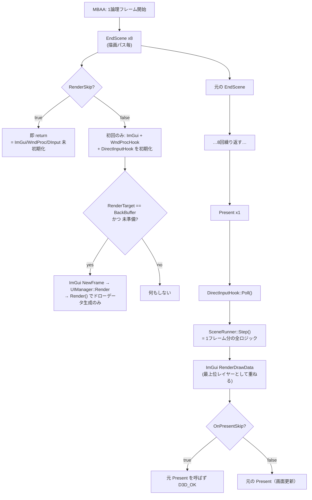

> **旧監査資料（2026-08-13）**。現行仕様は [CURRENT_STATE](../../CURRENT_STATE.md) を参照。本文の「現行」「未実装」は当時の状態。

# 02. フック層 — ゲームへの割り込み口

## 責務

MBAA.exe というブラックボックスの中に、こちらのコードを実行する足場を作る。具体的には3つ。

1. **フレーム境界の獲得** — ゲームの1論理フレームがどこで終わるかを知る手段は D3D9 の `Present` しかない。ここを起点に DLL の全ロジックが動く。
2. **時間の主導権の奪取** — ゲーム内蔵のフレームリミッタを無効化し、ペース制御の権限を `Metronome` に移す。
3. **入出力経路の割り込み** — ウィンドウメッセージ（ホットキー・ImGui）と、ゲーム自身のキーボード読み取りの停止。

**フック層は判断をしない。** イベントを上位（`GameFrameOrchestrator` → `SceneRunner`）へ転送するだけの層として設計されている。ただし `TimeHooks` だけはこの原則から外れており、プロセス全体に恒久的な副作用を撒いている（後述）。

---

## 現状の構造

### 主要コンポーネント

| # | 対象 | 手法 | 設置箇所 | 呼出頻度 | スレッド |
|---|---|---|---|---|---|
| H1 | `IDirect3DDevice9::EndScene` (vtable[42]) | MinHook。ダミーデバイスを生成して vtable を複製 | `DxHook.cpp:119-133` ← `dllmain.cpp:273` | **1F 約8回** | ゲームスレッド |
| H2 | `IDirect3DDevice9::Reset` (vtable[16]) | 同上 | `DxHook.cpp:127-131` | 解像度変更 / Alt+Tab 復帰時 | ゲームスレッド |
| H3 | `IDirect3DDevice9::Present` (vtable[17]) | MinHook。**初回 `EndScene` の中でゲーム実デバイスの vtable から動的に**取得 | `DxHook.cpp:170-186` | **1F 1回** | ゲームスレッド |
| H4 | `kernel32!Sleep` / `QueryPerformanceCounter` / `GetTickCount`、`winmm!timeGetTime` | MinHook インラインフック | `TimeHooks.cpp:113-135` ← `dllmain.cpp:254` | 任意。ゲームは毎フレーム複数回 | **プロセス全スレッド** |
| H5 | ウィンドウプロシージャ | `SetWindowLongPtr(GWLP_WNDPROC)` | `WndProcHook.cpp:20` ← `GameFrameOrchestrator.cpp:140` | メッセージ毎 | ウィンドウスレッド（＝ゲームスレッド） |
| H6 | `user32!FindWindowA/W`、`kernel32!CreateMutexA` | **生バイト書き換え**（MinHook を使わない） | `dllmain.cpp:54-84` ← `DllMain(ATTACH)` | 恒久 | プロセス全スレッド |
| H7 | MBAA 本体コードの入力クリアループ / キーボードマップ / 非アクティブ判定 | NOP・ゼロ埋め | `MbaaPatcher.cpp:27-53` | 起動時1回 | — |
| – | `DirectInputHook` | **フックではない**。`DirectInput8Create` で自前デバイスを列挙 | `DirectInputHook.cpp:84-90` | `Poll()` が 1F 1回 | ゲームスレッド |

補助スレッドが1本ある。`TimeUpdateThread`（`TimeHooks.cpp:73-99`）が 1ms 周期で実時間の経過を積算し、`g_addedQPC/GTC/TGT` に「加算すべき水増し量」を溜める。フック関数はこの値を足して返すだけなので、フック自体は軽い。

### 処理の流れ



**なぜ `Present` が駆動の入口なのか。** `EndScene` は描画パスごとに呼ばれるため、1F に約8回来る（`GameFrameOrchestrator.cpp:36-39` のコメントおよび `:112`）。フレーム境界として使えない。対して `Present` はバックバッファのフリップ 1 回に対応し、実機ログで `ΔWorldTimer = ΔPresent回数 = 60` が全フェーズ・98サンプル×2機で例外なく一致している（`REALHW_RESULT_2026-08-13.md` B-2）。**`Present` はゲームの論理フレームと厳密に 1:1** であり、これがフレーム空間設計（04章）の前提になっている。

**なぜ ImGui の描画が2箇所に割れているのか。** `EndScene` で `RenderDrawData` すると、その後に来る7回のゲーム描画に上書きされる。そこで `EndScene` ではドローデータの生成まで（`GameFrameOrchestrator.cpp:168-223`）、実際の転送は全描画完了後の `Present` 直前（`:87-92`）に行う。`s_imguiFrameReady` はこの2段階を繋ぐフラグで、1F1回のガードも兼ねる。

**なぜ `Present` だけ動的フックなのか。** `EndScene`/`Reset` はダミーデバイスの vtable から静的に取れているのに、`Present` は初回 `EndScene` でゲーム実デバイスの vtable から取り直している（`DxHook.cpp:171-172`）。ダミーデバイスとゲームの実デバイスで `Present` の実装アドレスが一致しないケースがあった、という経緯だと**推測**するが、コードにもコメントにも根拠は残っていない（→ 未確定事項）。

**`TimeHooks` が何をしているか。** `dllmain.cpp:256-257` が `SetTimeMultiplier(1000)` と `SetSleepBypass(true)` を**恒久設定**する。狙いは1つで、**ゲームからフレームペースの決定権を取り上げること**である。MBAA の内蔵リミッタは `timeGetTime`/QPC で経過を測り `Sleep` で待つが、時計が 1000 倍速で進み `Sleep` が即返るため、待機条件が常に成立済みになりリミッタが機能しない。結果ゲームは無制限 FPS で走り、ペース制御は `Metronome`（04章）が `Present` の入口で行う一元管理になる。FastBoot（07章）がメニューを高速に流せるのも同じ仕組みに乗っている。

### 他領域との境界

| 相手 | 境界 | 向き |
|---|---|---|
| **01 プロセス** | `DllMain` → `InitThread` が全フックを設置順に並べる。フック層は「誰がいつ Initialize を呼ぶか」を持たない | 01 → 02 |
| **03 ゲームメモリ** | `MbaaPatcher`（H7）はゲームコードの書き換えなので実体は 03 側。フック層は「ゲームが自前でキーボードを読む経路を H7 が塞いでいる」ことに依存 | 03 → 02 |
| **04 フレーム空間と時間** | `Present` 到達回数がフレームの刻み。`TimeHooks::Real*` が唯一の「本物の時計」。実際の呼び出しは `Platform.hpp` 経由（後述） | 02 → 04 |
| **05 入力パイプライン** | `DirectInputHook::GetLocalPlayerInput()` が入力の生成源。呼ぶのは `SceneRunner.cpp:201` | 02 → 05 |
| **06 ネットワーク** | 直接の依存なし。ただし `SetSleepBypass(true)` が通信スレッドの待機を破壊しており、間接的に最も強く影響している | 02 → 06（副作用のみ） |
| **07 セッション状態機械** | `OnPresent` → `SceneRunner::Step()` の1本だけ。フック層は状態を知らない | 02 → 07 |
| **08 ロールバック** | 現状未接続。将来 1F 内で複数回の再シミュレートを行う場合、`Present` 1回 = 1フレームという前提の見直しが要る | — |
| **09 UI** | `WndProcHook` はメッセージを `UIManager::HandleWndProcMessage` に丸投げするだけ（`WndProcHook.cpp:43`）。ImGui の初期化・描画は `GameFrameOrchestrator` が持つ | 02 ⇄ 09 |
| **10 検証基盤** | harness には `TimeHooks` の stub（`harness_stubs.cpp:158-172`）が入り、フック層全体が存在しないものとして動く。`Platform.hpp` がこの差を吸収する | 02 → 10 |

### `Platform.hpp` seam（2026-08-13 新設）

`src/core_dll/common/Platform.hpp` は「時刻取得・待機・CPU 緩和・中断・プロセス終了」の唯一の窓口である。**目的は harness を Linux でビルドできるようにすること**で、`TimeHooks::Real*` を直接呼んでいた箇所を Platform 経由に置き換えた（`Platform.cpp:43,71`）。呼び出し元は `SceneRunner.cpp:42,338` / `NetplaySession.cpp:157,159` / `Metronome.cpp:64,66` / `WasapiClock.cpp:155` / `FrameControl.hpp:103` / `harness_main.cpp`。

seam としての位置づけで重要なのは次の点。

- **`Platform.hpp` は `windows.h` を include しない。** これを破るとヘッダを取り込んだ側が Windows 専用に戻り、seam の意味が消える。
- **`SleepMs()` と `RealSleepMs()` は意図的に別物**（`Platform.hpp:16-27`）。前者はフック後の `::Sleep`、後者は `TimeHooks::RealSleep`。移行時に挙動を変えないため、既存の呼び出しはすべて `SleepMs()` に対応させてある。**つまり A-4 のビジースピンは Platform 導入では直っていない**。直す作業は「`SleepMs` → `RealSleepMs` に置き換える」1行単位の判断に縮小されており、seam はそのための準備という位置づけ。
- `RealMonotonicUs()` はフック前 QPC を使う。ゲーム側の 1000 倍速時計と混ざらないことが、ネットワーク層の θ/RTT 計測（06章）の前提になっている。

---

## 現状の問題

### AUDIT 既知（行番号は現ツリーで再確認済み。AUDIT 記載値からずれているものは併記）

| ID | 内容 | 現ツリーの根拠 |
|---|---|---|
| **B-1** | **`RenderSkip` が ImGui / WndProcHook / DirectInputHook の初期化を丸ごとブロックする。** `SceneRunner::Init` が `SetModeHighSpeedSkip()` で RenderSkip=true にし（`SceneRunner.cpp:107`）、これを落とす唯一の経路 `SetRenderSkipByGap(0)`（`:158`）は **FastBoot 早期 return（`:144-152`）より後ろ**にある。RenderSkip が真の間 `OnEndScene` は `GameFrameOrchestrator.cpp:116-118` で即 return し、`:121-145` の初期化ブロックに永久に到達しない | AUDIT 記載 `SceneRunner.cpp:111,148,163` → 現 `107,144,158` |
| **B-10** | **`TimeHooks::Initialize()` が `MH_ERROR_ALREADY_INITIALIZED` を失敗扱いする**（`TimeHooks.cpp:108-111`）。`DxHook::Initialize` は許容している（`DxHook.cpp:115`）。現在は dllmain が TimeHooks を先（`:254`）、DxHook を後（`:273`）に呼ぶので通っているが、**順序を入れ替えた瞬間、時間フックが黙って全滅する**。しかも `s_initialized` が false のままなので `Shutdown()` も no-op になり、痕跡が残らない | `TimeHooks.cpp:108-111` / `dllmain.cpp:254,273` |
| **A-4** | **`SetSleepBypass(true)` は MinHook のインラインフックなので、自 DLL の `Sleep()` も化ける。** `Hooked_Sleep`（`TimeHooks.cpp:39-47`）は呼び出し元を一切区別しない。`Platform::SleepMs` は意図的にフック後の `::Sleep` を呼ぶ（`Platform.cpp:63`）ため、`NetplaySession.cpp:157` と `Metronome.cpp:64` の `SleepMs(1)` は実機で `Sleep(0)` になり、通信スレッドとゲームスレッドが常時ビジースピンする | `TimeHooks.cpp:39-47` / `Platform.cpp:60-67` |
| **A-2** | 上記の帰結として、**ゲーム内蔵フレームリミッタは常時無効**。`Metronome` は Counting 到達まで Start しないため、その窓ではペースを決める主体が誰もいない（詳細は 04章） | `dllmain.cpp:256-257` |
| **A-6** | **`WndProcHook::Shutdown()` の呼び出し元が 0 件。** DLL アンロード時、ゲームの `WndProc` がアンロード済みメモリを指し続ける | grep 結果: 定義（`WndProcHook.cpp:33`）と `Initialize`（`GameFrameOrchestrator.cpp:140`）のみ |
| **B-9** | **`dllmain.cpp:54-67` の `FindWindowA/W` 全プロセスパッチにより、`WndProcHook.cpp:15-16` は永久に NULL を得る。** ただし実害は限定的で、NULL のとき引数の `hwnd`（= `params.hFocusWindow`）がそのまま使われるため結果的に正しい HWND にフックできている。**問題は「効いていないコードが正常系のように残っていること」**で、次に FindWindow を使った瞬間に踏む | `dllmain.cpp:56-67` / `WndProcHook.cpp:15-17` |

### 新規（本章で確認）

| ID | 内容 | 根拠 |
|---|---|---|
| **N-1** | **アンロード時の順序が逆。** `dllmain.cpp:322` の `DxHook::Shutdown()` が `MH_Uninitialize()`（`DxHook.cpp:157`）でトランポリンを解放するが、`TimeUpdateThread` はまだ生きており（停止は `dllmain.cpp:324` の `TimeHooks::Shutdown()`）、その間 `pOrigSleep(1)` / `pOrigQPC()`（`TimeHooks.cpp:78-95`）で解放済みメモリを呼び続ける | `dllmain.cpp:321-324` / `DxHook.cpp:156-157` / `TimeHooks.cpp:73-99` |
| **N-2** | **`TimeHooks::Shutdown()` が `MH_DisableHook(MH_ALL_HOOKS)` を呼ぶ**（`TimeHooks.cpp:158`）。自分が張った4つだけでなく D3D9 フックも巻き添えにする。所有権が曖昧で、呼び順を変えると相手を壊す | `TimeHooks.cpp:158` / `DxHook.cpp:156` |
| **N-3** | **`Present` の動的フックに失敗すると、以後毎 `EndScene`（8回/F）で `MH_CreateHook` を再試行し `HookLog` を出す**（`DxHook.cpp:170-185`。`isPresentHooked` は成功時しか立たない）。480行/秒のログが出て、しかもフレーム駆動は一切来ない | `DxHook.cpp:170-186` |
| **N-4** | **`CreateMutexA` の生パッチはプロセス全体に効く**（`dllmain.cpp:71-83`）。ゲーム以外（CRT・winmm・asio・ImGui など）が `CreateMutexA` を呼ぶと偽ハンドル `0x1337` を受け取り、`WaitForSingleObject`/`CloseHandle` が静かに失敗する。**推測:** 現在は誰も踏んでいないだけで、依存ライブラリを増やすと踏みうる | `dllmain.cpp:71-83` |
| **N-5** | **`WndProcHook::HookedWindowProc` の分岐が実質2択しかない**。`result == 0`（ゲームに通す）と `result == -1`（判定なし）はどちらも `CallWindowProc` に落ちるため区別が無い（`WndProcHook.cpp:44-48`）。`UIManager` 側は3値を返す契約で書かれている（`UIManager.cpp:85`） | `WndProcHook.cpp:44-48` |
| **N-6** | **1000 倍速時計が ImGui にも適用される。推測:** `imgui_impl_win32` の `NewFrame` は `QueryPerformanceCounter` で `io.DeltaTime` を算出するため、フック済み QPC を読んで 1000 倍の値になる。キーリピート・ダブルクリック判定・アニメーションが実用外になっているはず。UI 側で違和感が報告されたら、まずここを疑う | `TimeHooks.cpp:49-55` / `GameFrameOrchestrator.cpp:168-170` |
| **N-7** | **`DirectInputHook` は名前に反してフックを一切張っていない。** `DirectInput8Create` で自前のデバイスを列挙・ポーリングしているだけ（`DirectInputHook.cpp:80-91`）。ゲーム自身の入力読み取りを止めているのは `MbaaPatcher`（H7）であり、両者は別ファイル・別レイヤーに分かれていて依存関係がコード上に現れない。**キーボードに至ってはデバイスすら作っておらず、`ImGui::IsKeyDown` を読んでいる**（`DirectInputHook.cpp:239-247`）。したがって B-1 で ImGui が初期化されない状態では、キーボード入力も同時に死ぬ | `DirectInputHook.cpp:80-91,239-247` / `MbaaPatcher.cpp:27-41` |

---

## 目指す設計

### 設計原則

1. **フックは転送のみ。ポリシーを持たない。** `DxHook` はこの原則を満たしている（コールバック登録だけで、判断は `GameFrameOrchestrator`）。`TimeHooks` は満たしていない。プロセス全体の時計を書き換えるのは「転送」ではなく「政策」であり、政策は上位が持つべき。
2. **フレーム駆動の入口は `Present` 1点に固定する。** `EndScene` は描画専用。ここに副作用のあるロジックを足さない（8回走るため）。
3. **初期化とポリシーを分離する。** 「オーバーレイを描くか」（RenderSkip）と「オーバーレイを初期化したか」は無関係でなければならない。B-1 の本質はこの2つが同じ if に入っていること。
4. **時間改変はスコープを持つ。** 少なくとも「自 DLL のスレッドは常に本物の時計を使う」を保証する。理想は呼び出し元判定だが、現実解は Platform seam の徹底。
5. **設置と解除は対称にする。** `Initialize` を持つものは必ず DETACH パスから `Shutdown` される。MinHook の所有者を1つに決める。
6. **OS 依存は `Platform.hpp` だけ。** 新規コードで `windows.h` を直接触ってよいのは `Platform.cpp` と `hook/` 配下のみ。

### 変更点

| # | 変更 | 対応 | 主な変更先 |
|---|---|---|---|
| 2-A | ImGui / WndProcHook / DirectInputHook の初期化を `RenderSkip` の early return より**前**へ移す | B-1, N-7 | `GameFrameOrchestrator.cpp:114-145` |
| 2-B | `TimeHooks::Initialize()` で `MH_ERROR_ALREADY_INITIALIZED` を成功扱いにする。ついでに MinHook の初期化・終了を専用の小さな所有者（例 `MinHookOwner`）に集約し、`DxHook`/`TimeHooks` の双方から `MH_Initialize`/`MH_Uninitialize`/`MH_DisableHook(ALL)` を呼ばない | B-10, N-2 | `TimeHooks.cpp:108-111,158` / `DxHook.cpp:115,156-157` |
| 2-C | DETACH パスの順序を「自前スレッド停止 → コールバック解除 → フック解除 → MinHook 終了」に直し、`WndProcHook::Shutdown()` / `NetplaySession::Stop()` を追加 | A-6, N-1 | `dllmain.cpp:316-332` |
| 2-D | CPU を返したい待機を `Platform::RealSleepMs` に切り替える。対象は通信スレッドと Metronome の待機ループ | A-4 | `NetplaySession.cpp:157` / `Metronome.cpp:64` |
| 2-E | `Present` 動的フックの再試行に上限（例 3回）とワンショットログを入れ、失敗を致命エラーとして扱う | N-3 | `DxHook.cpp:170-186` |
| 2-F | `FindWindowA/W` パッチを撤去し、`WndProcHook::Initialize` の FindWindow フォールバックも削除して `hFocusWindow` 一本にする。多重起動抑止に本当に要るのは Mutex 側だけかを実測で確認する | B-9 | `dllmain.cpp:54-67` / `WndProcHook.cpp:15-17` |
| 2-G | `CreateMutexA` パッチを「MBAA が使う名前のときだけ偽装」に絞る | N-4 | `dllmain.cpp:69-83` |
| 2-H | `DirectInputHook` を `LocalInputSource` 等に改名し、`MbaaPatcher` のキーボード封じとの依存関係をコメントではなく初期化順で表現する | N-7 | `hook/DirectInputHook.*` |
| 2-I | `WndProcHook` の戻り値を2値（consume / pass）に縮める | N-5 | `WndProcHook.cpp:44-48` / `UIManager.cpp:88` |

### 移行手順

順序に意味がある。**2-A を最初に置くのは、これが直るまで実機で何が起きているかを画面で確認できないため。**

```
Step 1  2-A（RenderSkip と初期化の分離）
        → オーバーレイとコントローラが起動直後から生きる。以降の実機観測が可能になる。
        検証: FastBoot 中にオーバーレイが表示されること。実機のみ。

Step 2  2-B → 2-C（MinHook 所有権の一本化とアンロード対称化）
        → 順序依存の地雷と use-after-free を同時に潰す。2-B を先にしないと
          2-C で呼び順を触った瞬間 B-10 を踏む。
        検証: DETACH 経路を通す E2E（ゲーム終了）でクラッシュしないこと。

Step 3  2-E, 2-I（局所修正。副作用なし）

Step 4  2-D（RealSleepMs への切替）
        → CPU 2 コアが返る。ただしフレームタイミングが変わるため、
          04章の Metronome 変更と同時に実機で計測し直す。
        検証: CPU 使用率と、実機ログの ΔWT / ΔnetFrame 比。

Step 5  2-F, 2-G（多重起動バイパスの縮小）
        → 2窓テストが壊れないことが唯一の合否条件。dual_test.bat で確認。

Step 6  2-H（改名）。他が落ち着いてから。差分が大きく、混ぜると原因切り分けが崩れる。
```

`SetTimeMultiplier(1000)` / `SetSleepBypass(true)` の撤廃はこの計画に**入れない**。ゲームからペース制御を奪う構造そのものが 04章の設計に組み込まれており、フック層単独では判断できない。

---

## 未確定事項

1. **`Present` を動的フックしている理由。** ダミーデバイスの vtable[17] では駄目だった経緯があるはずだが、記録が無い。静的化できれば N-3 の再試行問題ごと消える。
2. **`SetTimeMultiplier(1000)` の「1000」に根拠があるか。** どの処理がこの倍率を要求しているか特定できていない。FastBoot のメニュー送りが依存していると**推測**するが未検証。倍率を下げられるなら N-6（ImGui の DeltaTime 汚染）は緩和できる。
3. **Sleep バイパスを解除したときにゲーム内蔵リミッタが復活するか。** 復活すると `Metronome` と二重にペース制御が効き、どちらが勝つか不明。`SetTimeMultiplier` を残したままなら復活しないはずだが、実測していない。
4. **`REALHW_RESULT` E のホストフリーズ（`Present` が来なくなる）がフック層起因か。** `MH_CreateHook` はスレッドをサスペンドするため、`Hooked_EndScene` 内での動的フック（`DxHook.cpp:175-176`）は自スレッドをサスペンド対象に含む可能性がある。**推測の域を出ない。** 再現条件が要る。
5. **`MbaaPatcher` の 4-1(`EB 0E` @0x4A1D42) / 4-2(`EB` @0x4A1D4A) の意図。** 4-2 が 4-1 のジャンプ範囲の内側にある。3章の担当だが、H7 が入力経路を塞ぐ以上フック層の前提にも関わる。
6. **ImGui キーボード入力とゲーム本体のキーボード封じ（H7）の関係。** `MbaaPatcher` が `0x54D2C0` を20バイトゼロ埋めした状態で、ゲーム側が別経路からキーを読んでいないかの確認が取れていない。
