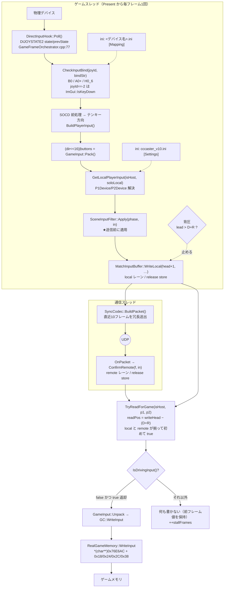

> **旧監査資料（2026-08-13）**。現行仕様は [CURRENT_STATE](../../CURRENT_STATE.md) を参照。本文の「現行」「未実装」は当時の状態。

# 05. 入力パイプライン — デバイスからゲームメモリまで

## 責務

物理デバイスの状態を、両機で**必ず一致する 32bit 値**に変換し、フレーム番号を付けて
バッファに置き、相手の同番号の値と組にしてゲームメモリへ書き込む。

この経路には「入力を取る」以外に3つの責務が乗っている。

| 責務 | 担当 | なぜここに要るか |
|---|---|---|
| 符号化の一意化 | `GameInput` | 過去に非互換な符号化が並存し、方向がボタンとして書き込まれた |
| 決定性の担保 | `SceneInputFilter` | 同じ入力列から両者が違う結果を出す経路（キャラセレ）を入力側で潰す |
| スレッド分離 | `MatchInputBuffer` | ゲームスレッドと通信スレッドが同一スロットに触る |

**フォールバックは存在しない。** `MbaaPatcher::ApplyStartupPatches()` がゲーム自身の
入力読み取りループを NOP で潰し（`MbaaPatcher.cpp:27-34`）、キーボードマップを
ゼロクリアしている（`:40-41`）。この経路のどこか1箇所でも 0 を返すと、
「入力が効きにくい」ではなく**入力が 100% 死ぬ**。2026-08-13 のバグがそういう質感で
現れたのはこのためで、以後もこの前提は変わらない。

---

## 現状の構造

### 主要コンポーネント

| コンポーネント | ファイル | スレッド | 役割 |
|---|---|---|---|
| `DirectInputHook` | `core_dll/hook/DirectInputHook.cpp` | ゲーム | DI8 列挙・ポーリング、INI バインド解決、32bit 値の組立 |
| `GameInput` | `core_dll/mbaa_mem/GameInput.hpp` | — | `direction<<16 \| buttons` の唯一の符号化 |
| `MbaaInputDefs.hpp` | `core_dll/mbaa_mem/` | — | ボタンビット、書込みアドレス・オフセット |
| `SceneInputFilter` | `core_dll/engine/SceneInputFilter.cpp` | ゲーム | 画面別のボタン制約（状態を持つ） |
| `MatchInputBuffer` | `core_dll/sync/MatchInputBuffer.hpp` | 両方 | フレーム別リング（600F）、local/remote レーン分離 |
| `SceneRunner::Step()` (E)(F2) | `core_dll/engine/SceneRunner.cpp:164-212, 237-269` | ゲーム | 書込み・背圧・読出し・ゲームメモリ書込み |
| `SyncCodec` | `core_dll/network/SyncCodec.cpp:141-153, 202-217` | 通信 | 冗長10フレーム分の送出・確定 |
| `RealGameMemory::WriteInput` | `core_dll/mbaa_mem/RealGameMemory.cpp:60-70` | ゲーム | `0x76E6AC` 経由でゲームメモリへ |
| `DataPaths` | `core_dll/common/DataPaths.cpp` | — | DLL 基準の絶対パス解決 |
| `ConfigManager` / `Config` | `cli_launcher/ConfigManager.cpp` | — | INI。`ConfigManager` は static ＝**プロセス毎に1つ** |

### 処理の流れ



線を1本で言い直すと以下になる。

```
物理デバイス
  → DI8 EnumDevices/Poll（DIJOYSTATE2、軸閾値 16383、Y 軸反転、POV は 8方向→テンキー）
  → バインド文字列の照合（B<n> / A<n>± / H<n>_<dir>、joyId=-2 は ImGui キー名）
  → SOCD 前処理（上下同時・左右同時は両方落とす）→ テンキー方向 1..9、5 は 0 に潰す
  → buttons の OR（A は CONFIRM、B は CANCEL を同時に立てる）
  → GameInput::Pack() = direction<<16 | buttons
  → SceneInputFilter::Apply(phase, …)           ← ボタンのみ落とす
  → MatchInputBuffer::WriteLocal(writeHead+1)   ← local レーン
  → SyncCodec::BuildPacket（直近10F 冗長）→ UDP → 相手の ConfirmRemote  ← remote レーン
  → TryReadForGame(readPos = writeHead − (delay + maxRollback))
  → isHost ? {p1=local, p2=remote} : {p1=remote, p2=local}
  → GC::WriteInput(GameInput, GameInput)
  → *(char**)0x76E6AC の +0x18(dir,4B) +0x24(btn,2B) +0x2C(dir,4B) +0x38(btn,2B)
```

確認済み事実として、`Poll()` は `OnPresent` の先頭で `Step()` より前に1回だけ呼ばれる
（`GameFrameOrchestrator.cpp:74-81`）。2回呼ぶと `prevState` が潰れてマッピング UI の
エッジ検出が死ぬため、呼び出し位置は動かせない。

#### `GameInput` の符号化と、非互換な符号化が4種類あった経緯

現在の唯一の規約は `direction<<16 | buttons`（`GameInput.hpp:41-48`）。方向は
テンキー表記で、ニュートラルのみ 0（5 ではない）。過去には以下が並存していた。

| # | 符号化 | どこにあったか | 症状 |
|---|---|---|---|
| 1 | `direction<<16 \| buttons` | `DirectInputHook` / `FrameControl` / FastBoot | 実際の規約。これが正 |
| 2 | `BIT_UP=0x01 / BIT_DOWN=0x02` のビットマスク | 旧 `MbaaInputDefs.hpp`、`MatchScene` の Rematch が参照 | 「下」が `CC_PLAYER_FACING(0x02)`、「上」が `CC_BUTTON_START(0x01)` として書き込まれた |
| 3 | `COMBINE_INPUT = direction \| buttons<<8` | 旧 `MbaaInputDefs.hpp` のマクロ | 使用箇所ゼロの死んだ定義。読んだ人が 3 通りの規約を信じうる状態を作っていた |
| 4 | `InputEntry{uint16_t}` | `rollback/RollbackEngine.*`（CMake 除外） | 16bit なので繋ぐと direction が丸ごと落ちる（AUDIT Phase 4） |

2 と 3 は削除済みで、削除の理由が `MbaaInputDefs.hpp:28-31, 52-54` にコメントとして
残してある。**同じ形の再発は「生の `uint32_t` を境界の外に出す」ことで起きる**ため、
`GameInput` は型で守るために導入されている。4 は未接続のまま残っており、第8章の対象。

#### `SceneInputFilter` — 何を落とし、なぜ送信前か

落とすのは**ボタンだけ**で、方向は一切触らない（`SceneInputFilter.cpp:51-96`）。

| フェーズ | 制約 | 定数 |
|---|---|---|
| `CharaSelect` / `Rematch` | 方向が変化してから N フレームは決定(A/CONFIRM)・キャンセル(B/CANCEL) を落とす | `DIR_SEAL_FRAMES = 2` |
| `CharaSelect` / `Rematch` | 決定を受け付けてから M フレームの決定を落とす（連打での項目スキップ防止） | `CONFIRM_GUARD_FRAMES = 3` |
| `InGame` | `START` / `FN1` / `FN2` を落とす（対戦中にメニューへ抜けさせない） | — |
| その他 | 何もしない | — |

方向を落とさないのは、方向がカーソル移動そのものだからである。方向を削ると
「移動できない」という直接の機能欠損になるうえ、ずれの原因である「移動と決定の同時到着」は
決定側を遅らせれば消える。**片側だけ削れば足りるものを両側削らない。**

適用位置は `MatchInputBuffer::WriteLocal()` の直前、つまり**送信前**である
（`SceneRunner.cpp:206-207`）。理由は決定性にある。

- フィルタの引数 `phase` は**ローカルのフェーズ**である。ロード時間が違えば両者のフェーズは
  実際にずれる（REALHW C-3 で Rematch 滞在時間が host 479 行 / client 1056 行と実測）。
- 読み出し時に適用すると、同じフレーム番号に対して両者が違うフィルタをかける。
- 送信前に適用すればフィルタ済みの値が回線に乗るので、**両者が受け取る値は必ず一致する**。
  フェーズの一致を前提にしなくてよい。

`(F2)` の読出し側でフィルタを掛けないのは同じ理由（`SceneRunner.cpp:249-250`）。
フィルタ状態がローカル固有（`OnPhaseChanged` で `Reset()`）でも問題にならないのも、
フィルタが**自入力にしか掛からない**ためである。

呼び出しは1フレーム1回で、背圧で書き込みを止めたフレームでは呼ばれない
（`lead <= maxLead` の内側にある）。状態を持つフィルタなので、この対応は崩せない。

#### `MatchInputBuffer` — レーン分離と公開順序

| レーン | 書き手 | フィールド | 読み手 |
|---|---|---|---|
| local | ゲームスレッドのみ | `localFrame` / `localInput` / `predictedRemote` / `rollbackable` | 通信スレッド（送信）、ゲームスレッド |
| remote | 通信スレッドのみ | `remoteFrame` / `remoteInput` | ゲームスレッド |

スロットは `frame % 600`。周回するので、**読み書きの両方で「そのスロットが本当に
要求フレームのものか」を検証する**（`TryGetLocalInput` / `TryGetRemoteInput`）。

公開順序は「ペイロード → フレーム番号を release ストア」、読む側は
「フレーム番号を acquire ロード → ペイロード」。これで「番号は新しいが中身は古い」が
構造的に起きない。旧実装はこれを持っておらず、harness で `ConfirmConflicts` が
1900件超を検出していた（`MatchInputBuffer.hpp:13-22`）。

### 設定の往復

設定は2種類あり、置き場所も所有者も別である。

| 設定 | ファイル | セクション/キー | 書き手 | 読み手 |
|---|---|---|---|---|
| デバイス割当 | `cccaster_v10.ini` | `[Settings] P1Device` / `P2Device`（サニタイズ済みデバイス名） | `ControllerUiLogic::SaveDeviceAllocations()` / `SaveBinds()` (`:249`) | `DirectInputHook::ReloadConfigs()` / `GetLocalPlayerInput()` |
| バインド | `<サニタイズ済みデバイス名>.ini` | `[Mapping] Up..A+B`, `Up_Alt..Right_Alt` | `ControllerUiLogic::SaveBinds()` | `LoadOrCreateDeviceConfig()` → `s_p1Config` / `s_p2Config` |

パスは**両方とも** `cccaster::core::paths::Resolve()` を通す。ルートは
`dllmain.cpp:111` が `GetModuleFileNameA` から求めた DLL のディレクトリ
（実機では `<ゲーム>\cccaster\`）。サニタイズ規則（`\ / : * ? " < > |` を `_` に）は
書き手（`Controller_Ui_Logic.cpp:196`）と読み手（`DirectInputHook.cpp:282-288`）で
一致していなければならない。**片方だけ変えるとファイル名が食い違い、症状は
「設定が効かない」としか出ない。**

`ConfigManager` は static メンバなのでプロセス毎に1つ。UI が `SetString` → `Save` した後は
`DirectInputHook::ReloadConfigs()` を必ず呼び、デバイス別 INI をメモリ上のキャッシュに
再読込する（`Controller_Ui_Logic.cpp:144, 181, 302, 320`）。

#### 2026-08-13 に直した3点 — なぜそうなっていたか

| # | 不具合 | なぜそうなっていたか | 対処 |
|---|---|---|---|
| 1 | **DLL が設定ファイルを一度も Load していなかった** | `ConfigManager::configData` は static ＝プロセス毎。`Load()` の呼び出しはリポジトリ全体で `cli_launcher/main.cpp:27` の1箇所だけで、それはランチャー EXE のプロセス。DLL は `LoadLibraryA` で別プロセスに入るので、ランチャーが読んだ内容は一切来ない | `dllmain.cpp:145-149` で DLL 側でも `Load()` |
| 2 | **`P1Device`/`P2Device` の意味が UI と読み手で食い違っていた** | UI は「画面左=P1」＝**ローカルの座席**、読み手は `isHost ? P1 : P2` ＝**ホスト機/クライアント機**。クライアントの人は自分を 1P と認識して左に割り当てるが、読み手は `P2Device` を見る。`_TEST_MBAACC` の ini は**両機とも「読むほうが空」**だった | `GetLocalPlayerInput(isHost, soloLocal)`。ネットプレイのローカルは1人なので、本来のスロットが空なら反対を使う。オフラインは2人ともローカルなのでこの読み替えをしない |
| 3 | **設定パスが相対パスだった** | `"cccaster\\xxx.ini"` はゲームのカレントディレクトリ基準。ゲームが `SetCurrentDirectory` を呼べば書き手と読み手が別の場所を指しうる。ログは既に DLL 基準に直っていたのに、設定だけ取り残されていた | `DataPaths` を新設し、読み手・書き手の両方を `Resolve()` に通す |

1 の帰結が重要である。`GetString("Settings","P1Device")` が常に `""` を返し、
`GetJoyIdFromDeviceName("")` が `-1`、`BuildPlayerInput(-1, …)` が**無言で 0** を返し、
その 0 が毎フレーム `GC::WriteInput` に渡っていた。設定画面だけ反応したのは、
そちらが `ImGui::IsKeyPressed()` と `DirectInputHook::GetAnyInputEdge()` を直接読み、
`ConfigManager` を通らないため。**「設定できるのに効かない」はこの非対称がそのまま出たもの。**

同日の UI 側修正（`ControllerUiLogic`）は3点。F4 で閉じるとバインドが破棄されていた
（`EndUiSession` が `SaveBinds` を通らなかった）／開閉するだけで割当が消えていた
（`s_pXJoyId` が起動時 `-1` 固定で復元処理が無かった）／書き手のパスが相対だった。
`SaveBinds()` は**空のバインドを書かない**。空＝そのセッションで到達しなかった項目であり、
空文字で上書きすると読み手の既定値フォールバックまで殺してそのボタンが無反応になる。

`Up_Alt` / `Down_Alt` / `Left_Alt` / `Right_Alt` は**読み手にしか存在しないキー**で、
既定値 `A1-` / `A1+` / `A0-` / `A0+` によりアナログスティックが常時バインドされる
（`DirectInputHook.cpp:349-352`）。UI に該当項目が無いので利用者からは解除も変更もできない。
暫定対処として、ジョイスティックの ini に**既定値と同じ値を実体化して書き出す**ように
した（`Controller_Ui_Logic.cpp:234-246`）。挙動は変わらないが、値がファイルに見えるので
手編集で解除・変更ができる。UI 項目を 13→17 に増やす案は却下した。このウィザードは項目を
スキップできず、アナログスティックの無いレバーで設定を完了できなくなるため。

### 他領域との境界

| 相手 | 境界 | 内容 |
|---|---|---|
| 01 プロセス | `dllmain.cpp:111,145-149` | `paths::SetDataRoot()` と `ConfigManager::Load()`。ここを飛ばすと入力が全死する |
| 02 フック | `GameFrameOrchestrator.cpp:77,141` | `Poll()` の呼び出し位置、`DirectInputHook::Initialize()` の初期化タイミング（`RenderSkip` に阻まれる） |
| 03 ゲームメモリ | `IGameMemory::WriteInput` / `MbaaInputDefs.hpp` | 書込みアドレスとオフセット。`MbaaPatcher` のゲーム側入力読取り潰しもここ |
| 04 フレーム空間と時間 | `writeHead` / `readPos` | フレーム番号の採番権。`relFrame = WT − BaseWT` へ移す計画は 04 が持つ |
| 06 ネットワーク | `SyncCodec::BuildPacket` / `ConfirmRemote` | 冗長10F、`inputCount` の上限、`baseFrame>0` ガード |
| 07 セッション状態機械 | `IsDrivingInput()` / `OnRematch` | 自動ナビ中はパイプラインを止めて `MatchScene` が直接書く |
| 08 ロールバック | `predictedRemote` / `rollbackable` / `ConsumeMismatch()` | 予測と巻き戻し起点。現状は書かれるだけで消費されない |
| 09 UI | `Controller_Ui_*` / `ControllerMapper.cpp` | 設定の書き手。UI 設計自体は 09 の領分 |
| 10 検証基盤 | `ScriptedInput` / `[REC]` ログ | フレーム番号だけから決まる入力列と、配信フレームの記録 |

---

## 現状の問題

### P-1（最重大）オフライン（Training）では入力が 100% 死ぬ

`dllmain.cpp:262` の `isNetplay = (appMode == 0)` により、Training では通信が初期化されない。
一方 `SceneRunner::Step()` の (E)(F2) は**モードに関係なく実行される**。結果:

- `ConfirmRemote` が一度も呼ばれない → `remoteFrame` は永久に `EMPTY_SLOT`
- `TryGetRemoteInput(readPos)` が毎フレーム false → `TryReadForGame` が毎フレーム false
- `GC::WriteInput` に到達しない → `MbaaPatcher` がゲーム側の読取りを潰しているのでフォールバックなし

背圧は `HasConfirmedRemote()` が false のとき `confirmed = head` として lead=0 にするので
書込み側は止まらない。**止まるのは読出し側だけ**であり、`stallFrames` が毎フレーム加算される。
このパイプラインは「相手がいる」ことを構造的な前提にしている。

### P-2 入力がゲームに届かなくなる条件（網羅）

| # | 条件 | 場所 | 検出 |
|---|---|---|---|
| 1 | `TryReadForGame` が false（local か remote のどちらかが readPos に無い） | `MatchInputBuffer.hpp:106-115` | `stall=` |
| 2 | `MatchScene::IsDrivingInput()` が true（Rematch 自動ナビが入力を握る） | `SceneRunner.cpp:247` | なし |
| 3 | 背圧 `lead > delay+maxRollback` で `WriteLocal` を止める → local が欠番 → 1 に波及 | `SceneRunner.cpp:196-211` | `starve=` / `[Backpressure] STALLED` |
| 4 | FastBoot 早期 return（`phase < CharaSelect` かつ未完了）で (E)(F2) 全体に到達しない | `SceneRunner.cpp:144-152` | なし |
| 5 | デバイス解決失敗（`joyId == -1`）→ 常にニュートラル | `DirectInputHook.cpp:334, 454-459` | 状態変化時に1回ログ |
| 6 | `InputBasePtr()` が NULL | `RealGameMemory.cpp:61-65` | 120回に1回ログ |
| 7 | `RenderSkip` が `DirectInputHook::Initialize()` に到達させない | `GameFrameOrchestrator.cpp:116-145` | なし（AUDIT B-1） |
| 8 | リング周回（600F ＝ 10秒以上の停止後の再開） | `MatchInputBuffer.hpp:119-129` | なし |

1・2・4・7 は**無言**である。ログを見ても「入力が来ていない」ことが分からない。
2026-08-13 のバグが長く残ったのと同じ構造がまだ残っている。

### P-3 `MatchScene::OnRematch` が古い API を使っており、08-13 の修正の外にある

`MatchScene.cpp:270-272` は `GetPlayer1Input()` / `GetPlayer2Input()` を `isHost` で
選んでいる。これは修正前の読み手と同じ意味づけで、`GetLocalPlayerInput()` を通らない。

推測: REALHW F-1 の「`[Rematch] Local selected` が client で 0 件」はこれで説明できる。
クライアントの人がデバイスを `P1Device` に入れていると、対戦中は
`GetLocalPlayerInput` のフォールバックで動くのに、Rematch 画面だけ無反応になる。

さらに自動ナビは `GC::WriteInput` を**直接**呼ぶ（`MatchScene.cpp:261-264`）。
ゲームメモリへの書き手が2つあり、`IsDrivingInput()` という排他フラグ1つで守っている。

### P-4 `WriteInput` の書込み幅が型と合っていない

`direction` は `uint16_t` なのに 4 バイトで書いている（`RealGameMemory.cpp:66,68`）。
`+0x1A..0x1B` / `+0x2E..0x2F` を巻き込む。AUDIT A-7・未確定事項5 と同じ箇所で、
書込み先の検証（SEH / `IsBadWritePtr`）も無い。

### P-5 その他

- **`ControllerMapper.cpp`（542行）は到達不能な重複実装。** 入力の観点では、
  `Controller_Ui_Logic.cpp` に入れた 08-13 の3つの修正が**こちらには入っていない**ことが
  問題になる。次に「設定が保存されない」を追う人がこちらを直して直らない。削除すべき（第9章）。
- `RefreshDevices()`（USB 挿抜）は `ReloadConfigs()` を呼ばない。デバイスは名前で解決するので
  即座に壊れはしないが、新しいデバイスのバインドはキャッシュに載らない。
- `BuildPlayerInput()` は毎フレーム17回 `GetString()` を呼び、その都度 `shared_mutex` の
  取得と `std::string` の生成を行う。ゲームスレッドのホットパスとしては素直でない。
- SOCD 規則は「上下同時・左右同時とも両方落とす」。旧 CCCaster とは異なる。両者が同じ
  規則を使う限り決定性は保たれるので現状は害がないが、**規約として明文化されていない**。
- `BuildPlayerInput()` の `direction == 5` チェック（`:369`）は到達不能。直前の else が
  既に 0 を代入している。

---

## 目指す設計

### 設計原則

1. **無言のニュートラルを作らない。** 入力が 0 になる経路には必ず「なぜ 0 か」の区別を持たせる。
   `MbaaPatcher` がフォールバックを潰している以上、0 は「押していない」と「壊れている」の
   両方を意味しうる。この2つを型で分ける。
2. **フィルタは送信前、1フレーム1回。** 回線に乗る値がフィルタ済みであることが、
   両者一致の唯一の根拠。読み出し側では絶対に加工しない。
3. **ゲームメモリへの書き手は1つ。** 現状の「パイプライン + 自動ナビ」の二重書き込みを、
   自動ナビ側も同じバッファに流し込む形に寄せる。
4. **相手がいない場合を第一級の状態として持つ。** オフラインは例外処理ではなく、
   「remote レーンが自分自身である」構成として扱う。
5. **設定の意味づけは1箇所。** `PxDevice` の解釈が UI と読み手で分かれた事故を繰り返さない。

### 変更点

| # | 変更 | 対象 | なぜ |
|---|---|---|---|
| 5-1 | **オフライン用ローカルループバック**。`appMode != 0` のとき、`WriteLocal` と同時に同じフレームへ `ConfirmRemote` を打つ（P2 側は `GetPlayer2Input()`、未割当ならニュートラル） | `SceneRunner.cpp` (E) | P-1。読出し側の条件式を1つも変えずにオフラインが通る。分岐を (E) に閉じ込められる |
| 5-2 | **`TryReadForGame` の失敗を分類してログ**（local欠 / remote欠 / 周回）。連続 N フレームで1回だけ出す | `MatchInputBuffer` / `SceneRunner` (F2) | P-2 の 1 が無言。原因の切り分けが `stall=` の数字だけでは付かない |
| 5-3 | **`MatchScene::OnRematch` を `GetLocalPlayerInput()` に統一** | `MatchScene.cpp:270-272` | P-3。08-13 の修正から取り残された唯一の呼び出し元 |
| 5-4 | **自動ナビをバッファ経由にする**。`GC::WriteInput` 直呼びをやめ、ナビ入力を `WriteLocal` に載せる。`IsDrivingInput()` を廃止 | `MatchScene.cpp:255-267` / `SceneRunner.cpp:247` | 書き手を1つにする。現状はナビ入力が相手に送られないので、そもそも両者で結果が揃わない |
| 5-5 | **`WriteInput` の書込み幅を `uint16_t` に揃え、書込み先を検証** | `RealGameMemory.cpp:60-70` | P-4。AUDIT A-7 / Phase 2-3 と同一 |
| 5-6 | **バインド解決のキャッシュ化**。`ReloadConfigs()` 時に文字列 → 解決済み構造体（種別・番号・符号）へ変換し、毎フレームは構造体だけ見る | `DirectInputHook.cpp:236-273, 333-372` | P-5。毎フレームの `stoi` / `string` 生成と mutex 取得を消す |
| 5-7 | **`*_Alt` を UI から扱えるようにする**（スキップ操作の追加とセット） | `Controller_Ui_*` | 読み手にしか無いキーの恒久対応。第9章と共同 |
| 5-8 | **`ControllerMapper.cpp` の削除** | `ui/ControllerMapper.cpp` | 入力の観点では「修正の入っていない同名実装」が並存していることが害。第9章が主管 |
| 5-9 | **SOCD 規則と方向符号化を仕様として固定するテスト**を追加 | `src/tests/` | 規約が暗黙。両者一致が壊れたときに気付ける唯一の手段 |

### 移行手順

順序に意味がある。**観測できるようにしてから直す。**

| 段 | 内容 | 完了条件 |
|---|---|---|
| 1 | 5-2（失敗分類ログ） | Training 起動で `remote欠` が毎フレーム出ることをログで確認できる |
| 2 | 5-1（ループバック） | Training でキャラが動く。`stall=` が 0 に張り付く |
| 3 | 5-3（Rematch の API 統一） | クライアント側で `[Rematch] Local selected` が 1 以上出る |
| 4 | 5-5（書込み幅と検証） | 既存の対戦が回帰しない（実機2窓） |
| 5 | 5-9（規約テスト） | `ctest` に SOCD・符号化・フィルタの固定テストが乗る |
| 6 | 5-4（自動ナビのバッファ経由） | `[Rematch] Resolved` が両機で 1 以上。書き手が1つになる |
| 7 | 5-6 / 5-8 | 回帰なし。`ControllerMapper.cpp` が消える |
| 8 | 5-7 | 第9章のスキップ操作が入ってから |

段 6 は第7章（セッション状態機械）の Rematch 設計と衝突するので、そちらの結論を待つ。
段 4 は第3章（ゲームメモリ）と同じコードに触るので、どちらか一方がまとめて行う。

---

## 未確定事項

1. **`+0x1A..0x1B` / `+0x2E..0x2F` は本当に未使用パディングか。** 現状の 4 バイト書込みが
   何を壊しているか（あるいは壊していないか）が分からない。AUDIT の未確定事項5 と同じ。
   逆アセンブルか、当該領域の書き換え前後のメモリ差分で判定する。
2. **オフラインの 2P をどう扱うか。** 5-1 のループバックで「P2 は常にニュートラル」にするか、
   `P2Device` が割り当たっていれば実入力を通すか。Training のダミー操作を考えると後者だが、
   `soloLocal=false` の現在の読み替え規則と整合を取る必要がある。
3. **`MbaaPatcher` の NOP 対象 9箇所が本当に「入力クリアループ」だけか。** コメントはあるが
   逆アセンブルの根拠が無い。ゲーム側の入力読み取りを部分的に生かせるなら、
   フォールバック（＝無言のニュートラルの緩和）が成立しうる。
   推測: `0x4A024E`〜`0x4A02F2` の連なりは 4 プレイヤー分ないし 4 デバイス分のループ展開に見える。
4. **リング 600 フレームで足りるか。** 相手のフリーズ（REALHW E）で 10 秒以上停止した場合、
   周回によって「番号は一致するが別フレーム」を掴む可能性がある。現状は
   `localFrame != frame` の検証で false を返すだけで、フリーズ検出とは繋がっていない。
5. **`SceneInputFilter` の定数（2F / 3F）の妥当性。** 旧 CCCaster の `historyCheck` 相当と
   されているが、値の由来が記録されていない。キャラセレのずれが実際に消えているかを
   測る手段（キャラセレ選択結果の突き合わせ）が無い。
6. **`ScriptedInput` が実機経路のどこまでを覆っているか。** `IsScriptedInputEnabled()` は
   `GetLocalPlayerInput()` を丸ごとバイパスするので、デバイス解決・バインド解決・SOCD は
   自動テストで一度も踏まれていない。ここを覆う手段が要る（第10章）。
