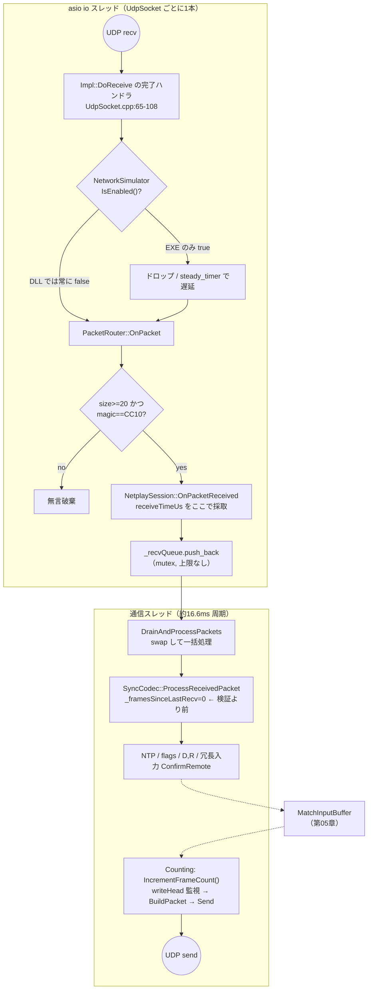

> **旧監査資料（2026-08-13）**。現行仕様は [CURRENT_STATE](../../CURRENT_STATE.md) を参照。本文の「現行」「未実装」は当時の状態。

# 06. ネットワーク層 — パケットと配送

## 責務

対戦相手との間で、**フレーム番号付きの入力**と**時計同期用のタイムスタンプ**を、
1本の UDP ソケットで往復させる。それだけである。

この層が持つべきで持っていない責務が3つある。本章はその欠落を主題とする。

| 責務 | 現状 | 節 |
|---|---|---|
| 送信元が本当に対戦相手か検証する | **一切していない**（AUDIT A-5） | 現状の問題 §3 |
| 相手の**ゲームが進んでいる**ことを確認する | していない。プロセスの生存しか見ていない | 現状の問題 §4 |
| ロス・遅延に対する耐性を検証する | **一度も試験されていない**（AUDIT B-7） | 現状の問題 §6 |

---

## 現状の構造

### 主要コンポーネント

| コンポーネント | ファイル | スレッド | 役割 |
|---|---|---|---|
| `UdpSocket` | `core_dll/network/UdpSocket.cpp` | asio io スレッド（専用1本） | asio standalone の Pimpl。`async_receive_from` の自己再帰ループ |
| `NetworkSimulator` | `core_dll/network/NetworkSimulator.cpp` | 呼出元 | 遅延・ロス注入のシングルトン。**DLL では有効化されない** |
| `PacketRouter` | `core_dll/network/PacketRouter.cpp` | asio io | magic を見て `NetplaySession` へ渡すだけ。実質18行 |
| `NetplayManager` | `core_dll/network/NetplayManager.cpp` | ゲーム（初期化時のみ） | ソケットの生成・破棄、送信ラムダの供給 |
| `SyncCodec` | `core_dll/network/SyncCodec.cpp` | 通信 | パケットの組立・解析。**この層の実体はここに全部ある** |
| `NetplaySession` | `core_dll/sync/NetplaySession.cpp` | 通信 | 受信キュー、モード機械、送信タイミング（第07章） |
| `SessionNegotiator` | `cli_launcher/network_wrapper/SessionNegotiator.cpp` | EXE メイン | 起動前の疎通確認。**別プロトコル・別ソケット** |
| `ConnectionHash` | `cli_launcher/network_wrapper/ConnectionHash.cpp` | EXE メイン | IPv4/IPv6/LocalIPv4/port を Base32 + XOR で1文字列に |

### パケット仕様

対戦中に流れるパケットは**1種類しかない**。`PKT_SYNC_TICK` (0x30) のみで、
`WaitReady` / `WaitStart` / `Counting` の全フェーズを flags と `startTimeUs` で表現する
（`SyncCodec.hpp:14-15`）。**固定 105 バイト**（20 + 85）。可変長部分は無い。

#### CC10 統一ヘッダ（20B, `SyncCodec.cpp:51-65`）

| off | size | フィールド | 送信値 | 受信側の読み手 |
|---|---|---|---|---|
| 0 | 4 | `magic` | `0x30314343` (`'CC10'` LE) | `PacketRouter.cpp:33` と `SyncCodec.cpp:102` で**二重**に検証 |
| 4 | 1 | `phase` | 常に `0x00` | **無し（死フィールド）** |
| 5 | 1 | `type` | `0x30` | `SyncCodec.cpp:104-105` |
| 6 | 2 | — | ゼロ埋め | **無し（未定義パディング）** |
| 8 | 8 | `timestampUs` | 送信時の `WasapiClock::GetTimeUs()` | **無し**。NTP はペイロードの `t_send` を使う（死フィールド） |
| 16 | 4 | — | ゼロ埋め | **無し（未定義パディング）** |

ヘッダ 20B のうち、実際に意味を持つのは **5B（magic + type）だけ**。
残り 15B は送信され、帯域を消費し、誰も読まない。

#### SyncPayload（85B, `SyncCodec.cpp:23-46`, `#pragma pack(1)`）

| off(payload) | off(絶対) | size | 型 | フィールド | 受信側の扱い |
|---|---|---|---|---|---|
| 0 | 20 | 8 | i64 | `t_send` | NTP T3 / `_lastPeerT1` へ保存（`:115,119`） |
| 8 | 28 | 8 | i64 | `echo_t1` | `>0` のとき `AddNtpSample`（`:114-116`） |
| 16 | 36 | 8 | i64 | `echo_t2` | 同上 |
| 24 | 44 | 4 | u32 | `baseFrame` | 冗長入力の基点 / `_latestPeerFrame`（`:141,167`） |
| 28 | 48 | 1 | u8 | `inputCount` | 10 でクランプ（`:139`） |
| 29 | 49 | 1 | u8 | `delay` | `0xFF`=変更なし。それ以外は**そのまま自分の D を上書き**（`:158`） |
| 30 | 50 | 1 | u8 | `maxRollback` | 同上（`:159`） |
| 31 | 51 | 1 | u8 | `flags` | bit0=READY, bit1=PHASE_READY（`:123,172`） |
| 32 | 52 | 8 | i64 | `startTimeUs` | `>0` で `SetPeerStartTime`（`:131-135`） |
| 40 | 60 | 1 | i8 | `retryMenuIndex` | `>=0` で `SetRemoteRetryMenuIndex`（`:178-180`） |
| 41 | 61 | 4 | u32 | `phaseBaseFrame` | `if(>0)` が**到達不能**。送信側が常に 0 を積む（AUDIT: `MatchScene.cpp:103`）→ **死フィールド** |
| 45 | 65 | 40 | u32×10 | `inputs[10]` | 冗長入力（後述） |

**プロトコルに存在しないもの**を明示しておく。

| 無いもの | 帰結 |
|---|---|
| シーケンス番号 | 重複・並べ替えを検出できない。UDP の再順序で古い `delay`/`maxRollback` が再適用されうる |
| セッション ID / トークン | 前回セッションの遅延パケットと区別できない |
| チェックサム | UDP チェックサム任せ。壊れたペイロードは `inputCount<=10` 以外の検証を通過する |
| プロトコルバージョン | magic の一致だけが互換性の保証。フィールドを1つ足したら混在時に無言で壊れる |
| 有効ビットマスク | 「入力 0」と「入力が無い」を区別できない（AUDIT B-5 の原因） |

### ネゴシエーション用パケット（26B, magic 無し）

対戦パケットとは**別プロトコル・別プロセス・別ソケット**である
（`SessionNegotiator.cpp:254-267`）。

| off | size | 内容 |
|---|---|---|
| 0 | 2 | `seqNum`（u16, インクリメントのみ。ロス数の推定に使う） |
| 2 | 8 | `timestampNow`（u64, `system_clock` の μs） |
| 10 | 8 | `lastReceivedRemoteTime`（相手のタイムスタンプのエコー） |
| 18 | 8 | `localProcessingDelay`（受信から返送までの滞留時間。RTT から差し引く） |

両者の関係は「時間的に排他」であって「論理的に接続」していない。

1. EXE が `SessionNegotiator::RunNegotiation()` でこの 26B を 60Hz で往復させ、
   ping / jitter / loss を表示する。到達確認できた相手の IP と**送信元ポート**を
   `NegotiationResult` に記録する（`:321-325`）。
2. 接続確定と同時に `UdpSocket` はスタック上で破棄され、**ポートが一度開放される**。
3. その値が `SharedState` 経由で DLL に渡り、`dllmain.cpp:266` が
   `NetplayManager::Initialize()` を呼んで**新しいソケットを開き直す**。

この開け直しには2つの副作用がある。

- **NAT のマッピングが張り直される。** ネゴで通ったポートで対戦パケットが通る保証は無い。
- **DLL 側は交渉結果のポートへ盲目的に送る。** 受信時に `_peerActualPort` を
  `NetplaySession.cpp:119` で拾っているが、**送信には一切使われない**
  （`NetplayManager.hpp:61-69` の送信ラムダは初期化時の `_targetPort` を値キャプチャする）。
  相手のポートが変わった場合、片方向だけ通る状態に固定される。

なお 26B パケットは `>= 20` バイトあるため `PacketRouter` の長さ判定は通るが、
magic 不一致で無言破棄される（`PacketRouter.cpp:29-41`）。残存パケットの混入は事故にならない。

### 処理の流れ



`receiveTimeUs` を asio スレッド側（`NetplaySession.cpp:102`）で採取している点は正しい。
通信スレッドの 16.6ms のバッチ処理が Θ/RTT の推定を汚さない。

一方 `_recvQueue` に**上限が無い**。通信スレッドが止まればメモリを食い続ける。

### `PacketRouter` は層として空である

`PacketRouter::OnPacket()` の実質的な処理は「長さ ≥ 20 かつ magic 一致なら転送」だけで、
以下をすべて行っていない。

- **ルーティングをしていない。** パケット種別は1つしかなく、分岐先も1つしかない。
- **検証が `SyncCodec` と重複している。** magic を2回チェックし、
  `CC10_MAGIC` と `UNIFIED_HEADER_SIZE` の定数は `SyncCodec.hpp:86-88`、
  `PacketRouter.cpp:19-20`、`NetplaySession.hpp:133-135` の**3箇所に別々に**存在する。
- **送信元を見ていない。** 引数 `fromIp` / `fromPort` は素通りするだけ。

つまり現状は「クラス1つ・ファイル2つ分のコスト」を払って何も得ていない。
ただし**唯一、asio スレッド上で全受信パケットが必ず通る一点**であるという性質があり、
送信元検証を置く場所としてはここが正しい（AUDIT 2-2 の判断と一致）。

### 冗長入力 — 設計と、その正しさが依存しているもの

送信（`SyncCodec.cpp:202-217`）:

```
maxCount = min(frame, 10)
for i in 0..maxCount-1:
    inputs[i] = ローカル入力(frame - i)      // i=0 が最新
    取得失敗 かつ i==0 なら呼出元の値、それ以外は 0
```

受信（`SyncCodec.cpp:141-150`）:

```
for i in 0..inputCount-1:
    ConfirmRemote(baseFrame - i, inputs[i])
```

**設計意図**: 1パケットに直近10フレームを載せることで、**9連続までのパケットロスを
再送なしで吸収**する。`ConfirmRemote` は先勝ち（`MatchInputBuffer.hpp:76-83`）なので、
重複到着は無害な no-op になる。ロールバック netplay の標準的な手口であり、方針は正しい。

**この方式が成立する条件は1つだけである — 両者の `frame` が同じ論理的瞬間を指すこと。**

`inputs[i]` は「相対位置 i」ではなく**絶対フレーム番号 `baseFrame - i`** に紐づく。
受信側はその絶対番号のスロットへ直接書く。番号の意味が両者でずれていれば、
入力はずれたまま確定し、**ネットワーク層には検出する手段が一切ない**。

- `ConfirmConflicts`（`MatchInputBuffer.hpp:188-189`）は「同じ番号に違う値」しか検出しない。
  原点が k フレームずれている状態では、両者とも自分の番号体系で一貫しているため、
  衝突は1件も出ない。
- 第04章のとおり `netFrame` は「`Step()` が背圧を通過した回数 + 200」であり
  （`NetplaySession.cpp:57`）、ゲーム内時計と突き合わされていない。
  実機では starve 差 4〜5、Rematch を挟むと 148 フレームの開きが観測されている
  （`REALHW_RESULT_2026-08-13.md` C-2/C-3）。

**つまり冗長入力は、正しさの前提を第04章に完全に外注している。**
本章側でできるのは「前提が崩れたことを検出できるようにする」ところまでである。

---

## 他領域との境界

| 境界 | 相手 | 契約 |
|---|---|---|
| ソケット生成タイミング | **第01章（プロセス）** | `dllmain.cpp:266` の `InitThread`。EXE がポートを開放した後 |
| `Sleep` の意味 | **第02章（フック）** | `SetSleepBypass(true)` により通信スレッドの `SleepMs(1)` が 0ms 化（`NetplaySession.cpp:152-157`） |
| `WorldTimer` の読み | **第03章（ゲームメモリ）** | 現状はログ用のみ（`NetplaySession.cpp:228`） |
| **フレーム番号の意味** | **第04章（フレーム空間）** | `baseFrame` の解釈は 04 が定義する。**冗長入力の正しさはここに全依存** |
| 入力の符号化とバッファ | **第05章（入力パイプライン）** | `MatchInputBuffer::ConfirmRemote` / `TryGetLocalInput` |
| モード機械・送信契機 | **第07章（セッション状態機械）** | `WaitReady`→`WaitStart`→`Counting`、keepalive 契機 |
| ロールバック起点の通知 | **第08章（ロールバック）** | `RecordMismatch` は本章の `ConfirmRemote` が起こす |
| 切断・停止のユーザ通知 | **第09章（UI）** | `SharedState::lastErrorCode` 経由。`MainController.cpp:157` |
| 遅延・ロス注入 | **第10章（検証基盤）** | `NetworkSimulator`。**現状 DLL に届いていない** |

---

## 現状の問題

### 1. 送信元検証がゼロ（AUDIT A-5 / 🔴）

`PacketRouter.cpp:25` は `fromIp`/`fromPort` を受け取って何もせず、
`SyncCodec.cpp:94` に至っては**引数名がコメントアウトされている**。
magic 4バイトを知る任意のホストから、以下がすべて注入できる。

| 注入先 | 影響 |
|---|---|
| `ConfirmRemote(frame, input)` | 先勝ちのため、**本物の入力を永久に捨てさせられる**。以後デシンク確定 |
| `delay` / `maxRollback` | `MatchInputBuffer::SetSyncParams` を直接書換え。0 にすれば恒久 stall |
| `SetPeerStartTime` | 合意開始時刻をずらす |
| `peerPhaseReady` | IntroBarrier を素通りさせる（現状バリアは元から無効だが、01-05 の修正後に効く） |
| `retryMenuIndex` | Rematch の選択を奪う |
| `_framesSinceLastRecv = 0` | **検証より前（`:96`）にリセットされる**。ゴミパケットを投げ続けるだけで切断検出を無限に抑止できる |

ポート番号は `ConnectionHash` で配布され、`SessionNegotiator` が
グローバル IP を ipify で取得して表示する。攻撃に必要な情報は公開されている。

### 2. `_framesSinceLastRecv` のリセット位置（🟡だが 1 と同根）

`SyncCodec.cpp:96` は関数の**先頭**にある。magic 検証（`:102`）も type 検証（`:105`）も
サイズ検証（`:106`）も、すべてその後ろ。`PacketRouter` が magic を先に見ているので
実害はマジックを知る相手に限られるが、**検証結果を疎通判定に反映しない**という
構造そのものが誤りである。

### 3. キープアライブがゲームスレッドの生死を反映しない（本章の中心課題）

実機で発生した事象（`REALHW_RESULT_2026-08-13.md` E）:

```
MBAACC_1(host)   : [SyncCodec] RECV pkt: baseFr=5459 … だけが延々と続く
                   ★ [SceneRunner] も [Backpressure] も出力が止まっている
MBAACC_2(client) : [Backpressure] STALLED head=5459 confirmed=5452 lead=7 maxLead=6
                   ★ 延々と繰り返し
→ Peer Disconnected はどちらにも出ていない。両者が無言で固まった。
```

因果は完全に追える。

```
[1] host のゲームスレッド（Present→Step）が停止 → writeHead が 5452 で凍結
[2] host の通信スレッドは生存。needKeepalive は SceneRunner.cpp:217 で立てられたまま
      解除されないので、NetplaySession.cpp:264-271 が 3フレームごとに送り続ける
[3] keepalive の baseFrame は凍った newHead。中身は同じ 10 フレーム分の入力
[4] client 側: パケットは届く → _framesSinceLastRecv=0 → IsPeerAlive() は永久に true
[5] client: lead = 5459 - 5452 = 7 > maxLead 6 → SceneRunner.cpp:196 で恒久停止
[6] client のゲームメモリ書込みも止まる → 両者フリーズ、エラー表示なし
```

構造的な欠陥は2点ある。

| 欠陥 | 内容 |
|---|---|
| **キープアライブの意味** | 送出主体が通信スレッドなので、証明できるのは「相手プロセスが生きている」ことだけ。「相手のゲームループが回っている」ことは**一切保証しない** |
| **判定主体の配置** | 切断判定を実行するのは `SceneRunner.cpp:316-327` = **ゲームスレッド**。自機のゲームスレッドが死んだ場合、判定コード自体が動かないので、自分が止まったことを誰にも通知できない |

そして**判定に必要な情報はすでに回線を流れている**。`baseFrame` は毎パケットに載り、
`SyncCodec.cpp:167-169` が `_latestPeerFrame` に記録している。この値の読み手は
`NetplaySession.cpp:279` の 60 フレームおきのログ**1箇所だけ**である（AUDIT 是正機構一覧と一致）。

### 4. 冗長入力が「未書込みフレーム」を 0 として確定させる（AUDIT B-5）

`SyncCodec.cpp:207-216` は `TryGetLocalInput` が失敗しても（i>0 なら）`0` を送る。
受信側は先勝ちで `0` を確定し、後から届く本物を `ConfirmConflicts` に計上して**捨てる**。

実害の窓は現状「セッション開始直後」に限られる。`writeHead` は 200 から始まり
`WriteLocal(head+1)` で連続に進むため、リングに穴は空かない。
最初のパケット（frame=201）だけが未書込みの 192〜200 に対して 9 個の 0 を配る。
ただし**有効性を表現する手段がプロトコルに無い**という構造は残り、
ロールバック導入や原点再基準化（第04章 1-3）でフレーム番号が不連続になった瞬間に一般化する。

### 5. IPv6 は DLL 側で必ず壊れる（AUDIT B-6）

- EXE 側は IPv6 で正常にネゴシエートできる（`SessionNegotiator.cpp:120` が `isIpv6` を渡す）。
- `SharedState` は `isIpv6` を持つ（`IpcData.hpp:47`）。
- **`MatchContext` に `isIpv6` フィールドが存在しない。** IPC → `MatchContext` の
  変換でこの1ビットが落ちる。
- `NetplayManager::Initialize()` にも `isIpv6` 引数が無く、
  `NetplayManager.cpp:38` は `UdpSocket(_localPort)` — 既定値 `isIpv6=false` で
  **必ず IPv4 ソケットを開く**。

その後 `peerIp` は IPv6 文字列なので `make_address` は成功し、v6 エンドポイントが
できあがる。v4 ソケットへの v6 送信エラーは `async_send_to` の完了ハンドラで
**捨てられる**（`UdpSocket.cpp:197-199`）。結果、**ログに何も残らないまま無通信**になる。

### 6. `NetworkSimulator` が DLL 側で有効化されない（AUDIT B-7）

`NetworkSimulator::Enable()` の呼出元は `cli_launcher/main.cpp:79` の**1箇所のみ**。
これは EXE プロセスであり、シングルトンはプロセスごとに独立している。
`UdpSocket.cpp:74-101`（受信）と `:157-192`（送信）に注入コードは存在するが、
ゲームプロセス内では `IsEnabled()` が常に false を返す。

| | ネゴシエーション 26B | 対戦 105B |
|---|---|---|
| プロセス | EXE | DLL（MBAA.exe 内） |
| `--sim-delay` / `--sim-loss` | **効く** | **効かない** |

`dual_test.bat` は「遅延 50-90ms・ロス 20% 注入」と称しているが、
劣化しているのは**対戦開始前に破棄されるソケット**だけである。

> **帰結: 冗長入力（唯一のロス対策）は、一度もロス下で試験されていない。**
> B-5 のような「ロスがあると顕在化するバグ」がテストをすり抜けるのは当然である。

さらに、有効化しても現状のままでは**校正が二重になる**。
`UdpSocket` は送信時と受信時の両方でロス判定・遅延付与を行うため、
両機で 20% / 50ms を設定すると実効ロスは約 36%、実効片道遅延は約 100ms になる。

### 7. その他

| 項目 | 根拠 |
|---|---|
| `_recvQueue` に上限が無い | `NetplaySession.cpp:104` |
| 送受信のエラーが全て握り潰される | `UdpSocket.cpp:104-107, 197-199, 201-203` |
| `_peerActualPort` を採取するが送信に使わない | `NetplaySession.cpp:119` vs `NetplayManager.hpp:61-69` |
| `SessionErrorType::SyncTimeout` を書くコードが存在しない | `IpcData.hpp:32` |
| `[SyncCodec] RECV pkt` を毎パケット出力（実機ログの 47%） | `SyncCodec.cpp:111` / `REALHW_RESULT` F-2 |
| ネゴシエーションが 2 秒で自動ロックし ENTER 確認が到達不能 | `SessionNegotiator.cpp:243-251` |

---

## 目指す設計

### 設計原則

1. **「相手が生きている」を「相手のゲームが進んでいる」に置き換える。**
   プロセスの生存はユーザにとって何の意味も持たない。観測すべきは
   ゲームループのティックであり、それは packet に載せられる。
2. **生死の判定は通信スレッドに置く。** ゲームスレッドが死んだときに
   ゲームスレッドが判定するのでは、原理的に間に合わない。
3. **検証を通過したパケットだけが状態に触れる。** 送信元・トークン・型・長さを
   すべて `PacketRouter` で通し、以後は「検証済み」を前提にできるようにする。
4. **無効を表現できるフィールドを持つ。** 「0」が「入力なし」と「未取得」の
   両方を意味する状態を残さない。
5. **フレーム番号の意味は第04章が定義する。** 本章は番号を運ぶだけだが、
   **意味がずれたことを検出する責務は負う**（原点ハッシュの相互検証）。

### 変更点

#### 変更 A — 相手のフレーム停止検出（最優先）

現状の判定を2軸に分ける。

| 軸 | 意味 | 判定材料 | 通知 |
|---|---|---|---|
| **リンク断** | パケットが来ない | `_framesSinceLastRecv >= 180`（既存） | `PeerDisconnected` |
| **相手のゲーム停止**（新規） | パケットは来るがフレームが進まない | `_latestPeerFrame` の停滞 | `PeerStalled`（新設） |

**第1段（プロトコル変更なし・すぐ入れられる）**

通信スレッドの `Counting` ティック（`NetplaySession.cpp:241-283`）で毎回評価する。

```
if (_latestPeerFrame != _prevPeerFrame) {
    _prevPeerFrame = _latestPeerFrame;
    _peerStallTicks = 0;
    _peerEverAdvanced = true;
} else if (_peerEverAdvanced && !PeerLegitimatelyStarved()) {
    ++_peerStallTicks;
}
```

**誤検出を避けるための3条件**を明示する。

| 条件 | 理由 |
|---|---|
| `_peerEverAdvanced` が true になるまで武装しない | 相手が FastBoot（`SceneRunner.cpp:144-152`）中は `writeHead` が原理的に進まない。この区間は数秒に及ぶ |
| `Counting` モードのみ | `WaitReady`/`WaitStart` では `baseFrame=0` 固定 |
| `PeerLegitimatelyStarved()` が true なら数えない | **通常の背圧停止との区別**（下記） |

**通常の背圧停止との区別。** 相手が背圧で止まるのは
「相手の head が、相手が確定できた**こちらの**フレームより D+R 以上先行したとき」である。
こちらが相手に配れた最大フレームは自分の `writeHead` W なので:

```
PeerLegitimatelyStarved() := (_latestPeerFrame - W) > (delay + maxRollback)
```

実機の事象に当てはめると:

| 視点 | `_latestPeerFrame` | 自分の W | 差 | D+R | 判定 |
|---|---|---|---|---|---|
| client から見た host | 5452 | 5459 | **−7** | 6 | 正当な飢餓ではない → **停止として計上**（正しい） |
| host から見た client | 5459 | 5452 | +7 | 6 | 正当な飢餓 → 計上しない（host 側は元々判定不能なので無害） |

この非対称性が本質である。**止まっている側は「相手より遅れている」ため、
背圧で止まる理由を持たない。** 遅れているのに進んでいなければ、それは故障である。

**閾値**:

| 閾値 | 値 | 根拠 |
|---|---|---|
| 警告（UI 表示のみ） | 60 tick ≈ 1s | 60Hz のゲームで 1 秒進まないのは既に異常。ただし単発のヒッチで切断はしない |
| 確定（セッション終了） | 180 tick ≈ 3s | 既存 `DISCONNECT_TIMEOUT_FRAMES = 180` と同値に揃え、閾値を2種類持たない |

**第2段（プロトコル変更あり・恒久解）**

第1段の弱点は、`baseFrame` が「背圧を通過したフレーム」であるため、
「ゲームループは回っているが背圧で止まっている」と「ゲームループが死んだ」を
`PeerLegitimatelyStarved()` という**推論**でしか分けられないことにある。

そこで **`presentCounter`（u32）** を追加する。
これは `SceneRunner::Step()` の**最先頭**で、FastBoot 判定より前、背圧より前に
無条件に ++ するカウンタで、意味は「ゲームスレッドが Present から呼ばれた回数」。
第04章が確立した「Present とゲームフレームは厳密に 1:1」（`REALHW_RESULT` B-2）に
直接対応する。

これが載れば判定は推論を含まなくなる。

| `presentCounter` | `baseFrame` | 解釈 | 動作 |
|---|---|---|---|
| 進む | 進む | 正常 | — |
| 進む | 止まる | 相手が背圧で待機中 | 正常。UI に「相手待ち」 |
| **止まる** | 止まる | **相手のゲームスレッド死亡** | `PeerStalled` で終了 |
| 止まる | 進む | ありえない | プロトコル異常として破棄 |

同時に**自機側のウォッチドッグ**も入れる。通信スレッドは自分の `presentCounter` も
監視し、停滞したら送信パケットに `FLAG_GAME_STALLED` を立てる。
相手は 3 秒待たずに即座に区別できるようになる。

#### 変更 B — 送信元検証を `PacketRouter` に集約（A-5）

```
OnPacket(data, fromIp, fromPort):
  1. 長さ >= 20                     … 既存
  2. magic == CC10                  … 既存
  3. version == 現行                … 新規
  4. sessionToken == ネゴで合意した値 … 新規（ヘッダ off16..19 の空き 4B を使う）
  5. fromIp == NetplayManager::GetTargetIp()   … 新規
  6. fromPort == 期待ポート（初回受信でラッチ、以後固定） … 新規
  → すべて通ったものだけ NetplaySession へ
```

- `sessionToken` は `ConnectionHash` が既に生成している値（`DecodedAddress::sessionToken`）を
  IPC 経由で DLL に渡して流用する。新規に鍵交換を作らない。
- ポートは「初回受信でラッチ」にすることで、変更 C（NAT 再バインド）と両立させる。
- `_framesSinceLastRecv = 0` を `SyncCodec.cpp:96` から**この検証の直後**へ移す。
  検証を通らないパケットが疎通判定に影響しなくなる。

#### 変更 C — 送信先ポートの学習

`NetplayManager::GetSendFunc()` の値キャプチャをやめ、検証済みの最初のパケットの
送信元ポートを送信先として採用する（ラッチ後は固定）。ソケット開け直しによる
NAT マッピング変更に片方向で耐えられるようになる。

#### 変更 D — 死フィールドの整理と有効ビットマスク

| フィールド | 処遇 |
|---|---|
| ヘッダ `phase`(off4) | `version` に転用 |
| ヘッダ off6..7 | `flags16`（`FLAG_GAME_STALLED` 等）に転用 |
| ヘッダ `timestampUs`(off8..15) | 削除。`t_send` と重複している |
| ヘッダ off16..19 | `sessionToken` に転用 |
| `phaseBaseFrame` | **第04章 1-4 が `baseWT` に転用する。本章では触らない** |
| 新規 `presentCounter` u32 | 変更 A 第2段 |
| 新規 `inputValidMask` u16 | 変更 D。`inputs[i]` の有効性ビット。B-5 の恒久解 |

削除 8B・転用 5B・追加 6B で、パケットは 105B → 103B。MTU 上の制約は無い。

#### 変更 E — `NetworkSimulator` を DLL に届ける（B-7 / 第10章）

- `SharedState` に `simDelayMin` / `simDelayMax` / `simLossPercent` を追加し、
  `dllmain.cpp` の `InitThread` で `NetplayManager::Initialize()` **より前**に
  `Enable()` を呼ぶ。環境変数（`CCCASTER_SIM=...`）でも同じ経路に入れる。
- 校正の二重適用を解消する。**注入は受信側だけにする**（送信側の判定を削る）。
  片側だけの適用なら、設定値がそのまま実効値になる。
- 推測: asio の `steady_timer` は内部でイベント待ちを使うため
  `SetSleepBypass(true)` の影響を受けない。ただし有効化後にログで実測して確認すること。

#### 変更 F — 観測性

| 変更 | 理由 |
|---|---|
| `[SyncCodec] RECV pkt` を毎パケットから「異常時のみ」へ | 実機ログの 47% を占め、他が読めない（`REALHW_RESULT` F-2） |
| `_latestPeerFrame` / `presentCounter` / stall tick を 60F ごとの定期ログへ | 変更 A の判定根拠を後追いできるようにする |
| 送受信エラーをログに出す | 現状は完全に無音。IPv6 の失敗が見えなかった直接の原因 |
| `SyncTimeout` を実際に書く | `IpcData.hpp:32` の定義を生かす |

### 移行手順

各段階を単独でリリースでき、前段が次段の前提にならない順序で並べる。

| # | 内容 | 依存 | 検証方法 |
|---|---|---|---|
| 6-1 | 変更 F（ログ間引き + 送受信エラー出力） | なし | 実機ログ行数が 1/10 になること |
| 6-2 | 変更 A 第1段（`_latestPeerFrame` 停滞検出） | なし | harness で片側の `Step()` を強制停止 → 3秒で `PeerStalled` |
| 6-3 | 変更 E（`NetworkSimulator` を DLL へ） | なし | ロス 20% で 5 分対戦し `ConfirmConflicts()==0` |
| 6-4 | 変更 B + C（送信元検証・ポート学習） | なし | 第三者から magic 付きパケットを投げても状態が動かないこと |
| 6-5 | 変更 D（ヘッダ整理 + `inputValidMask`） | 6-3（ロス下で効果を測るため） | 6-3 の試験を再実行し B-5 の 0 確定が消えること |
| 6-6 | 変更 A 第2段（`presentCounter`） | 6-5（同時にプロトコルを変える） | 背圧停止と停止死を混同しないこと |
| 6-7 | 変更 E'（IPv6: `MatchContext` に `isIpv6` を通す） | なし | IPv6 ループバックで対戦成立 |

6-2 と 6-3 は独立に効き、いずれも**実害が最も大きい**（`REALHW_RESULT` G の優先順1位・
AUDIT Phase 3-1）。この2つを先に出す。

---

## 未確定事項

| # | 項目 | 判断に必要なもの |
|---|---|---|
| 1 | ホストのゲームスレッドが停止した原因 | 再現条件。`[FATAL]` も `Aborted` も無く、利用者がウィンドウを閉じた可能性も残る（`REALHW_RESULT` E）。**原因が何であれ変更 A は必要**だが、原因次第では第01章側の修正が本筋になる |
| 2 | `PeerStalled` 時の正しい振る舞い | 現状の `PeerDisconnected` は `GC::ExitGame()` でゲームごと終了する（`SceneRunner.cpp:324`）。相手のフリーズで自分のゲームまで落とすのが妥当か。推測: 背圧を解除してオフライン継続させる方が親切だが、その時点で状態は既にデシンクしている |
| 3 | 実運用でのヒッチ長 | 閾値 60/180 tick の妥当性。ロード・アルトタブ・ドライバ再初期化で何 tick 止まるかの実測が無い |
| 4 | `sessionToken` の DLL への渡し方 | `SharedState` に追加するのが素直だが、`ConnectionHash` の 6 時間ウィンドウ鍵とライフサイクルが合うかは未確認 |
| 5 | NAT 越えの実態 | ネゴでソケットを開け直す設計が、実際の NAT でどれだけ失敗しているか不明。変更 C で足りるか、ホールパンチの再確立が要るか |
| 6 | 原点ハッシュの相互検証をどこに置くか | 第04章が `relFrame = WT - BaseWT` を導入した後、「同じ番号が同じ状態を指す」ことをパケットで相互検証すべきか。載せる値（WT? チェックサム?）と頻度は第04章・第10章と合わせて決める |
| 7 | 受信キューの上限 | 上限を付けた場合に古いパケットと新しいパケットのどちらを捨てるか。冗長入力があるため新しい方を残す方が合理的だが、NTP サンプルの連続性は失われる |
