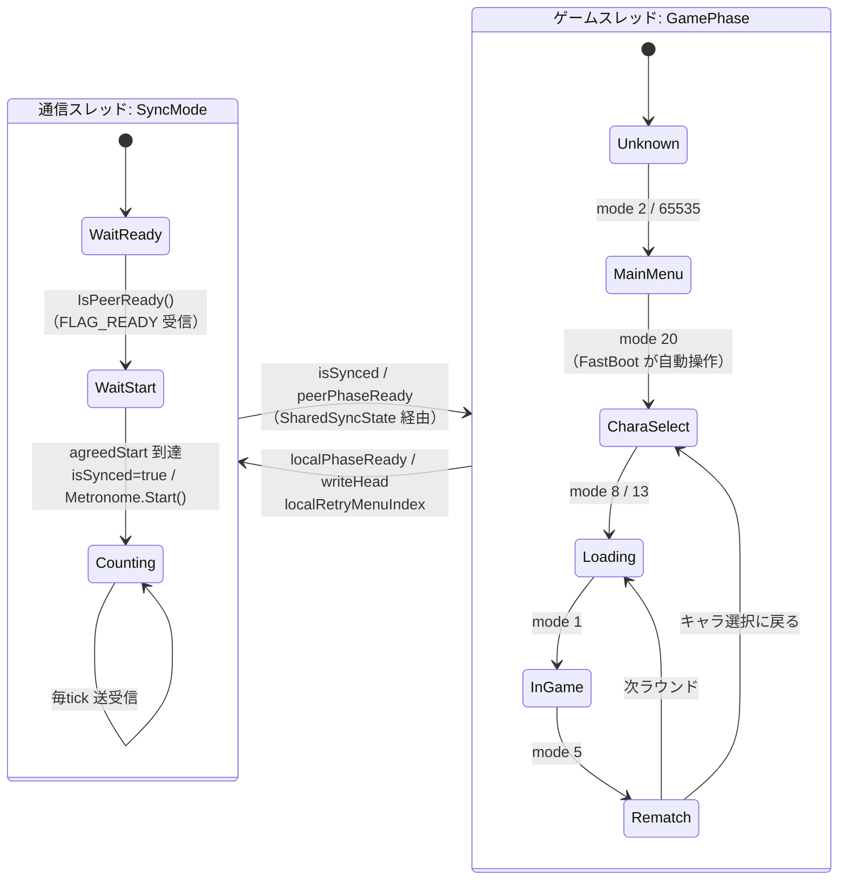
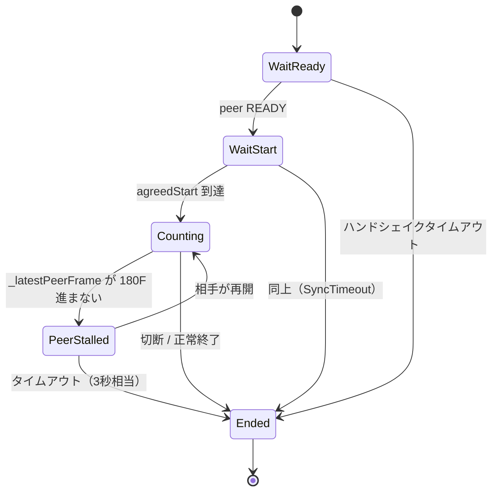

> **旧監査資料（2026-08-13）**。現行仕様は [CURRENT_STATE](../../CURRENT_STATE.md) を参照。本文の「現行」「未実装」は当時の状態。

# 07. セッション状態機械 — 接続からラウンド繰り返しまで

## 責務

- **通信セッションの状態機械**（`SyncMode`）— 接続確立からフレーム送受信開始までのハンドシェイク
- **ゲーム進行の状態機械**（`GamePhase`）— キャラセレ / ロード / 対戦 / リマッチのディスパッチ
- 両者の**対応付け**と、ラウンド境界で基準点（BaseWT）を取り直すこと
- ラウンド開始バリア（IntroBarrier）の成立条件
- Rematch のメニュー選択合意と、次ラウンドへの再突入

本章が扱わないもの: フレーム番号の算出そのもの（04章）、入力の読み書き（05章）、パケット形式（06章）。

---

## 現状の構造

### 主要コンポーネント

| ファイル | 役割 | 実態 |
|---|---|---|
| `sync/NetplaySession.hpp` `:35-39` | `SyncMode` 定義（WaitReady / WaitStart / Counting） | 3状態・一方通行・戻りなし |
| `sync/NetplaySession.cpp` `:178-290` | 通信スレッドのメインループ。`SyncMode` の遷移をここだけが行う | ✅ 動作 |
| `sync/NetplaySession.hpp` `:44-78` | `SharedSyncState` — 2スレッド間の共有状態 | 一部が死にフィールド（後述） |
| `mbaa_mem/PhaseMonitor.cpp` `:34-59` | ゲームメモリの生モードID → `GamePhase` 変換 | ✅ 動作。**状態を持たない毎フレーム読み取り** |
| `engine/SceneRunner.cpp` `:129-346` | `Step()`。フェーズ検出 → 遷移検出 → `MatchScene` ディスパッチ | ✅ 動作 |
| `engine/SceneRunner.cpp` `:48-72` | `OnPhaseChanged()` — 遷移時のリセット | ✅ 動作 |
| `engine/MatchScene.cpp` `:61-131` | IntroBarrier（`HandleRoundStartSync`） | ⚠️ **何もブロックしない**（AUDIT A-3） |
| `engine/MatchScene.cpp` `:159-294` | Rematch のメニュー同期 + 自動ナビ | ❌ **一度も成立していない**（REALHW F-1） |
| `engine/MatchContext.hpp` | 画面間で持ち回す POD | 半分が死にフィールド |

### 2つの状態機械

**この2つは同期していない。** 片方が他方の前提になっているだけで、遷移は独立に起きる。

| | `SyncMode` | `GamePhase` |
|---|---|---|
| 所有スレッド | 通信スレッド | ゲームスレッド（`Present` フック） |
| 保持形態 | `NetplaySession::_mode`（メンバ変数） | **保持しない。毎フレーム `CC_GAME_MODE_ADDR` を読み直す** |
| 遷移の駆動 | 受信パケットと壁時計 | ゲーム本体の進行（DLL は観測するだけ） |
| ライフサイクル | セッション中に**1回だけ**前進。戻らない | ラウンドごとに**何周でも回る** |
| 相手との合意 | あり（READY 交換 / startTime 合意） | **なし。相手の `GamePhase` は一切送っていない** |
| 相互依存 | `Counting` 到達が Metronome 起動条件 | `GamePhase` は `SyncMode` を変えない |

唯一の結合点は `SharedSyncState`（`localPhaseReady` / `peerPhaseReady` / `localRetryMenuIndex` / `needKeepalive`）で、これが2つの状態機械の間の全通信路である。



**時系列上の重なり**（実機ログで確認）:

```
GamePhase :  MainMenu ────────────► CharaSelect ──► Loading ──► InGame ──► Rematch ──► Loading …
SyncMode  :  WaitReady ─► WaitStart ─► Counting ──────────────────────────────────────────────►
                                       ▲
                                       └ 実機実測: startFrame=200 WT=0（両機とも）
                                         ＝ Counting は CharaSelect 到達より前に成立する
```

`SceneRunner.cpp:144` の FastBoot 早期 return が `phase < CharaSelect` の間 (E) 以降を止めているため、
`Counting` 突入時点で両機の `writeHead` は初期値 200、`WorldTimer` は 0 で揃う（REALHW B-3）。
監査 A-1/A-2 が想定した「Counting 前に writeHead が暴走して原点がずれる」は**発現しなかった**。

### 処理の流れ

#### ハンドシェイク（`NetplaySession::ThreadMain`）

| 段 | 条件 | 動作 |
|---|---|---|
| **WaitReady** `:195-203` | 常時 `BuildPacket(0,0,ready=true,0)` を 16.6ms ごとに送信 | 相手の `FLAG_READY` を受けたら `WaitStart` へ |
| **WaitStart** `:209-235` | `_calc.IsThetaStable()` が真になった瞬間に `startTime = now + START_MARGIN_US(500ms)` を提案 | 提案後は合意値を送り続ける |
| **合意** `NetplayClock.cpp:182-185` | `agreed = max(localStart, peerStart)`（peerStart は θ 変換済み） | **遅いほうに合わせる**。両機が同じ値を出す |
| **Counting** `:222-234` | `now >= agreed` | `SetBaselineTheta()` / `isSynced=true` / `Metronome.Start()` |

- **θ の安定判定** (`NetplayClock.cpp:93-112`): 直近 10 サンプル（`STABLE_MIN`）の θ の σ が 1000μs（`STABLE_SIGMA`）未満。1サンプル/16.6ms なので**最短でも約 170ms** かかる。
- **`START_MARGIN_US = 500000`**（0.5秒）: 提案が相手に届き、相手が合意値を返し、両者がそれを認識するまでの猶予。片道遅延の数倍を取っている。
- **合意が `max` である理由**: 両者が独立に提案するため、小さいほうを採ると提案が届く前に開始時刻を過ぎうる。`max` なら遅いほうの提案が支配し、両者とも「未来の時刻」を見る。

> 注意（AGENTS.md / AUDIT A-2）: この 0.5 秒以上の窓の間、`TimeHooks` はゲーム内蔵リミッタを既に殺しており、
> Metronome はまだ動いていない。FastBoot 中は (D)(E) に到達しないためこの窓の実害は小さいが、
> **FastBoot が早く終わった機体では Counting 前にフリーランする**。実機では発現しなかったが、条件依存である。

#### フェーズ遷移（`SceneRunner::Step()`）

```
(A) PhaseMonitor::GetCurrentPhase()        ← 毎F ゲームメモリを読む（状態を持たない）
(B) phase != s_prev → OnPhaseChanged()     ← framesInPhase = 0、各 Reset*() を呼ぶ
(C) FastBoot（phase < CharaSelect のとき早期 return）
(D) Metronome::WaitForNextTick()
(E) ローカル入力 → MatchInputBuffer（背圧判定つき）   ★ 書込みはここで完了
(F) MatchScene::On*(ctx) をフェーズごとにディスパッチ  ★ IntroBarrier はここ
(F2) 確定入力 → GC::WriteInput()                      ★ 無条件に実行される
```

`OnPhaseChanged` のリセット内容:

| 遷移先 | リセット |
|---|---|
| `Loading` | `SetModeNormalSpeed()` / `roundStartSynced=false` / `rollbackReady=false` / `ResetLoading()`（local+peer の phaseReady を落とす） |
| `CharaSelect` | `SetModeNormalSpeed()` / `ResetCharaSelect()`（**空実装**） |
| `InGame` | `ResetInGame()`（`s_syncInitiated` / `s_reachedIntro2` / local+peer phaseReady を落とす） |
| `Rematch` | `ResetRematch()`（メニュー選択の static 一式 + `SharedSyncState.localRetryMenuIndex = -1`） |

#### IntroBarrier（`HandleRoundStartSync`）

```
1. IntroState()==2 を観測 → s_reachedIntro2 をラッチ    （瞬間値で待つと 2→1→0 を取り逃す）
2. localPhaseReady = true  → 以後パケットに FLAG_PHASE_READY が乗る（レベル駆動）
3. isSynced を待つ
4. peerPhaseReady を待つ                                 ← ここがバリア本体
5. 双方到達 → phaseBaseWorldTimer = WorldTimer()、ログ、roundStartSynced = true
```

`MatchScene.cpp:130` が `HandleRoundStartSync` の bool 戻り値を捨て、`OnInGame` は `void`。
呼び元の `SceneRunner.cpp:227-229` も戻り値を持たない。**したがって 1〜4 のどこで「待機」しても、
その後の (F2) は無条件に走る。しかも (E) の入力書込みは (F) より前に完了している。**

### 他領域との境界

| 相手 | 境界 |
|---|---|
| **01 プロセス** | `SceneRunner::Init()` が `NetplaySession::Start()` を呼ぶ。`Stop()` の呼び元が DLL に無い（B-8）のは 01 章の責務 |
| **02 フック** | `Step()` は `DxHook::Hooked_Present` から呼ばれる。**ここでブロックしてはいけない**制約の出所 |
| **03 ゲームメモリ** | `GamePhase` / `IntroState` / `WorldTimer` / `MenuStateCounter` の読み取り。`CC_INTRO_STATE_ADDR` の意味（2=演出中 / 0=進行中）は 03 章が権威 |
| **04 フレーム空間** | 本章のバリアが `BaseWT` と `epochId` を確立し、04 章がそれで `relFrame` を採番する。**基準点を「いつ」取るかが本章、「どう使うか」が 04 章** |
| **05 入力パイプライン** | `MatchScene::IsDrivingInput()` が (F2) の書込みを止める。Rematch の入力取得経路も 05 章と重複 |
| **06 ネットワーク** | `FLAG_READY` / `FLAG_PHASE_READY` / `startTimeUs` / `retryMenuIndex` / `phaseBaseFrame` のパケット表現は 06 章 |
| **08 ロールバック** | `roundStartSynced` / `rollbackReady` がロールバック開始条件になる予定。現状 `rollbackReady` は読み手ゼロ |
| **09 UI** | `isSynced` / `isPeerAlive` をオーバーレイが表示 |
| **10 検証基盤** | 「同じ relFrame なら同じ (mode, intro)」を固定するテストが必要。現在そのテストは存在しない |

---

## 現状の問題

### P-1. IntroBarrier は何もブロックしないのに、ラウンド1では BaseWT が 1 フレーム差で揃う

実機（REALHW C-3）:

| | ラウンド1 | ラウンド2 |
|---|---|---|
| host BaseWT | 1869 | 5412 |
| client BaseWT | 1870 | **5560** |
| 差 | **1** | **148** |

**なぜ揃うのか — バリアが効いているからではない。** 実装から順に説明する。

1. **バリアは「ブロック」ではなく「相互確認イベントの検出」として機能している。**
   ステップ5に到達する条件は「自分が intro=2 に到達済み」かつ「相手の `FLAG_PHASE_READY` を受信済み」。
   これは両機で**同じ論理的瞬間**（＝遅いほうが到達した時刻 + 片道遅延）に成立する。
   ゲームを止めなくても、**タイムスタンプとしては同期している**。ログ行が両機で出るのはこのためであって、
   バリアが待たせた結果ではない。

2. **ラウンド1のゲーム状態が揃っていたのは、バリアとは別の3つの機構による。**
   - `SyncMode::Counting` 突入が両機で `startFrame=200 WT=0`（REALHW B-3）。**原点が最初から揃っていた。**
   - 背圧（`SceneRunner.cpp:180-196`）が `head − confirmed ≤ delay + maxRollback = 6` を強制し、
     netFrame の先行を 6 フレームで頭打ちにする。
   - `WT − writeHead = −156 + starve`（REALHW C-1、実測で誤差 0）。この run では starve 差が 4 しかなかった。
     → WT の差も 4 前後に収まり、intro=2 到達フレームも 1 フレーム差に収まった。

3. **ラウンド2がその証明になっている。** 同じ非ブロックのバリアが同じログを出したにもかかわらず、
   BaseWT は 148 フレーム開いた。**`Both peers reached intro=2!` は「両者の状態が揃った」ことを一切示さない。**
   示しているのは「両者が intro=2 を通過したという通知を交換し終えた」だけである。

> 推測: 148 の内訳は starve 差である。`WT = wh − 156 + starve` と `|Δwh| ≤ 6` から
> starve 差 ≈ 142〜154 が導かれる。Rematch 中に client 側だけが背圧で書込みを止められ続けた
> （`[Backpressure] STALLED/NEAR` が client のログを埋めていることと整合する）。
> starve フレームでは `writeHead` は進まないが `WorldTimer`（＝Present 回数）は進むため、
> **メニュー中に片側だけ Present を余分に回した分が、そのまま WT 差として恒久化する。**

### P-2. ずれの主因は starve ではなく、Rematch フェーズの滞在時間差

Rematch 中のログ行数は host 479 / client 1056 と倍以上違う。
InGame 中は背圧が両者の Present を実質的に噛み合わせているが、**Rematch / Loading には
「進行を噛み合わせる機構が一つもない」。** netFrame は進み続けるのに、その番号がゲーム進行の
どこに対応するかは誰も見ていない。ラウンド間こそがずれの生産工場である。

### P-3. `FLAG_PHASE_READY` の送信がレベル駆動 / 受信がラッチという非対称（AUDIT M2）

| 側 | 実装 | 挙動 |
|---|---|---|
| 送信 | `SyncCodec.cpp:228-231` — `localPhaseReady` が真である**間ずっと**フラグを立てる | レベル駆動 |
| 受信 | `SyncCodec.cpp:172-175` — フラグを見たら `peerPhaseReady = true` を**store するだけ**。落とす経路が無い | ラッチ |

`ResetInGame` / `ResetLoading` が両側を false に戻すが、**リセットのタイミングは各機独立**である。
自分が先に Loading に入ってリセットしても、相手がまだ InGame で `localPhaseReady=true` を送り続けていれば、
次の1パケットで `peerPhaseReady` が復活する。**次ラウンドのバリアは、相手が前ラウンドで立てた真で解除される。**
現状バリアは何もブロックしないため実害が出ていないが、**バリアを効かせた瞬間にこれが最初に踏むバグになる。**

### P-4. Rematch の自動ナビは死んでいる — 原因は3つ重なっている

実測（REALHW F-1）:

| | host | client |
|---|---|---|
| `[Rematch] Local selected` | 1 | **0** |
| `[Rematch] Remote selected` | **0** | **506** |
| `[Rematch] Resolved` | **0** | **0** |
| `AutoNav` | 0 | 0 |

**原因1 — client が自分の入力を読めていない（確定）。**
`MatchScene.cpp:270-272` は `ctx.isHost ? GetPlayer1Input() : GetPlayer2Input()` を直接呼ぶ。
これは `DirectInputHook.cpp:404-423` が**まさに廃止した読み方**である。同ファイルのコメントが明記しているとおり、
`P1Device`/`P2Device` は「ローカルの座席」を意味するため、client 機の利用者は自分を左（P1Device）に割り当てる。
`GetPlayer2Input()` は空キーを読み、**永久に無反応**になる。
`SceneRunner.cpp:201` は `GetLocalPlayerInput(isHost, soloLocal)` に移行済みだが、**`OnRematch` だけ取り残されている。**

**原因2 — `AsmHacks::currentMenuIndex` が実装されていない（確定）。**
`MatchScene.cpp:137-140` の `AsmHacks` は「TODO: AsmHacks モジュールを v10 に統合後」と書かれたプレースホルダで、
`currentMenuIndex` / `menuConfirmState` に**ゲームメモリから値を入れるコードがリポジトリ全体に存在しない**
（書込みは `ResetRematch` の `=0` と `HandleMenuGate` の `menuConfirmState=2` のみ）。
したがって host の `s_localRetryMenuIndex` は常に 0 になり、`HandleAutoNavigation` の
`currentIndex(0) == targetIndex(0)` 分岐に落ち、確定ボタンを撃ち続ける形にしかならない。

**原因3 — 合意が構造的に成立しない（確定）。**
host は remote が来ないので `Resolved` に至らず、client は local が来ないので `Resolved` に至らない。
`max(local, remote)` は**片方が `MENU_INDEX_NONE(-1)` の間は評価されない**（`:221` の AND 条件）ため、
「片側だけ選んだ」状態は永久に未決定のまま残る。

**そして実際のメニュー操作は、この層をまったく通っていない。** `ResolveMenuSelection` が
`input.buttons &= ~(A|CONFIRM)` で確定を潰しているが、この `input` はローカル変数で誰にも渡されない。
物理入力は (E)→バッファ→回線→(F2) の通常経路でゲームに届き、メニューはそちらで進む。
**`OnRematch` 全体が、動いていない並行実装である。**

### P-5. `IsDrivingInput()` の恒久ラッチ

`SceneRunner.cpp:247` は**フェーズを問わず** `IsDrivingInput()` が真の間 (F2) の書込みを止める。
解除するのは `HandleAutoNavigation` の `currentState >= s_targetMenuState` のみだが、
`menuConfirmState` は `OnRematch` のステップ5（`:283`）でしか 0 に戻らず、
そのステップ5は自動ナビ中の早期 return（`:266`）で**到達しない**。
`HandleMenuGate` が `=2` を入れられなければ、`s_targetMenuState=2` は永久に解除されず、
**InGame に戻ってもゲームメモリへの入力書込みが停止したままになる。**
現状は `Resolved` が成立しないので発火しないが、原因1・2 を直して `Resolved` を通した瞬間に露出する。

### P-6. `retryMenuIndex` がフェーズを無視して適用される（AUDIT M3）

`SyncCodec.cpp:178-180` は受信パケットの `retryMenuIndex >= 0` を見て、**フェーズに関係なく**
`SetRemoteRetryMenuIndex()` を呼ぶ。送信側（`:235-236`）もレベル駆動で、`ResetRematch` が
`-1` に戻すまで送り続ける。client が 506 回受けたのはこのためで、
**前ラウンドの選択が次ラウンドの Rematch に漏れる**経路になっている。

### P-7. `MatchContext` の死にフィールド

| フィールド | 状態 |
|---|---|
| `appMode` / `isHost` / `peerIp` / `peerPort` / `localPort` / `delay` / `maxRollback` | ✅ 使用中 |
| `framesInPhase` | ✅ 使用中（60F ログとフェーズ内経過） |
| `roundStartSynced` | ⚠️ `HandleRoundStartSync` の内部ガードのみ。外部の読み手なし |
| `phaseBaseWorldTimer` | ⚠️ **代入とログのみ**（`MatchScene.cpp:100,105`）。算術利用ゼロ |
| `charaSelectSyncDone` | ❌ **読み書きとも 0 件** |
| `fastBoot` | ❌ **読み書きとも 0 件**（FastBoot の実状態は `SceneFastBoot` 側にある） |
| `rollbackReady` | ❌ 書込みのみ（`SceneRunner.cpp:57`）。読み手ゼロ |

`SharedSyncState` 側も同様に、`currentFrame`（読み手ゼロ）、`phaseBaseFrame`（恒久 0）、
`peerPhaseBaseFrame`（書かれるが読み手ゼロ）が死んでいる。

---

## 目指す設計

### 設計原則

1. **2つの状態機械の役割を明示的に分ける。**
   `SyncMode` は**セッション寿命に1回**の接続状態機械。`GamePhase` は**ラウンドごとに回る**進行状態機械。
   依存は `SyncMode::Counting → GamePhase 側が動いてよい` の一方向だけにし、逆流させない。

2. **バリアは「止める」のではなく「番号を切り替える」。**
   `Present` から呼ばれる `Step()` はブロックできない（AGENTS.md / 2026-03-11 の切断事故）。
   だが「ゲームスレッドを止める」以外に待ち合わせの実現方法がある —
   **`relFrame` を発行しない**（＝ (E) の書込みと (F2) の反映をスキップして即 return する）ことである。
   ゲームの絵は進むが、**フレーム空間には何も入らない**。keepalive は通信スレッドが独立に維持する。
   これがブロック禁止制約との両立解である。

3. **基準点はラウンドごとに取り直す。** `BaseWT` はセッションに1つではなく、**エポックごとに1つ**。
   ラウンド間（Rematch / Loading）の進行差は「吸収する」のではなく、
   **エポックを閉じることでフレーム空間から締め出す**。差を計算で消そうとしない。

4. **死んだ機構は通電するか撤去するかの二択。放置しない。**

### 変更点

#### C-1. `RoundEpoch` の導入 — 基準点をいつ取り直すか

```
struct RoundEpoch {
    uint32_t epochId;   // バリアを通過した回数。ラウンド通番
    uint32_t baseWT;    // このラウンドで初めて IntroState()==2 を観測した瞬間の WT
    bool     valid;     // false の間は relFrame を発行しない
};
```

| 事象 | エポック操作 | 理由 |
|---|---|---|
| `GamePhase → Loading` / `→ Rematch` | **`valid = false`**（エポックを閉じる） | ここが差の生産工場。番号を発行しないことで差が入らない |
| `GamePhase → InGame` | `s_reachedIntro2` 待ちに入る | まだエポックは開かない |
| `IntroState()==2` を初観測 | `baseWT = WorldTimer()` を採取（**まだ valid にしない**） | 04章 C-1 と一致。この瞬間はゲーム本体が決めるので相手依存がない |
| `peerPhaseReady`（当該 epochId） 成立 | `epochId++` / `valid = true` | ここで初めてフレーム空間が開く |

**なぜ `baseWT` をバリア解放時ではなく intro=2 ラッチ時に採るか**（04章 と同じ判断）:
バリア解放時刻には片道遅延が乗り、しかもその遅延は左右非対称である。
intro=2 の到達時刻はゲーム本体の演出進行が決めるので、**同じ ROM なら同じ論理位置**になる。
ラウンド1の BaseWT 差 1 フレームは、現状が解放時に採っているために乗った片道遅延誤差だと考えられる（推測）。

#### C-2. バリアを本当に効かせる — ブロックせずに

`OnInGame` を bool 化する案（AUDIT 1-5）は**採らない**。戻り値を (F2) の条件にするだけでは
(E) が既に書き終わっている問題が残り、(E)(F)(F2) の順序を組み替える大手術になる。

代わりに `SceneRunner::Step()` の先頭に**エポックゲート**を置く。

```
(A) phase 検出
(B) 遷移検出
(C) FastBoot
(C2) ★ エポックゲート:
       epoch.valid == false なら
         → バリア進行（intro=2 ラッチ / localPhaseReady 送出要求 / peerPhaseReady 判定）だけ行う
         → needKeepalive = true
         → return   ← ゲームスレッドはブロックせず、次フレームで再チェック
(D) Metronome
(E) 入力 → バッファ（relFrame で採番）
(F) MatchScene ディスパッチ
(F2) 確定入力 → ゲームメモリ
```

- ゲームスレッドは 1 フレーム分の処理を終えて `Present` に戻るので、**描画も WndProc も keepalive も止まらない**。
- (E) が実行されないため `writeHead` は進まず、相手が待たされても背圧が誤作動しない。
- Rematch / Loading もこのゲートに落ちるので、**メニュー滞在時間の差はフレーム空間に一切入らない**。

#### C-3. `PHASE_READY` を epochId タグ付きにする（P-3 の解）

| | 現状 | 変更後 |
|---|---|---|
| 送信 | `flags.bit1` のレベル駆動 | `flags.bit1` + **`readyEpochId`（uint32）**を同梱 |
| 受信 | 無条件に `peerPhaseReady = true` | **`readyEpochId == 自分の次の epochId` のときだけ** ラッチ |

`epochId` は「バリアを通過した回数」なので**両機で自明に一致し、交換して突き合わせる必要がない**
（04章 C-3 の二層番号と同じ性質）。これで「前ラウンドの true が次のバリアを素通りさせる」経路が閉じる。
死んでいる `phaseBaseFrame`（恒久 0）をこのフィールドに転用すれば、パケットサイズは変わらない。

#### C-4. Rematch の自動ナビは**撤去する**

**判断: 直さない。機能ごと外す。** 理由を順に述べる。

1. **復活コストが同期本体より高い。** 動くには `AsmHacks::currentMenuIndex` / `menuConfirmState` を
   ゲームメモリから供給する必要があるが、これは未実装の ASM フックモジュールであり、
   `MbaaAddresses.hpp` のキャラセレ・メニュー系定数も全て未使用（AUDIT: 定数の 78% が未使用）。
   本章の主題である「ラウンド間の進行差」とは無関係な投資になる。
2. **実害があり、しかも直すと露出する。** P-5 の `IsDrivingInput()` 恒久ラッチは、
   自動ナビが**成立しない今だから安全**という状態にある。原因1・2 を直して `Resolved` を通すと、
   全フェーズの入力書込みが止まるバグが本番で顕在化する。
3. **必要性そのものが消える。** C-1/C-2 により Rematch はエポック外＝同期対象外になる。
   メニューは各機のローカル入力で独立に動かし、**次のエポックで合流する**設計になるため、
   「両者のメニュー選択を合意して自動でカーソルを動かす」機構が不要になる。
4. **メニュー操作は既に通常経路で動いている。** 物理入力は (E)→回線→(F2) で相手にも届いており、
   実機で 2 ラウンド + リマッチが進行した実績がある。

**撤去する対象**: `HandleAutoNavigation` / `ResolveMenuSelection` / `HandleMenuGate` /
`IsDrivingInput()` とその呼び出し（`SceneRunner.cpp:247`）/ `AsmHacks` プレースホルダ /
`SyncPayload.retryMenuIndex` の適用（`SyncCodec.cpp:178-180`）/ `SharedSyncState.localRetryMenuIndex`。

**残すもの**: `OnRematch` は「エポックを閉じ、相手が Rematch を抜けたかを1ビットで交換する」だけにする。
選択インデックスは送らない（P-6 の漏れ経路がフィールドごと消える）。

> 撤去は機能の放棄ではない。**両者の合意が要るのは「次のラウンドを始める」ことだけで、
> 「どのメニュー項目を選ぶか」ではない。** 後者はゲーム本体が入力から決める。

#### C-5. `SyncMode` に終端状態を足す

現状 `SyncMode` は前進のみで、異常も終了も表現できない。



- **`PeerStalled`**: REALHW E の「ホストがフリーズしても切断にならない」への対処。
  `_latestPeerFrame`（現状ログのみ）が一定時間進まなければ状態を落とす。
  キープアライブは「プロセスが生きている」しか示さないので、**進行の生存性は別に見る必要がある**。
- **`Ended`**: `SessionErrorType::SyncTimeout` を書くコードが存在しない問題（AUDIT M）の受け皿。
  `NetplaySession::Stop()` の呼び出し（B-8）と合わせて 01 章の DETACH パスと接続する。

#### C-6. `MatchContext` / `SharedSyncState` の整理

| 対象 | 措置 |
|---|---|
| `charaSelectSyncDone` / `fastBoot` / `rollbackReady` | **削除**（キャラセレ同期・ロールバックは未実装。復活時に必要な形で再定義する） |
| `phaseBaseWorldTimer` | `RoundEpoch.baseWT` に**移設**。`MatchContext` からは外す（ゲームスレッド専有ではなく 04 章と共有するため） |
| `roundStartSynced` | `RoundEpoch.valid` に**統合** |
| `SharedSyncState.phaseBaseFrame` | `readyEpochId` に**転用**（C-3） |
| `SharedSyncState.peerPhaseBaseFrame` / `currentFrame` | **削除**（読み手ゼロ） |
| `SharedSyncState.localRetryMenuIndex` | **削除**（C-4） |
| `SharedSyncState.remoteInputs[]` / `remoteWriteIndex` | 要調査。`MatchInputBuffer` と二重の可能性（05 章と突き合わせ） |

### 移行手順

各段が単独でビルド・検証可能であること、**壊れやすい順ではなく実害の大きい順**に並べる。

| 段 | 内容 | 検証（合格条件） |
|---|---|---|
| **T0 観測** | `epochId` を計算してログにだけ出す。`[IntroBarrier]` に `epochId` と `intro=2 ラッチ時の WT` を追記。ログ間引き（REALHW F-2）を先に済ませる | 実機 2 ラウンドで `epochId` が両機 1,2 と一致する。ラッチ時 WT と解放時 WT の差が測れる |
| **T1 自動ナビ撤去** | C-4。`IsDrivingInput()` と `retryMenuIndex` 経路を削除 | 実機でリマッチが従来どおり進行する。`[Rematch]` 系ログが消える。**単独で P-5 の潜在バグが消える** |
| **T2 エポック導入（影運用）** | `RoundEpoch` を作り、`valid` の遷移だけ動かす。**ゲートはまだ入れない** | Loading/Rematch で `valid=false` になる区間がログで確認できる。挙動は不変 |
| **T3 エポックゲート投入** | C-2 の (C2) を有効化 | harness で `--host-loading 60 --client-loading 180` を与えても、InGame 開始後の入力列が一致する。リマッチ後の BaseWT 差が消える |
| **T4 PHASE_READY のタグ化** | C-3 | 2 ラウンド目のバリアが 1 ラウンド目の通知で解除されないこと（意図的に片側を遅らせて確認） |
| **T5 PeerStalled / Ended** | C-5 | 片側を強制サスペンドしたとき、3 秒以内に両者がエラー終了する（現状は無言フリーズ） |
| **T6 死にフィールド削除** | C-6 | ビルドが通る。単体テストが通る |

T3 は 04 章の `relFrame` 切替（04章 S2）と**同時に入れる必要がある**。
ゲートだけ入れて採番が `writeHead` のままだと、`valid=false` 区間で番号が進まない一方
`WT` は進み続け、`WT − wh` の恒等式が壊れて計測が読めなくなる。

---

## 未確定事項

1. **エポック外（`valid=false`）に相手から届いた入力をどう扱うか。**
   捨てる / 次エポックの先頭として貯める、の 2 案。片側が先に次ラウンドの InGame に入り、
   もう片側がまだ Rematch にいる区間が必ず存在するため、実測で長さを測ってから決める。

2. **`intro=2` を観測できないラウンドが存在するか。**
   `GamePhase::InGame` には `CC_GAME_MODE_REPLAY(26)` も含まれる。リプレイ再生や特殊演出で
   `IntroState` が 2 を経由しない場合、エポックが永久に開かず (C2) で固まる。
   **フォールバック（N フレーム経過で強制的にエポックを開く）が要るかどうかは未確認。**
   → T0 で `[IntroTrack]` の遷移列を全ラウンド分集めれば判定できる。

3. **`epochId` は本当に交換不要か。**
   「バリア通過回数は両機で一致する」は、片側だけがラウンドを取りこぼさないことに依存している。
   `GamePhase` の遷移検出はメモリ読み取りなので、1 フレームだけ現れる中間モードを
   片側が取り逃すと `epochId` がずれる。**ずれた場合の検出手段（パケットで突き合わせるだけ）は安いので、
   交換しないが検証はする、が妥当と考える。**

4. **`CharaSelect` はエポックを持つべきか。**
   キャラセレ同期は未実装（`CC_P1/P2_CHARA_SELECTOR_ADDR` 等が全て未使用）。
   現状はキャラセレ中も入力が回線を通っており、事実上「同期しているつもり」の状態にある。
   エポック外にすると選択が相手に届かなくなるため、**キャラセレは当面エポック内のまま残す**が、
   基準点が無いので `relFrame` の意味が InGame とは異なる。この扱いは 04 章と合わせて再検討が要る。

5. **ホストのフリーズ原因（REALHW E）。**
   `Present` が来なくなった理由が特定できていない。C-5 の `PeerStalled` は**症状の緩和**であって
   原因の修正ではない。再現条件が要る。

6. **`MenuStateCounter()` の実装差。**
   `GameMemory.cpp:22` は 0 を返すスタブ、`RealGameMemory.cpp:56` は実アドレスを読む。
   どちらが本番経路かによって `HandleMenuGate` の挙動が変わるが、C-4 で撤去するため
   **実害は消える。ただし将来メニュー同期を再実装する際は最初にここを確認すること。**
