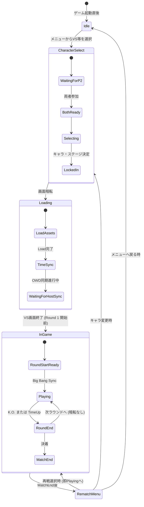

# 09 Netplay Workflow (ネット対戦_ワークフロー仕様書)

## 1. 概要
プレイヤーA (Host) とプレイヤーB (Client) がネット対戦を開始し、終了するまでのシステム全体の流れ（ワークフロー）を概要レベルで定義します。
詳細なパケット送受信やタイミングの内部ロジックは「10 ネット対戦_ワークフロー詳細仕様書」を参照してください。

## 2. 全体フロー図

```mermaid
sequenceDiagram
    participant Host as Player A (Host)
    participant Relay as Relay API (Optional)
    participant Client as Player B (Client)
    participant GameA as MBAA.exe (A)
    participant GameB as MBAA.exe (B)

    Note over Host, Client: 1. 接続確立フェーズ (CLI App)
    Host->>Host: CLI起動、Netplay -> Hash Connect (Host) 選択
    Host->>Relay: グローバルIP情報の取得要求
    Relay-->>Host: IP返却
    Host->>Host: Hash生成、クリップボードコピー、UDP待受開始
    Host-->>Client: (Discord等でHash文字列を伝達)
    Client->>Client: CLI起動、Netplay -> Hash Connect (Client) 選択、Hash入力
    Client->>Host: UDP Ping (Hole Punching) 送信
    Host-->>Client: UDP Pong 返信 (接続確立)

    Note over Host, GameB: 2. ゲーム起動フェーズ
    Host->>Host: IPC(共有メモリ)に接続情報書き込み
    Client->>Client: IPCに接続情報書き込み
    Host->>GameA: MBAA.exe 起動 & DLL Injection
    Client->>GameB: MBAA.exe 起動 & DLL Injection

    Note over GameA, GameB: 3. インゲーム同期フェーズ (DLL)
    GameA->>GameA: キャラセレ画面到達
    GameB->>GameB: キャラセレ画面到達
    GameA<-->>GameB: (Lock-Step) 入力パケット交換・カーソル同期
    GameA->>GameA: キャラ決定 -> Loading状態
    GameB->>GameB: キャラ決定 -> Loading状態
    GameA<-->>GameB: TimeSynchronizerによる時刻同期 (OWD測定)
    
    Note over GameA, GameB: 4. ラウンド開始フェーズ
    GameA->>GameA: VS画面終了 -> ラウンド1 Ready
    GameB->>GameB: VS画面終了 -> ラウンド1 Ready
    GameA<-->>GameB: 同期開始 (Big Bang Sync)

    Note over GameA, GameB: 5. 対戦フェーズ (Rollback)
    GameA<-->>GameB: (Rollback稼働) 入力パケット送受信ループ
    GameA->>GameB: 切断検出 または 試合終了
```

## 3. セキュリティと安定性
- UDP Hole Punchingは双方から同時に打ち合うことでNAT越えを実現しますが、失敗した場合は外部のRelayサーバーへのフォールバックを将来の拡張機能として考慮します。
- DLLインジェクション後は、外部のCLIアプリ(CCCaster.exe)はゲーム自体に関与せず、最小限のリソースで裏に待機します。


---

# 10 Netplay Workflow Details (ネット対戦_ワークフロー詳細仕様書)

## 1. 概要
「09 ネット対戦_ワークフロー仕様書」で定義した全体フローにおいて、各ステップにおけるシステム内部での詳細な条件分岐、パケット処理、およびエラーハンドリングを定義します。

## 2. フェーズ別詳細フロー

### 2.1 接続確立フェーズ (ネゴシエーション)
- **Host側**:
  - バインドポートが開けない場合は「Bind Error」として終了処理へ移行。
  - 受信パケットのうちサイズ26B未満のものはすべて破棄（Drop）。
- **Client側**:
  - Hashから抽出したIPv4/IPv6の2エンドポイントに対し、Pingパケット（Type: 0）を 100ms 間隔で最大30回 (約3秒) 送り続ける。
  - 先にPongが返ってきたアドレスを `Active Endpoint` として固定。以降、もう一方のアドレスへの送信パケットは破棄。
- **Auto-Lock (テスト用確定ロジック)**:
  - 両者が相互に送受信を開始してから、連続して「パケット到達」が確認できた状態が 2.0 秒間続いた時点で「安定接続（Lock-in）」と判定する。
  - タイマーが3.5秒（変更可能）を超過してもPongが来ない場合、Timeout（切断）エラーとしてMainMenuに還元する。

### 2.2 ゲーム起動フェーズ (IPC書き込み処理)
- `MemoryMappedFile` (名称: `Local\CCCaster_IPC_Config`) に対して128バイトの固定長構造体を書き込む。
- 書込内容:
  - Target IP Address (文字列: 16B)
  - Target Port (ushort: 2B)
  - Self Port (ushort: 2B)
  - Initial Ping Value (ushort: 2B)
- `GameLauncher` は `MBAA.exe` をCREATE_SUSPENDEDフラグ付きで起動。
- プロセスIDを取得し、スレッドコンテキストを弄ることなく `LoadLibraryA` スレッドを安全に注入する。DLLエントリポイント実行後、メインスレッドをResume。

### 2.3 DLL初期化・インジェクト後フロー
- DLL側 (`dllmain`) はアタッチ直後に `IpcManager::Read()` を実行。
- 共有メモリにデータが存在しない場合（つまり手動で直接MBAAが起動された場合）、ネットワークThreadは立てず、**純粋なオフライン動作**として稼働をフォールバックする。
- 接続情報が存在すれば、`PacketRouter` のバックグラウンド送信スレッドと受信リスナースレッド（Asio io_context）を走らせる。

### 2.4 インゲーム同期・障害対応
- 対戦中にUDPパケットのシーケンス番号（`sequenceId`）がスキップした場合（ドロップ検知）、ACK/NACKや再送要求（Retransmission）は行わない。
- 代わりに、必ず次のパケットに同梱されている「過去10フレーム分」の入力から欠落データを補間（Redundancy Recovery）する。
- 10フレーム（166ms）以上連続してロスした場合にのみ、初めて致命的なDesync（またはフリーズ）が発生する設計。


---

# 11 Netplay Screen Transition (ネット対戦_画面遷移順序の仕様書)

## 1. 概要
インゲームフック（DLL）側から見た、ゲーム本体の画面推移と、それに紐づくパケットおよび内部同期ステートの切り替え順序を定義します。

## 2. 状態遷移図 (State Machine)

各状態（Phase）は `GameInterface::GetGameState()` などをポーリングすることでフック側が受動的に検知します。



## 3. 各遷移時のトリガーおよびアクション

### [T1] Idle -> CharacterSelect
- **検知トリガー**: ゲーム内メモリ `introState` が 特定の値 (例: 5) になる。
- **DLLアクション**: `PacketRouter` に対してPhase=0のパケット送信許可を出す。過去に保持された入力を全クリアする。

### [T2] CharacterSelect -> Loading
- **検知トリガー**: キャラ・月・アシスト・ステージのメモリ値が両プレイヤー分確定（LockedIn）し、画面フェードアウト開始。
- **DLLアクション**: Phase=1。入力パケットの送信を停止する代わりに、`TimeSynchronizer` に「SyncReq開始指示」を発行する。

### [T3] Loading -> InGame (Big Bang Sync)
- **検知トリガー**: VS画面が終わり、キャラクターがステージに配置された状態(`introState == 2 && frameTimer == 0`)。
- **DLLアクション**: 
  - `TimeSynchronizer` が両者のタイマーを照合し、同じタイミング（オフセット反映後）でゲームエンジンのスリープ（または VirtualClock の Halt）を解除する。
  - RollbackEngine の SaveState(Frame 0) を作成し、バッファリング開始。Phase=2(通常入力交換)へ。

### [T4] MatchEnd -> CharacterSelect
- **検知トリガー**: リザルト画面で「キャラクターセレクトに戻る」が選ばれた時。
- **DLLアクション**: RollbackEngineの全状態破棄。`TimeSynchronizer`の推測ドリフト値だけを維持し、それ以外をクリア。Phase=0へ遷移。


---

# フェーズ別 同期処理・入力制御 総合設計書

本ドキュメントでは、ネットワーク対戦における3つの主要なゲームフェーズ（①キャラセレクト、②対戦中、③再戦画面）についての「インプット処理」「同期処理」の業務仕様、関連変数、対象ソースコード、および具体的な不安材料を定義します。

---

## 1. キャラクターセレクト画面 (Character Select)
ゲームモード: `CC_GAME_MODE_CHARA_SELECT` (20)

### 1-1. インプット処理（入力フィルタリング）
- **概要:** プレイヤーからの生の入力（DirectInput等）をそのままメモリに書き込まず、システム状態に応じて特定のボタン入力を安全にマスクします。
- **仕様:**
  1. 画面移行後150Fは「Aボタン / 決定」を無効化（ムーン選択時のDesync回避策）。
  2. 自身が「キャラ選択中」の状態（=ムーン選択やカラー選択ではない状態）では、「Bボタン / キャンセル」を無効化（前画面への逆行によるセッション断絶防止）。

### 1-2. 同期処理（ディレイベース完全同期）
- **概要:** キャラセレ画面はゲーム状態の保存・巻き戻し（ロールバック）が安全に行えない（UIアニメーションやアセットロードが絡むため）ため、**純粋なディレイベース方式**を採用します。
- **仕様:**
  - ローカルの入力とリモート（相手）の入力が特定のフレームで揃うまで、ゲームのループ進行（`WORLD_TIMER`の進行）をポーズ（`SKIP_FRAMES`等を活用）して待機します。

### 1-3. 担当ソースファイルと業務変数
- **ソースファイル:**
  - `src/app/core_dll/sync/InputFilter.cpp` (入力マスク・フィルタ処理)
  - `src/app/core_dll/game_interface/GameHooks.cpp` (モード検知・スキップフレーム制御)
- **業務変数:**
  - `framesInCharaSelect`: 画面突入からのローカル経過フレーム数。
  - `CC_P1_SELECTOR_MODE_ADDR` / `CC_P2_SELECTOR_MODE_ADDR`: 現在の選択階層（キャラ/ムーン/カラー）。

### 1-4. 具体的な不安材料 (Anxiety Points) と 旧仕様での解決策
1. **暗黙のUIディレイによるズレ:** メニューUIの描画やアニメーションが環境（PCスペック・ロード時間）によって微妙に異なり、全く同じフレームで入力を合成してもキャラセレ結果がズレる（Desync）危険性。
   - **旧仕様での解決策:** 一切の「決定ボタン」「キャンセルボタン」を、カーソル移動（十字キー入力）の直後 `3F` （フレーム）は完全に無効化する処理（`hasButtonInHistory` 等の履歴参照）を入れることで、UIアニメーション中のミスクリックによるDesyncを力技で排除していました。
2. **決定プロセスのデッドロック:** 一方がキャラを決定して「Loading」に進もうとしている際、もう一方がパケットロスで取り残された場合、両者のゲームモード状態が乖離し進行不能に陥るリスク。
   - **旧仕様での解決策:** モード遷移時（`CharaSelect` -> `Loading`）に `TransitionIndex` というインクリメントされる状態番号をTCP相当の到達保証付きパケットで送り合い、互いのインデックスが揃うまでゲーム進行タイマー (`WORLD_TIMER`) を停止（スキップ）させることで同期を担保していました。
3. **観戦者の初期ステート生成:** 観戦者がキャラセレの「途中」から参加した場合の、途中経過（誰が何を選んでいるか）のブロードキャスト生成タイミングの難しさ。
   - **旧仕様での解決策:** キャラセレ中であってもメモリ上の `CC_P1_CHARACTER_ADDR` 等の即値をそのまま `InitialGameState` メッセージに詰めて後入り観戦者に送信していました。観戦者側は受信した即値を毎フレームメモリに上書きし続ける（疑似操作）ことで、ホスト側への完全追従を実現していました。

---

## 2. 対戦中 (In-Game / Versus)
ゲームモード: `CC_GAME_MODE_IN_GAME` (1)

### 2-1. インプット処理（予測と確定）
- **概要:** ローカル入力は遅延（Fixed Delay）分だけバッファに積み、即座には適用しません。リモート入力は到着次第バッファに格納します。
- **仕様:** 相手の入力が届いていない未来のフレームを描画する際は、相手の**「最後の確実な入力」をリピート（予測）**してローカルの入力を適用し、ゲームを進行させます。

### 2-2. 同期処理（ロールバック同期）
- **概要:** GGPO方式のステート保存(Save)・巻き戻し(Load)・再計算(Fast-forward)を行います。
- **仕様:**
  1. 毎フレーム、変更前のゲームメモリ全体（または差分）をバックアップ（`SaveState`）。
  2. リモートの遅延入力が到着した際、過去の予測入力と異なっていた場合は、不整合が起きたフレームまで状態をロード（`LoadState`）。
  3. そのフレームから現在フレームまで、正しい入力を用いてゲームロジックだけを高速で再実行（描画スキップ）し、現在フレームに追いつきます。

### 2-3. 担当ソースファイルと業務変数
- **ソースファイル:**
  - `src/app/core_dll/sync/RollbackEngine.cpp` (予測・巻き戻し・高速進行制御)
  - `src/app/core_dll/sync/StateBuffer.cpp` (メモリ状態のリングバッファ管理)
- **業務変数:**
  - `localFrame` / `remoteFrame`: 双方の確定済み入力フレーム。
  - `rollbackFrames`: 現在進行フレームと確定フレームの差分（どこまで巻き戻れるか）。
  - `MAX_ROLLBACK`: ロールバックの限界値（例: 15フレーム）。

### 2-4. 具体的な不安材料 (Anxiety Points) と 旧仕様での解決策
1. **メモリセーブ・ロードの取りこぼし:** RNG（乱数シード）、エフェクトジェネレータのポインタ、サウンドの再生フラグなど、セーブ対象から漏れたポインタがあると、ロールバックのたびに乱数がズレて決定的なDesync（蝶や飛び道具の軌道ズレなど）を引き起こす。
   - **旧仕様での解決策:** 旧 `DllRollbackManager.cpp` では、メモリ全体のダンプ（`binary_res_rollback_bin`等で定義された静的アドレス群）をセーブするだけでなく、**SFX（効果音）の再生履歴配列 (`sfxHistory`) を自前で管理**し、ロード時に「ロールバックで取り消されたフレームで鳴るはずだった音」をミュート属性で上書きして消し込むという、非常に緻密な状態補正を手動で行っていました。また、リプレイ入力履歴のポインタ差し戻しも手動で計算していました。
2. **パフォーマンススパイク:** 1フレーム中に最大15フレーム分のゲーム処理を再計算するため、CPU負荷がスパイクし60FPSを維持できなくなるリスク。
   - **旧仕様での解決策:** 描画命令（DirectX / DX9）のフック処理を活用し、ロールバックによる `AdvanceFrame`（再計算）の実行中はフラグ (`CC_SKIP_FRAMES_ADDR`) を立てて画面へのレンダリングを完全にスキップ（Early Exit）することで、CPU/GPUの計算リソース落ちを回避していました。
3. **ラウンド開始の同期:** "Fight!" の文字が出る遷移フレーム（対戦開始フレーム）において、両者の `WORLD_TIMER` 0フレーム目が完全に合致しないと、開幕からDesyncする問題。
   - **旧仕様での解決策:** `Loading` から `InGame` への以降時に、双方のRNG（乱数）状態の完全なコピー（`RngState` メッセージ）を送信・共有し、強制的に乱数シードを一致させた上で `startWorldTime` 変数を基準としてフレーム番号の絶対評価をリセットしていました。

---

## 3. 再戦画面 (Rematch / Retry Menu)
ゲームモード: `CC_GAME_MODE_RETRY` (5)

### 3-1. インプット処理
- **概要:** リザルト画面・再戦選択メニューでの入力制御。
- **仕様:** 対戦終了後の猶予期間は入力を自由に受け付けますが、UI上の「再戦 (Rematch)」「キャラ変更 (Chara Select)」「メインメニュー (Main Menu)」のいずれかにカーソルを合わせて「決定」を押した瞬間に、以降のアクション入力をロック（マスク）します。

### 3-2. 同期処理（非対称メニュー同期）
- **概要:** 両者の選択結果が出揃うまで、画面遷移をネットワークレイヤーで保留（ディレイベース）にします。
- **仕様:**
  - どちらかが「決定」を送信したら、相手からの「決定」パケットが届くまでローカルのゲーム状態をスピンウェイト（`SKIP_FRAMES`）させます。
  - 両者の決定が出揃った時点でネットワーク調停を行い、**「どちらか一方がキャラ選択やメインメニューを選んだ場合は、格下げしてそちらに合わせる（再戦フラグを折る）」**といった遷移ルーチンを強制適用します。

### 3-3. 担当ソースファイルと業務変数
- **ソースファイル:**
  - `src/app/core_dll/sync/MenuSync.cpp` (新規作成想定：非戦闘メニュー専用の同期ハンドラ)
  - `src/app/core_dll/game_interface/GameHooks.cpp`
- **業務変数:**
  - `localRetrySelection` / `remoteRetrySelection`: それぞれのプレイヤーの再戦メニューにおける選択結果（列挙型）。
  - `isRetrySyncComplete`: 双方が選択を完了し、次画面への移行が許可されたかどうかのフラグ。

### 3-4. 具体的な不安材料 (Anxiety Points) と 旧仕様での解決策
1. **フライング画面遷移:** ローカルが先に「キャラ選択」を選んだ際、ゲームクライアントのネイティブロジックが相手の返答を待たずに勝手に暗転・画面遷移を開始してしまう（フックしきれない）リスク。
   - **旧仕様での解決策:** ゲーム自身のメニュー配列（`AsmHacks::currentMenuIndex` 等）とローカル・リモートそれぞれの「決定したインデックス」情報（`_localRetryMenuIndex`）を分離して管理し、双方が同じインデックスを選択する（または強めのメニューに格下げ調停される）まで、`RETURN_MASH_INPUT ( 0, CC_BUTTON_CONFIRM )` などでゲームに入力を渡さない（あるいは押しっぱなし状態をキャンセルする）というフックを仕掛けていました。メニュー遷移中は自動的に相手を待つ状態 (`menuConfirmState`) に遷移させていました。
2. **タイムアウト時の挙動:** 相手が回線落ち（またはAlt+F4等）した場合、再戦画面で「相手の決定待ち」のままデッドロックし、アプリケーションが永久フリーズする問題。
   - **旧仕様での解決策:** `DllMain.cpp` のタイムアウト・切断検知時（UDP Pingの欠落など）に `delayedStop` または `lazyDisconnect` フラグを立て、再戦メニューなど通信が必要なステートに入った段階で問答無用で `ERROR_INTERNAL` や「Disconnected!」を投げてセッションをクローズ（タイトル画面等に強制送還）する安全装置が組み込まれていました。
3. **勝敗数のメモリ同期:** 再戦を選択してシームレスに `CC_GAME_MODE_IN_GAME` に戻る際、各クライアント内で保持している勝敗数（Win Count）やゲームラウンドカウンタが正しくリセット・継承されるかの不確実性。
   - **旧仕様での解決策:** （この点は明確なハックコードがなく、MBAA本体のゲームシステムが勝手にP1/P2のWin Countを維持して再戦してくれる仕様にタダ乗りしていました。万一Desyncした場合はゲーム終了までズレたままになります）。


---


