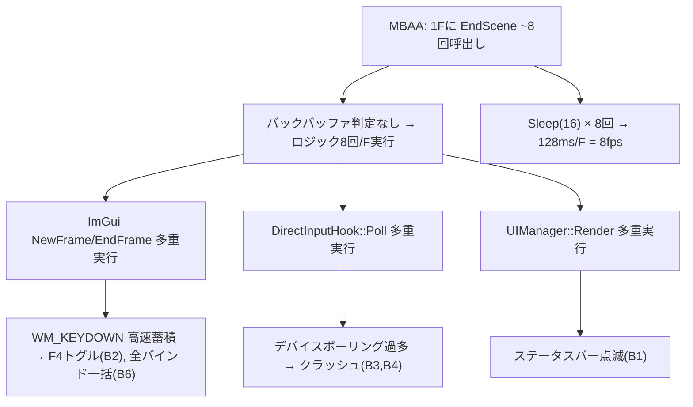

# バグ報告: UI描画の高速点滅・クラッシュ

**報告日**: 2026-02-28
**ステータス**: 🟡 修正済み（DxHook責務分離 `4ee87f2` で根本原因対処済み、要デプロイ確認）
**影響範囲**: 全 ImGui UI（ステータスバー、マッピングウィンドウ）
**再現性**: 100%（実機・VM 両方で発生）

---

## 症状一覧

| # | 症状 | 実機 | VM | 優先度 |
|---|------|------|-----|--------|
| B1 | ステータスバー（常時表示UI）が消失 or 一瞬表示→高速で消える | ✅ | ✅ | 🔴 |
| B2 | F4 マッピングUIが一瞬表示→即消失、高速点滅 | ✅ | ✅ | 🔴 |
| B3 | マッピングUI操作中にクラッシュ（~1秒後） | ✅ | ❌ | 🔴 |
| B4 | 何もせず放置していてもクラッシュ | ✅ | ❌ | 🔴 |
| B5 | バインドしたキーがゲームに反映されない | ✅ | 未確認 | 🟡 修正済 |
| B6 | ボタン1つで全バインドが埋まる | ✅ | 未確認 | 🟢 修正済 |

---

## 根本原因分析

### 主因: MBAA の 1F内 EndScene 多重呼び出し

```
想定:  EndScene(1回/F) → ロジック実行(1回/F)
実態:  EndScene(~8回/F) → ロジック実行(~8回/F)  ← 1Fに8回実行されていた
```

- MBAA は1フレーム中に描画関数 (EndScene) を **約8回** 呼び出す（バックバッファ + 複数サーフェス）
- DxHook がこの EndScene に直接ドメインロジック（SceneRunner::Step, DirectInputHook::Poll, UIManager::Render）を紐づけていたため、**1F分の処理が8回実行**されていた
- さらに `Sleep(16)` が全 EndScene 呼び出しに効くと 16ms × 8 = **128ms/F → 実質8fps** となり異常に遅く見える
- 結果として「高速呼び出し」と「極端な遅延」が場面により交互に発生していた

### 連鎖障害



### 対処（DxHook 責務分離 `4ee87f2`）

- **バックバッファ判定**: EndScene 呼び出し時にレンダーターゲットがバックバッファの場合のみ処理を実行
- **Sleep(16) 削除**: 二重フレーム制御を排除（`VirtualClock::Adaptive_FrameSleep` に一元化）
- **コールバック化**: ドメインロジックを DxHook から分離し、バックバッファ時のみコールバック発火

---

## 個別バグ詳細

### B1: ステータスバー消失

- **原因**: EndScene の超高速呼出しにより、ImGui の内部状態が不安定
- **追加要因**: 誤って追加した「タイムスタンプガード」（1ms 閾値）が高FPS環境で全フレームをスキップ
- **修正**: タイムスタンプガード撤去 + `Sleep(16)` 追加（コード修正済、**未デプロイ**）

### B2: マッピングUI 高速点滅・即消失

- **原因**: Windows の `WM_KEYDOWN` はキー押しっぱなしでリピート発火する。F4 の各リピートで `OnMappingInput()` が Open/Close を高速トグル
- **修正**: `InputHook.cpp` で `lParam & (1 << 30)` によるキーリピート除外（コード修正済、**未デプロイ**）

### B3: マッピングUI操作中クラッシュ

- **原因**: 高速描画環境下で以下が競合
  1. `ControllerUiLogic::Update()` が毎秒数千回実行
  2. `DirectInputHook::Poll()` のデバイスアクセス過多
  3. `CheckInputBind()` 内の `std::stoi` が不正文字列で例外
- **修正**: 
  - `CheckInputBind` に try-catch 追加（修正済）
  - `UIManager::Render` に try-catch 追加（修正済）
  - `Sleep(16)` で根本的に呼出し頻度を制限（コード修正済、**未デプロイ**）
- **注意**: try-catch は C++ 例外のみ捕捉。アクセス違反（SEH）は `__try/__except` が必要

### B4: 放置クラッシュ

- **原因**: B3 と同根。スピードハック下の超高速ポーリングでリソース枯渇 or メモリ破壊
- **修正**: `Sleep(16)` が効けば解消される見込み

### B5: バインド未反映（修正済）

- **原因**: `SaveBinds()` 完了後に `DirectInputHook::ReloadConfigs()` が呼ばれていなかった
- **修正**: 両パス（キーボード/ジョイスティック）で `ReloadConfigs()` 追加

### B6: 全バインド一括埋まり（修正済）

- **原因**: `ImGui::IsKeyPressed()` デフォルトでリピート有効
- **修正**: 全呼出しに `repeat=false` 追加 + バインド開始フレームの `ProcessBindingInput` スキップ

---

## 修正コードの状態

| ファイル | 修正内容 | コミット | デプロイ |
|---------|---------|---------|---------|
| `Controller_Ui_Logic.cpp` | IsKeyPressed repeat=false, ReloadConfigs 追加 | ✅ | ✅ |
| `DirectInputHook.cpp` | CheckInputBind try-catch | ✅ | ✅ |
| `InputHook.cpp` | マッピング中キーブロック + F4 リピート除外 | ✅ | ✅ |
| `UIManager.hpp/cpp` | IsMappingWindowOpen 追加 | ✅ | ✅ |
| `DxHook.cpp` | タイムスタンプガード撤去 + Sleep(16) + try-catch | ❌ | ❌ |

> [!CAUTION]
> `DxHook.cpp` のビルドが未完了のため、**タイムスタンプガードがまだ残ったDLL**が実行環境にデプロイされている。
> これが B1（ステータスバー消失）を悪化させている直接の原因。
> ビルド完了後に即デプロイが必要。

---

## 再現手順

1. CCCaster verB 1.0 beta を起動（スピードハック有効）
2. キャラセレ画面に遷移
3. → **B1 発生**: ステータスバーが表示されない or 一瞬だけ表示
4. F4 を押す
5. → **B2 発生**: マッピングUIが一瞬表示→即消失
6. Left/Right キーを押す
7. → **B3 発生**: ~1秒後にクラッシュ（実機のみ）
8. 何も操作せず放置
9. → **B4 発生**: 数秒〜数十秒でクラッシュ（実機のみ）

---

## 次のアクション

1. **最優先**: `DxHook.cpp` のビルド + デプロイ（`Sleep(16)` + タイムスタンプガード撤去）
2. テスト結果に応じて、`Sleep(16)` の値を調整（16ms = ~60fps, 対戦中は `SleepFrame` と二重になる可能性）
3. クラッシュが解消されない場合、SEH (`__try/__except`) の追加を検討
4. `GetConnectedDevices()` の毎フレーム呼出しをキャッシュ化（#4）
