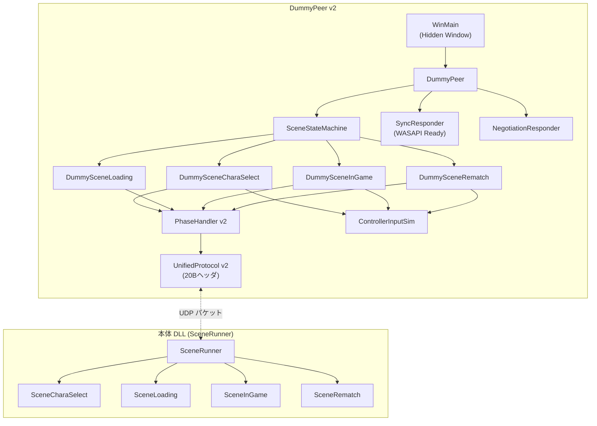
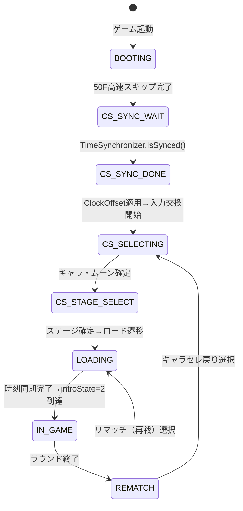

# DummyPeer v2 要件定義書 — 01. 概要

> **文書ID**: REQ-DP2-001  
> **作成日**: 2026-02-27  
> **ステータス**: レビュー待ち

---

## 1. 目的

CCCaster_v10 のテスト基盤である DummyPeer を大改修し、以下を実現する：

1. **WASAPI対応**: 高精度タイマーを本番と同等に動作させる
2. **本番業務フローの完全再現**: 画面遷移を擬似し、モックなしで全テスト可能に
3. **パケット仕様統一**: 業務状態変数（PeerState）をパケットヘッダに搭載
4. **コントローラ入力シミュレーション**: 画面別の本番互換入力生成

## 2. 背景

### 2.1 現行 DummyPeer の問題点

| # | 問題 | 参照 |
|---|---|---|
| B-1 | WASAPIがコンソールアプリで初期化失敗→QPCフォールバック | `ISSUE_TRACKER.md` B-1 |
| E-4 | パケットフォーマットが画面ごとにバラバラ | `ISSUE_TRACKER.md` E-4 |
| C-1 | 双方向同時通信テスト未対応 | `ISSUE_TRACKER.md` C-1 |
| C-3 | RollbackEngine結合テスト皆無 | `ISSUE_TRACKER.md` C-3 |
| — | 画面遷移を擬似しない（リアクティブループ方式） | — |
| — | 2バイト入力パケットのみで本番と非互換 | — |

### 2.2 対象ディレクトリ

```
tools/dummy_peer/
├── CMakeLists.txt
├── include/          # 14ヘッダ → 改修後22ヘッダ
├── src/              # 13ソース → 改修後15ソース
└── build/            # ビルド出力
```

---

## 3. システム構成

### 3.1 アーキテクチャ



### 3.2 本番DLLとの対応関係

| 本番DLLクラス | DummyPeer v2 クラス |
|---|---|
| `SceneRunner::Run()` | `SceneStateMachine::Update()` |
| `SceneCharaSelect::Update()` | `DummySceneCharaSelect::Update()` |
| `SceneLoading::Update()` | `DummySceneLoading::Update()` |
| `SceneInGame::Update()` | `DummySceneInGame::Update()` |
| `SceneRematch::Update()` | `DummySceneRematch::Update()` |
| `GameControl::SleepFrame()` | `SyncResponder::GetLocalTimeUs()` + Sleep |
| `TimeSynchronizer` | `SyncResponder` |

---

## 4. 業務状態変数（PeerState）

### 4.1 列挙定義

| PeerState | 値 | 業務内容 | 本番対応関数 |
|---|---|---|---|
| `BOOTING` | `0x01` | ゲーム起動～キャラセレ50F高速処理終了 | `HandleFastBootSkip()` |
| `CS_SYNC_WAIT` | `0x21` | キャラセレ同期準備完了・TimeSynchronizer待ち | `HandleTimeSyncWait()` — `!IsSynced()` |
| `CS_SYNC_DONE` | `0x22` | キャラセレ同期完了・ClockOffset適用済み | `HandleTimeSyncWait()` — `ApplySyncOffset()` |
| `CS_SELECTING` | `0x23` | キャラ・ムーンスタイル・ディレイ・RB・コントローラ設定選択中 | `ProcessDelayInput()` |
| `CS_STAGE_SELECT` | `0x24` | ステージ選択 | ゲーム内メモリ監視 |
| `LOADING` | `0x30` | ロード画面（時刻同期・加減速ワールドフレーム同期） | `SceneLoading::Update()` |
| `IN_GAME` | `0x40` | 対戦画面（intro=2開始時刻同期→RollbackEngine） | `HandleRoundStartSync()` + `ProcessRollbackFrame()` |
| `REMATCH` | `0x50` | リマッチ画面（menuConfirmStateゲート→画面遷移） | `SceneRematch::Update()` |

### 4.2 状態遷移ルール



### 4.3 遷移条件の詳細

| 遷移 | 条件 | DummyPeer側の判定方法 |
|---|---|---|
| BOOTING→CS_SYNC_WAIT | `framesInPhase >= 50` | フレームカウント |
| CS_SYNC_WAIT→CS_SYNC_DONE | TimeSynchronizer同期完了 | SYNC_DONEパケット交換完了 |
| CS_SYNC_DONE→CS_SELECTING | ClockOffset適用済み | 即座に遷移（1F） |
| CS_SELECTING→CS_STAGE_SELECT | キャラ・ムーン確定 | 設定可能フレーム数経過 or Confirmパケット受信 |
| CS_STAGE_SELECT→LOADING | ステージ確定 | 設定可能フレーム数経過 or ゲームモード変更パケット |
| LOADING→IN_GAME | Phase3完了 | SYNC_DONE + ディレイ入力交換完了 |
| IN_GAME→REMATCH | ラウンド終了 | 設定ラウンド数消化 or ゲームモード変更パケット |
| REMATCH→CS_SELECTING | キャラセレ選択 | RematchMenuPayload.menuIndex==1 |
| REMATCH→LOADING | リマッチ選択 | RematchMenuPayload.menuIndex==0 |

---

## 5. 関連ドキュメント

| ドキュメント | パス |
|---|---|
| 02. パケット仕様書 | `docs/requirements/dummy_peer_v2/02_packet_specification.md` |
| 03. 実装計画書 | `docs/requirements/dummy_peer_v2/03_implementation_plan.md` |
| ネットワークプロトコル設計書 | `docs/design/network_protocol_design.md` |
| 同期フェーズ仕様書 | `docs/design/core_dll/sync_phases_specification.md` |
| ISSUE_TRACKER | `docs/ISSUE_TRACKER.md` |
| AI作業手順書 | `AI_WORKSPACE_GUIDE.md` |
