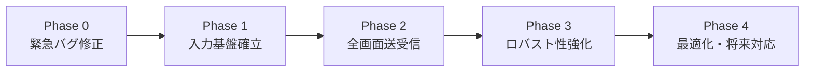

# DummyPeer v2 要件定義書 — 06. 統合改善提案書

> **文書ID**: REQ-DP2-006  
> **作成日**: 2026-02-27  
> **ステータス**: レビュー待ち  
> **入力資料**:  
> - [05_risk_analysis.md](05_risk_analysis.md) — 実務リスク分析10項目  
> - [05_risk_assessment.md](05_risk_assessment.md) — リスク評価レポート10項目  
> - [12_packet_field_specification.md](file:///I:/work_space/CCCaster_v10/docs/requirements/12_packet_field_specification.md) — パケット項目仕様書

---

## 1. 改善方針

2つのリスク分析で合計20項目のリスクが抽出された。重複を除去・統合すると**12の固有リスク**に集約される。
これらを**依存関係順**に5つの改善フェーズにグループ化し、段階的に解消する。

### リスク統合マッピング

| 統合ID | リスク名 | 分析元 | 評価元 | 統合後の重要度 |
|--------|----------|--------|--------|----------------|
| U-01 | 入力パケット仕様未確定 (2B vs 51B) | #1 | #1 | 🔴 致命的/即時 |
| U-02 | frameId不在によるロールバック不全 | #2 | #4 | 🔴 致命的/即時 |
| U-03 | DLLから入力送信が未実装（片方向通信） | #1 | #10 | 🔴 致命的/即時 |
| U-04 | PacketRouterの拡張性不足 | #3 | #2 | 🔴 致命的/中期 |
| U-05 | RedundantProtocol孤立 | #2 | #3 | 🟠 重大/中期 |
| U-06 | キャラセレ入力の未接続 | #5 | #5 | 🟠 重大/中期 |
| U-07 | Loading画面のディレイ交換未実装 | #6 | #5 | 🟠 重大/中期 |
| U-08 | Rematchメニュー同期未実装 | #7 | #5 | 🟡 中程度/中期 |
| U-09 | TimeHooks 1000倍速のTimeSync干渉 | — | #9 | 🟠 重大/即時 |
| U-10 | Phase 2 相対補正の未接続 | #4 | #6 | 🟡 中程度/長期 |
| U-11 | パケロス復旧ロジック未実装 | — | #8 | 🟠 重大/中期 |
| U-12 | UdpSocket再バインド競合 | #8 | — | 🟡 中程度/中期 |
| U-13 | プロトコルバージョン交換の欠如 | — | #7 | 🟢 軽微/長期 |
| U-14 | PCスペック交換未実装 (Phase 1.5) | #10 | — | 🟡 中程度/長期 |

---

## 2. 改善フェーズ一覧



| フェーズ | 名称 | 対象リスク | ゴール |
|----------|------|------------|--------|
| **Phase 0** | 緊急バグ修正 | U-09 | TimeSync精度を保証する |
| **Phase 1** | 入力基盤確立 | U-01, U-02, U-03, U-04, U-05 | 双方向入力パケット交換の完成 |
| **Phase 2** | 全画面送受信 | U-06, U-07, U-08 | CharaSelect→Loading→InGame→Rematch 全遷移の動作 |
| **Phase 3** | ロバスト性強化 | U-11, U-12 | パケロス耐性・ソケット信頼性の確保 |
| **Phase 4** | 最適化・将来対応 | U-10, U-13, U-14 | 長時間セッション品質・将来互換性 |

---

## 3. Phase 0: 緊急バグ修正

### 対象リスク: U-09 — TimeHooks 1000倍速のTimeSync干渉

**問題**: `MbaaSpeedController` が全SpeedModeで `SetTimeMultiplier(1000)` を呼ぶ。`TimeSynchronizer` は `RealSleep`/`RealQPC` に差し替え済みだが、**`GetLocalTimeUs()` 内のQPC呼び出しが差し替え漏れの可能性がある**。1000倍速環境でSYNC_REQが異常頻度で送信されると、θ計測の精度が崩壊する。

#### 改善内容

| # | 作業 | 対象ファイル |
|---|------|-------------|
| 0-1 | `TimeSynchronizer.cpp` の全 `QueryPerformanceCounter` 呼び出しを監査 | `TimeSynchronizer.cpp` |
| 0-2 | 差し替え漏れがあれば `RealQPC` に統一 | `TimeSynchronizer.cpp` |
| 0-3 | PING_INTERVAL_US の経過判定が実時間ベースであることを検証 | `TimeSynchronizer.cpp` |

#### 検証方法
- `TimeSynchronizer.cpp` 内の `QueryPerformanceCounter` / `GetLocalTimeUs` の呼び出し箇所をgrepで全洗い出し
- TimeHooks有効時に SYNC_REQ の送信間隔をログ出力し、50ms間隔を維持していることを確認

---

## 4. Phase 1: 入力基盤確立

### 設計判断: 入力パケットフォーマットの選択

> [!IMPORTANT]
> Phase 1 の最初に決定すべき最重要判断。全後続フェーズのアーキテクチャに波及する。

#### 推奨案: RedundantProtocol (CCTR 51B) を活用する（選択肢B拡張）

**理由**:
1. `EncodeInput()` / `DecodeInput()` が既に実装済み (計95行)
2. `frameId`, `historyInputs[10]`, `wasapiClock` など、ロールバック・パケロス復旧に必要なフィールドが全て含まれている
3. 帯域増加 (2B→51B) は60FPSでも `51B × 60 = 3,060 B/s ≒ 3KB/s` で問題にならない
4. 新規設計 (選択肢C) は工数が最大で既存コードとの整合性チェックも必要

**必要な修正点** (モック部分の解消):
- `creationTimeUs` が0固定 → `GetLocalTimeUs()` で実値を取得
- `InputPacket.wasapiClock` → QPCの生値を取得する関数と接続

---

### 4.1 改善 U-04: PacketRouter の拡張

**現状**: 2分岐のみ（TimeSyncバイト判定 / 2Bサイズ判定）

**改善設計**: 3段判定方式

```
PacketRouter::OnPacket(data)
├─ [1] data.size() >= 4 && data[0..3] == MAGIC_CCTR (0x42525443)
│       → RedundantProtocol を通してデコ―ド → タイプ別ハンドラへ
├─ [2] data[0] == 0x10-0x12
│       → TimeSynchronizer (後方互換)
├─ [3] data.size() == 2
│       → 旧2B入力パケット (後方互換・移行期間中のみ)
└─ [4] else → UNKNOWN ログ
```

#### 対象ファイルと変更内容

| # | 作業 | 対象ファイル |
|---|------|-------------|
| 1-1 | CCTR マジックナンバー判定を最優先分岐として追加 | [PacketRouter.cpp](file:///I:/work_space/CCCaster_v10/src/core/network/PacketRouter.cpp) |
| 1-2 | `PacketRouter.hpp` にCCTRパケットの処理もしくはコールバック登録API追加 | [PacketRouter.hpp](file:///I:/work_space/CCCaster_v10/src/core/network/PacketRouter.hpp) |
| 1-3 | `RedundantProtocol::DecodeInput()` を PacketRouter から呼び出す経路を作成 | [RedundantProtocol.cpp](file:///I:/work_space/CCCaster_v10/src/core/network/RedundantProtocol.cpp) |

---

### 4.2 改善 U-05: RedundantProtocol の接続

**現状**: Scene層からもPacketRouterからも呼ばれていない

**改善設計**:

```
[送信側 — Sceneから呼ぶ]
SceneInGame::OnFrame()
  → RedundantProtocol::EncodeInput(frameId, input, roundTimer, qpc, history)
  → UdpSocket::Send(encodedBytes)

[受信側 — PacketRouterから呼ぶ]  
PacketRouter::OnPacket()
  → RedundantProtocol::DecodeInput(data)
  → InputPacket{ frameId, currentInput, historyInputs, ... }
  → フレームバッファに格納（s_latestRemoteInput の代替）
```

#### 対象ファイルと変更内容

| # | 作業 | 対象ファイル |
|---|------|-------------|
| 1-4 | `creationTimeUs` を実値で埋める（モック解消） | `RedundantProtocol.cpp` |
| 1-5 | 受信入力のフレームバッファ構造体を設計（`s_latestRemoteInput` の置き換え） | 新規 or `net_Versus_main.cpp` |
| 1-6 | `OnRemoteInputPacket(uint16_t)` → `OnRemoteCCTRPacket(InputPacket)` のAPI変更 | `net_Versus_main.cpp`, `PacketRouter.cpp` |

---

### 4.3 改善 U-01/U-02/U-03: DLL側入力送信の実装

**現状**: DLLからの入力送信コードが**一切存在しない**

**改善設計**:

```
SceneInGame (60fps loop)
  ├─ ローカル入力を取得
  ├─ 入力履歴dequeに追加
  ├─ RedundantProtocol::EncodeInput(frameCount, localInput, roundTimer, qpc, history)
  └─ UdpSocket::Send(peer, encodedBytes)
```

#### 対象ファイルと変更内容

| # | 作業 | 対象ファイル |
|---|------|-------------|
| 1-7 | InGame ループ内に `EncodeInput()` + `Send()` の呼び出しを追加 | 該当Sceneファイル |
| 1-8 | 入力履歴 `std::deque<uint16_t>` の管理（最大10フレーム保持） | 該当Sceneファイル |
| 1-9 | フレームカウンタ `uint32_t frameCount` の管理 | 該当Sceneファイル |

#### DummyPeer側の対応

| # | 作業 |
|---|------|
| 1-D1 | DummyPeerにCCTR受信のデコード処理を追加（DLLからの入力を受信・検証） |
| 1-D2 | DummyPeerの送信もCCTR形式に移行（`--test-mode e2e` で有効化） |

---

## 5. Phase 2: 全画面送受信

### 前提条件
- Phase 1 で PacketRouter のCCTR分岐が動作していること
- CCTRパケットの `TYPE_INPUT (0x01)` 以外のタイプ拡張が可能な状態

### 5.1 改善 U-06: キャラセレ入力送受信

**現状**: `SceneCharaSelect.cpp` L200: `uint16_t remoteInputBtn = 0; // TODO`

**改善設計**:

新パケットタイプ `TYPE_CS_INPUT (0x02)` をCCTRヘッダ内に定義。

| フィールド | サイズ | 説明 |
|------------|--------|------|
| MAGIC (CCTR) | 4B | パケット識別 |
| type | 1B | `0x02` = CS_INPUT |
| filteredInput | 2B | フィルタ適用後の入力 |
| selectedChara | 1B | 選択キャラID |
| selectedMoon | 1B | 選択ムーンID |
| confirmState | 1B | 0=未確定, 1=確定済み |
| **計** | **10B** | |

#### 対象ファイルと変更内容

| # | 作業 | 対象ファイル |
|---|------|-------------|
| 2-1 | CS_INPUT の送信処理を実装（60fpsの入力ループ内） | `SceneCharaSelect.cpp` |
| 2-2 | PacketRouter に `TYPE_CS_INPUT` のディスパッチ追加 | `PacketRouter.cpp` |
| 2-3 | `RedundantProtocol` に CS_INPUT のエンコード/デコードを追加 | `RedundantProtocol.cpp/.hpp` |
| 2-4 | 受信した相手の入力をキャラセレ画面に反映 | `SceneCharaSelect.cpp` |

---

### 5.2 改善 U-07: Loading画面のディレイ交換

**現状**: `SceneLoading.cpp` L125-126: `SendLoadingInput` / `GetLatestRemoteLoadingInput` がTODO

**改善設計**:

新パケットタイプ `TYPE_LOADING (0x03)`。

| フィールド | サイズ | 説明 |
|------------|--------|------|
| MAGIC (CCTR) | 4B | パケット識別 |
| type | 1B | `0x03` = LOADING |
| delaySyncFrames | 1B | 自分が算出したディレイ値 |
| loadProgress | 1B | ロード進捗 (0-100%) |
| ready | 1B | 0=ロード中, 1=準備完了 |
| **計** | **8B** | |

**同期ロジック**: 両者の `delaySyncFrames` を受信後、`max(local, remote)` で統一する。

#### 対象ファイルと変更内容

| # | 作業 | 対象ファイル |
|---|------|-------------|
| 2-5 | LOADING パケットの送受信実装 | `SceneLoading.cpp` |
| 2-6 | ディレイ統一ロジック `max(local, remote)` の実装 | `SceneLoading.cpp` |
| 2-7 | PacketRouter に `TYPE_LOADING` のディスパッチ追加 | `PacketRouter.cpp` |

---

### 5.3 改善 U-08: Rematchメニュー同期

**現状**: `SceneRematch.cpp` L279/L284: 送受信ともにTODO

**改善設計**:

新パケットタイプ `TYPE_REMATCH (0x04)`。

| フィールド | サイズ | 説明 |
|------------|--------|------|
| MAGIC (CCTR) | 4B | パケット識別 |
| type | 1B | `0x04` = REMATCH |
| menuIndex | 1B | 0=リマッチ, 1=キャラセレ, 2=切断 |
| confirmed | 1B | 0=選択中, 1=確定 |
| **計** | **7B** | |

#### 対象ファイルと変更内容

| # | 作業 | 対象ファイル |
|---|------|-------------|
| 2-8 | REMATCH パケットの送受信実装 | `SceneRematch.cpp` |
| 2-9 | `max(local, remote)` 遷移先ロジックの接続 | `SceneRematch.cpp` |
| 2-10 | PacketRouter に `TYPE_REMATCH` のディスパッチ追加 | `PacketRouter.cpp` |

---

## 6. Phase 3: ロバスト性強化

### 6.1 改善 U-11: パケロス復旧ロジック

**現状**: `historyInputs[10]` はエンコードされるが、受信側で利用されない

**改善設計**:

```
受信側フレームバッファ:
  expectedFrameId = lastReceivedFrameId + 1

  if (received.frameId == expectedFrameId):
      → 正常処理
  elif (received.frameId > expectedFrameId):
      → 欠番フレーム数 = received.frameId - expectedFrameId
      → historyInputs[0..欠番数-1] から欠落フレームの入力を復元
      → ログ出力: "[RECOVERY] Restored N frames from history"
  elif (received.frameId < expectedFrameId):
      → 遅延パケット（古いフレーム）→ 破棄 or ロールバック判定に使用
```

#### 対象ファイルと変更内容

| # | 作業 | 対象ファイル |
|---|------|-------------|
| 3-1 | 受信側でframeId連続性チェックを実装 | 新規ユーティリティ or `net_Versus_main.cpp` |
| 3-2 | historyInputs からの欠落フレーム復元ロジック | 同上 |
| 3-3 | 復元成功/失敗のログ・統計出力 | 同上 |

---

### 6.2 改善 U-12: UdpSocket 再バインド競合

**現状**: CLI→DLL のソケット引き継ぎ時に `TIME_WAIT` でバインド失敗の可能性があるが、リトライなし

**改善設計**:

| # | 作業 | 対象ファイル |
|---|------|-------------|
| 3-4 | `SO_REUSEADDR` オプションの適用 | [UdpSocket.cpp](file:///I:/work_space/CCCaster_v10/src/core/network/UdpSocket.cpp) |
| 3-5 | バインドリトライ（3回 × 500ms間隔）の実装 | `UdpSocket.cpp` |
| 3-6 | リトライ失敗時のユーザー向けエラーメッセージ改善 | `GameHooks.cpp` |

---

## 7. Phase 4: 最適化・将来対応

### 7.1 改善 U-10: Phase 2 相対補正の接続

**現状**: `wasapiClock` フィールドはCCTRパケットに存在するが、`TimeSynchronizer::OnReceivePeerClockReport()` に渡す経路がない

| # | 作業 | 対象ファイル |
|---|------|-------------|
| 4-1 | CCTR受信時に `wasapiClock` を `TimeSynchronizer` に転送する経路 | `PacketRouter.cpp`, `TimeSynchronizer.cpp` |
| 4-2 | ドリフト補正のしきい値・適用ロジックの実装 | `TimeSynchronizer.cpp` |

---

### 7.2 改善 U-13: プロトコルバージョン交換

| # | 作業 |
|---|------|
| 4-3 | Negotiation完了後・TimeSync開始前にバージョンハンドシェイクパケットを追加 |
| 4-4 | バージョン不一致時の警告表示とグレースフルな切断 |

---

### 7.3 改善 U-14: PCスペック交換 (Phase 1.5)

| # | 作業 |
|---|------|
| 4-5 | ゲームフレーム処理のベンチマーク計測（CharaSelect画面で実行） |
| 4-6 | `PC_SPEC_EXCHANGE` パケットの仕様定義・実装 |
| 4-7 | `min(自分, 相手) - マージン` で maxRollback 自動計算 |
| 4-8 | CLI設定画面での手動オーバーライドUI |

---

## 8. DummyPeer v2 互換性戦略

> [!WARNING]
> DummyPeer v2 でCCTRパケットを先行導入すると、DLL側PacketRouter改修前は通信不能になる。

### 推奨: テストモード分離方式

| テストモード | 動作 | 用途 |
|---|---|---|
| `--test-mode game` | 旧プロトコル（2B入力 / 0x10-0x12 TimeSync） | 現行DLLとの後方互換テスト |
| `--test-mode e2e` | CCTRプロトコル（51B入力 / 新PacketRouter対応） | Phase 1完了後のE2Eテスト |

**移行スケジュール**:
1. DLL側 Phase 1 完了 → `--test-mode e2e` でCCTR通信テスト
2. Phase 2 完了 → 全画面遷移のE2Eテスト
3. 安定確認後 → `--test-mode game` を非推奨化

---

## 9. 全体スケジュール目安

```
Phase 0 [U-09]                  ████                    (1-2日)
Phase 1 [U-01~05]               ████████████████        (5-7日)
Phase 2 [U-06~08]                       ████████████    (4-5日)
Phase 3 [U-11,12]                               ██████  (2-3日)
Phase 4 [U-10,13,14]                                ████████ (後日)
```

> [!NOTE]
> Phase 0 と Phase 1 は直列（Phase 0 完了後に Phase 1 着手）。  
> Phase 2 以降は Phase 1 の安定を確認してから着手する。

---

## 10. 12_packet_field_specification.md への更新提案

Phase 1〜2 の完了に伴い、以下のセクションを追加・更新する必要がある:

| セクション | 変更内容 |
|---|---|
| §7 (CCTR 51B) | `creationTimeUs` のモック解消を反映 |
| §8 (未定義パケット) | CS_INPUT / LOADING / REMATCH の正式フォーマット定義 |
| 新規 §9 | PacketRouter 3段判定方式の仕様 |
| 新規 §10 | パケロス復旧ロジックの受信側仕様 |
